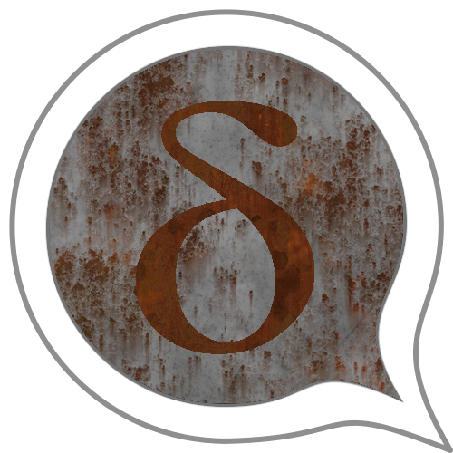
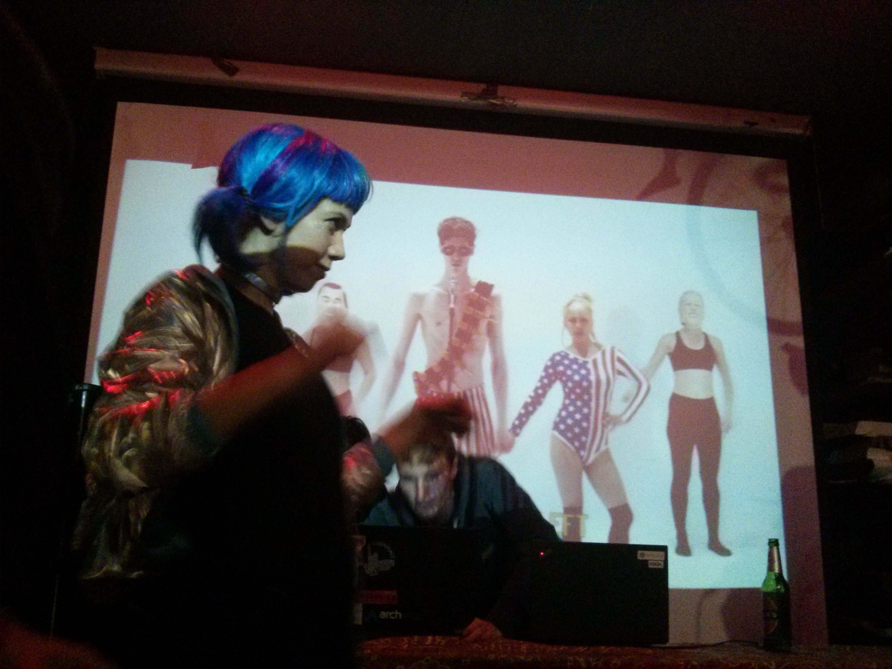

What do indigenous communities in the Amazon rainforest, friends in Cuba, families in Iran, activists from Russia, a monastery in Cambodia, and many folks in the Fediverse have in common?

You guessed it? They're using Delta Chat because it is:

- **adaptable**: Indigenous communities
  use [solar-powered routers deep in the rainforest](https://rhizomatica.org),
  facilitating fast local Wi-Fi chats and
  low-bitrate long-range communication with remote chat addresses.

- **resilient**: Internationally dispersed families and friends stay in contact,
  even when WhatsApp, Signal, VPNs, and Tor fail.

- **sovereign**: Members of a monastery, ethically barred from using "remote" accounts,
  run their own e-mail server with a chat-messenger that they accept as a gift (FOSS!).

- **interoperable**: You can chat with anyone even if they don't have
  the app (e-mail!).

### Why don't we spend more time on promotion?

Since the beginnings of Delta Chat in a small city north of Hamburg almost five years ago,
we have posted little about the wonderful and diverse ways people use our apps.
We usually prefer to share completed releases instead of pre-announcing or
trying to create hype by boasting about users and growth.
Avoiding popularity is not merely born out of humility, but also realism as
we can only address so much feedback and suggestions.
If we are over capacity, feature requests and ideas turn into pressure and stress.
This post is not a pre-announcement but a bit of a wild ride
through what's currently happening and what we are seeking out.

### Sharing web apps in a chat (webxdc)

[Sharing web apps in a chat (webxdc)](https://webxdc.org) was released in mid-2022.
Dozens of grassroots-ported games are now played everyday in chat groups and through mailing lists.
Collaborative tooling apps (polls, checklists, calendars, editors) are evolving.
No permission from us, or any app store, is needed to create and distribute your apps.
Programming newcomers succeeded in delivering working usable apps via a zip file
containing an `index.html`, some assets and JS/Typescript/CSS as preferred.
One of our more experienced and playful developers recently whipped up a chat app
that runs inside a chat group —
makes more sense if you consider a chat web app
running on top of an anonymizing mailing list:
suddenly people could do ephemerally e2e-encrypted private communications on top 🤯

Our Poll example app is 6 kilobytes and, as with all apps shared in a chat,
automatically operates with these wonderful properties and UX:

- offline-first and end-to-end encrypted,

- without any server deployments,

- without logins or GDPR/consent screens.

UX and privacy researchers and befriended hackers from diverse projects such as Cryptpad, DAT, IPFS,
Peermaps and Libreoffice agree:
web tech combined with decentralized chat (aka "webxdc") is a rare jewel worth refining.
Some friends and long-term followers hailed our approach as marking the beginning of a "decentralized super-app". What would you guess from which island's community these webxdc developments were inspired and co-driven?

### Movements in the woods and underground…

With a wide variety of users, developers, partners, and co-operative projects
we discuss many wants and needs:
Supporting emoji-reactions, having Telegram-style larger channels,
evolving WhatsApp-style communities,
encryption improvements, seamless multi-device setup,
and even the holy grails of Peer-to-Peer messaging.
The somewhat incredible thing is that we are actually progressing
around several of these topics.
We just don't like to pre-announce much.
This post here is a bit of an exception to prove the rule 🙂.

Delta Chat app developments are a usability and UX-driven effort and
we have [experienced UX and user researchers with us](https://delta.chat/en/2020-08-01-ux-final).
Security considerations play a day-to-day role.
However, the "most secure protocol" is useless if few are able to understand or use it.
"Usable security" itself remains an evasive concept
if we can't facilitate its implementation in real-life apps.
Between usability, security, and implementation considerations
there is no natural hierarchy: each constrains and influences the others.
In 2023, in collaboration with [TeamUSEC](https://teamusec.de/) we want
to perform systematic user and field-testing around security topics,
in part following up on the often-quoted usable security study ["When Signal hits the fan"](https://dx.doi.org/10.14722/eurousec.2016.23012).

### Never underestimate the importance of testing

Luckily, we have a wonderful testing community with key contributors
sorting out issues with users and discussing with developers.
One from Austria kept reminding us about specific connectivity problems
even if they rarely occur and are hard to re-produce:
the issues were fixed the last week, which increased resiliency for everyone.
Did you know that most Delta Chat features are first tested on a Caribbean island?
Some were originally developed in the DeltaLab app:
a friendly fork of Delta Chat Android only available in the Cuban app store.

### Ways out and around the dreaded onboarding problem

Using a pre-existing email account is one of Delta Chat's core features, but also
happens to be an impediment for many when getting started with Delta Chat.
Supplying the e-mail address and password is enough for autoconfiguration to
quickly succeed, but not without problems and, although plenty of e-mail providers work
with Delta Chat, several have unnecessary limitations and complications.
We are experimenting with single-click or QR-code based sign-up that
quickly bootstraps a working e-mail account and configures it with Delta Chat.
A newly joining sysadmin has setup a new server in an hour and
onboarded a couple of friends, now all happily using Delta Chat.

We have several efforts ongoing to launch what we call Automatic Accounts:
Any Delta Chat user on any platform could choose to get a single-click account
with an optimized baseline chat experience.
We avoid centralizing platform dynamics by simplifying migration to other e-mail providers:
freedom only arises if exit without sanctions is possible (and there is somewhere to go).
When our prospective Automatic Account offering reaches its limits,
you will need to migrate, and Automatic Accounts have the design goal of making this easy.

### The coming migrations

Speaking of migrations, we have more followers on the Fediverse than on Twitter
and interesting conversations are evolving on the Fediverse.
Aren't e-mail addresses and fediverse addresses strangely similar?
Aren't e-mail servers and ActivityPub servers both federated?
Don't ActivityPub and E-Mail protocols share a culture
of a diverse variety of players and different real-use implementations?
Wouldn't federated social media with proper end-to-end encrypted chatting be a nice twist?
What if you could use a QR-code scan from Delta Chat to login to a Fediverse instance,
and then have an integrated Web/Messaging experience?
Ecological and social contexts are changing and migrations out of need or choice need support,
not new barriers and walled gardens.

### Our Rust-core architecture (tm) and its UI bindings…

Delta Chat was the first fully Rust-based chat app available
on all platforms, and may still be the only one.
Rust is a system-level memory-safe language,
largely hailed for its safety and efficiency,
and ending two decades of a popular perspective considering
virtual machines as the holy grail of programming languages technology.
Rust enables large-scale collaboration between developers
on a wide variety of platforms without runtime-overheads.
C and C++ could never deliver this at similar scale,
however foundational they have been and are for today's state of things.
Our Rust core implements all networking, message processing, encryption,
chat and contact persistence, which offers a documented UX-oriented API for UIs and bots.
Core is licensed under the MPL and thus more permissive
than our user interface developments which are largely licensed under the GPL.

Our apps and bots use Rust-core bindings for Java, Swift, TypeScript and Python.
While our mobile apps use the long-evolved CFFI (C-Foreign-Function-Interface),
our Desktop app introduces JSON-RPC (JSON Remote-Procedure-Calls),
directly talking to core without a C-layer.
New asynchronous python bindings doing away with all CFFI were started this week
with first bots being ported to it.

For mailing-lists, SuperGroups, Mastodon, screenshots, downloading, and other fun experiments,
bots based on Rust-core are being deployed for practical and entertaining contexts.
But this post is getting long and twisted enough already so more on released bots some other time …

### We are looking for experienced React/Web, Java/Android and Swift/iOS developers

Our [Desktop app](https://github.com/deltachat/deltachat-desktop) uses Web technology (React, TypeScript), currently via
Electron, but maybe someday via Tauri so there's no need to ship a full browser with the app.
The desktop app is regularly released and published
to Windows, MacOS, and Linux distribution channels.
There are many things to improve regarding platform integration,
bug fixing and bringing about new or refined UI/UX interactions.

Our [Android app](https://github.com/deltachat/deltachat-android) is a 2019-fork of Signal's Java app,
diverged in some areas because we orient ourselves
around the interfaces of Telegram and WhatsApp.
The Android app remains our "flagship" app that is available in various stores,
among them Google Play and F-Droid.
Our [iOS app](https://github.com/deltachat/deltachat-ios) is a self-development using Uikit and Swift bindings to core.
It is the youngest sibling in our offerings and also needs more love.

### What we offer and how we (not) work

For both Desktop and mobile development we offer 80-120 hours-per-month contracts.
Payment is not bad, but certainly not what some corporate entities pay.
Read more about [our funding sources here](https://delta.chat/en/help#how-are-delta-chat-developments-funded).
We are happy to discuss situational arrangements and adaptations.
Contributing and collaborating happens remote mostly
but several of us tend to meet every few months
in Freiburg (black forest), elsewhere in Germany (Berlin, Hamburg, Leipzig…),
and from time to time in more remote locations like Kyiv or Havanna.
We typically invite and converse with folks from interesting or befriended projects,
collocated in decentralization, internet freedom, and queer fusion spaces.

Several of us avoid flying, and some are involved in Friday-for-Futures or adjacent activities.
If we gather somewhere remote then usually for weeks rather than days,
and without seeking much publicity.
We try to avoid constant busyness and urgency as it prevents enjoyable collaboration.
We aim to arrange ourselves [empathically](https://delta.chat/en/community-standards)
and keep dates and clocktime scheduling to a minimum.

Currently, there are around a dozen weekly committers to our repositories,
with a bit more than half of them receiving funding either
through employment contracts (if in Germany) or freelancing (if international).
Another dozen people and maintainers from other projects
are involved in background discussions and hack sessions around "what's interesting to do next, maybe together".
We work with people located on several continents, some of them exiled,
some of them migrants of choice, some of them in more stable and resource-rich environments.

### Please help us to further improve UX and UIs for everyone

Please contact us via e-mail addressed to delta@merlinux.eu
if you are interested in helping us and our users with beautiful front end developments.
Please provide some background on your prior projects or apps.
A CV is not neccessary but welcome if you have one around.
If we determine a base fit, we typically arrange a one month paid test period for both sides.
We'll organize an onboarding group for you and guide you through first issues and peoples involved.

Can't consider a job yourself but know someone who might be interested?
Please forward this post to whatever channels you find appropriate.
Thanks for reading and helping! Aren't cats all beautiful?

