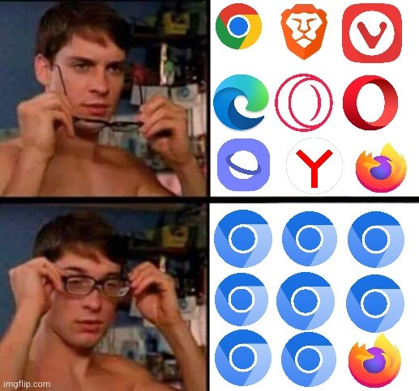

Delta Chat's ["web apps shared in a chat" (webxdc)](https://delta.chat/en/2022-06-14-webxdcintro) 
feature comes with unique privacy promise but in January was shown to be broken. 
We got into a surprising struggle with Web browser sandboxing issues
that took us several months to come out ahead of. 
This post provides the background story of this struggle leading to
the security-hardened Delta Chat 1.36 release series in April 2023.

## The unique privacy promise of web apps without tracking or platforms 


Unlike Telegram with its Bots or WeChat with its MiniApps, 
Delta Chat allows anyone to create and share web apps in a chat 
while maintaining the industries strongest privacy promise: 
web app developers or distributors can not track or control you
because web apps run in a browser sandbox without internet access
and can only exchange messages with other app instances by relaying through our
[security-audited Rust core library](https://delta.chat/en/2023-03-27-third-independent-security-audit). 
Delta Chat completely bars browsers from doing any network requests themselves. 

Enforcing this privacy promise depends on our ability to safely run
web code in a *network-isolated webview* to prevent it from
causing unwanted network traffic. 
We generally use standard Browser APIs and `Content-Security-Policy` directives to 
prevent web code from unwanted network access, such that: 

- external links do not work (`href` etc.).
- `XMLHttpRequest()` and related methods do not work.
- it is not possible to access not-embedded code or HTML via `src=...` etc.

Mid 2022 we developed a [webxdc test app](https://github.com/webxdc/webxdc-test)
to verify these guarantees and tested it on many devices until we were
sure we could run isolated webviews for users. 

Or so we thought.

## WebRTC breaks the sandbox and it's hard to fix it

In January 2023, a new contributor, [Wofwca](https://github.com/WofWca),
discovered that `RTCPeerConnection` objects
are not restricted by the known network-isolation options for webviews
or Content-Security-Policies that try to isolate parts of web pages.
`RTCPeerConnection` objects are the core programmatic offering of WebRTC protocols
which allow P2P communications for video or data transfers.

Our privacy promise was broken and an example exploit showcased it. 


We convened a "DISABLE-WEBRTC" working group from our team and befriended experts
to iteratively implement and develop mitigations to enforce network-isolation of webviews,
both for Chromium and Webkit/iOS. 
Not even all Delta Chat contributors knew of the massive work
taking place behind the scenes and only appearing in various PRs
in public repositories.


## Fill500: Disabling WebRTC on Chromium 

After many days of reading Chromium source code, trying and testing, 
we came up with this little snippet that needs to run before we start web apps: 

```javascript

// FILL500: Disable WebRTC on Chromium
for (let i = 0; i < 500; i++) {
    new RTCPeerConnection()
}
```

This is not a copy-paste error but the actual fix. 
Now, let us explain _why_ it works:

- Since 2019, Chromium has [a hard-coded limit](https://github.com/chromium/chromium/blob/c9060dc81d2a40733b627a4f5215ff237a64c691/third_party/blink/renderer/modules/peerconnection/rtc_peer_connection.cc#L155-L156)
  of 500 RTCPeerConnection *instantiations* per process.
  The according counter is not incremented when doing network connections but
  unconditionally incremented in the constructor where no network connections take place.
  If you try the 501st instantiation it fails persistently.

- We don't `.close()` `RTCPeerConnection`s so they don't get 
  garbage-collected (see [this debug assertion](https://github.com/chromium/chromium/blob/c9060dc81d2a40733b627a4f5215ff237a64c691/third_party/blink/renderer/modules/peerconnection/rtc_peer_connection.cc#L661)),
  so the counter is never decremented while the page is open.

- There is no way for user code to get at "dropped" RTCPeerConnection objects 
  but they are are also not garbage-collected.
  They are pretty much useless which is precisely the point. 

Special care still needed to be taken that neither navigation or iframe-constructions
can create a new pool of RTCPeerConnections.  
We'll skip on the details of that but it involved trying various Chromium variants 
and finding more surprises that needed modified mitigations or controls 
to prevent apps from getting a new RTCPeerConnection pool. 
Note that FILL500 can cause delays of sometimes 3-5 seconds for starting web apps on old phones.  It's not pretty but we consider our privacy promise more fundamental.  Web and Chromium experts from various projects and groups could not improve on FILL500.  If anyone has a better fix for preventing RTCPeerConnections, please come forward.  This blog post like all older ones can be commented on in the Fediverse, see the bottom of the post.


## Disabling WebRTC worked in February on all platforms but ...

FILL500 is used [on Android](https://github.com/deltachat/deltachat-android/blob/605008074ec122b196e65e86e7c6c9ae9789d068/res/raw/webxdc_wrapper.html#L63-L65) and [Electron-based Desktop](https://github.com/deltachat/deltachat-desktop/blob/4e40c4304b2e41ede7ec896f9ce28fd7552fbf1f/static/webxdc-preload.js#L91-L104) For webkit/iOS (used by Safari), DISABLE-WEBRTC mitigations [work differently](https://github.com/deltachat/deltachat-ios/blob/59ce95cf7e02e3c4799aea2ca1bfed1087506928/deltachat-ios/Controller/WebxdcViewController.swift#L135-L144).  For Webkit, the `RTCPeerConnection` object is removed from JavaScript namespaces such that web apps can not instantiate RTCPeerConnections at all.  The mitigation consisted in a just a few lines of code when creating the web view.
Beginning February 2023 Delta Chat apps on all platforms
were released containing the various DISABLE-WEBRTC mitigations.

Meanwhile [OpenTechFund](https://www.opentech.fund/) had thankfully agreed to
contract a security audit by [Cure53](https://cure53.de)
to perform a thorough security audit of our mitigations
and of webxdc security and privacy promises in general.
No compromise against our Disable-WebRTC mitigations was found
but it wasn't the end of an already exhausting story ... 


## DNS-prefetching marks another major exploit found by Cure53


Security auditors from Cure53 found another issue
which sent us back to the drawing board and lots of head scratching:
Chromium performs "DNS-prefetching" which aims to speed up browsing experiences
for users by performing DNS network queries before a user clicks on any link
or the page requests a resource.
Auditors provided two exploits for Desktop and Android respectively
which could exfiltrate data from web apps via Chromium's DNS-prefetch feature.
Unfortunately, the official suggestion for
[disabling DNS-prefetch on Chromium](https://www.chromium.org/developers/design-documents/dns-prefetching/#dns-prefetch-control) does not work. We even found in Chromiums source code
[tests that dns-prefetch "off" settings can be manually overriden](https://source.chromium.org/chromium/chromium/src/+/main:third_party/blink/web_tests/http/tests/misc/dns-prefetch-control.html;l=51?q=dns-prefetch). 

To cut another longer story short here, we'll found working mitigations (see next section)
so that webxdc apps can not leak data anymore via DNS-prefetch.


## Audit results of Delta Chat's ability to run web apps safely (webxdc)


[The Cure53 security audit about webxdc apps](https://public.opentech.fund/documents/XDC-01-report_2_1.pdf) 
identified five "high" and two "info" severity issues with our February releases.
Here we provide a summary of the issues and links to our fixes:

- (high) XDC-01: Data exfiltration via DNS-prefetch on Desktop;
  [deltachat-desktop #3179 now generally blocks DNS requests](https://github.com/deltachat/deltachat-desktop/pull/3179)
  in the Electron renderer process,
  only allowing requests for `*.mapbox.com` (needed for the opt-in
  experimental location streaming). Together with our DISABLE-WEBRTC
  fixes this makes for a hardened Delta Chat Desktop Electron app
  because no JavaScript rendering code can perform or cause any networking
  other than through our Rust-implemented Delta Chat core library.

- (high) XDC-02: Full CSP-bypass for `webxdc.js` on Desktop;
  fixed by [deltachat-desktop #3157](https://github.com/deltachat/deltachat-desktop/pull/3157)
  (see the `webxdc.ts` file).

- (high) XDC-03: Data Exfiltration via DNS Lookup on Android;
  This by far was the hardest issue because of a variety of
  Chromium versions on Android phones and problems reliably reproducing the problem.
  We were able to fix the problem on all devices where the XDC-03 exploit previously worked
  through these fixes:
  [deltachat-android #2539](https://github.com/deltachat/deltachat-android/pull/2539)
  [deltachat-android #2540](https://github.com/deltachat/deltachat-android/pull/2540)
  [deltachat-core #4339](https://github.com/deltachat/deltachat-core-rust/pull/4339)

- (high) XDC-04: Data exfiltration via dev-tools
  [Fixed by deltachat-desktop commit #649fe](https://github.com/deltachat/deltachat-desktop/commit/a9e5242acb2dfad132acc3dbbdacf89fb2a649fe). Now the dev tools can only be opened if the "Enable webxdc devtools" experimental setting is enabled.

- (high) XDC-05: Full CSP-bypass for PDF embed on Desktop
  Fixed in [deltachat-desktop commit #63577c](https://github.com/deltachat/deltachat-desktop/commit/e874c8bdb98321c12d2d972106b0143e7f63577c). When attempting to load a pdf file in an iframe, the PDF is now displayed as text.

- (info) XDC-06: Spoofable Recommendation for `selfAddr` in payload
  This issue does not allow exfiltration of data but it allows malicious
  users to cause apps to malfunction or mis-identity users.
  We are going to evolve the webxdc API to avoid the issue.

- (info) XDC-07: Lack of CSP-header for `webxdc-update.json`
  Fixed in [deltachat-ios #1839](https://github.com/deltachat/deltachat-ios/pull/1839).

All high-severity issues are fixed with the 1.36 release series
already published to app stores and our web page in April.


## Take aways on better browser sandboxing 

We were a bit naive thinking that Web Browsers and especially Chromium sandboxes
allow to control network access on web views. 
Then again, with web browsers and their sandboxing models used for a lot of
commercial and payment activities, with tons of third-party code running on user's Browsers,
we did not expect it would be so hard to control the network behaviour of web code.

### Browsers: please implement the W3C "WEBRTC: block" directive


Platforms serving web pages or apps need to trust their complete
supply chain of JavaScript dependencies if they don't want
users of their offerings to leak app data through WebRTC.
Most importantly, Content-Security-Policies do not prevent leakage currently.
The issue is actually long known, see the [WebRTC can be used for exfiltration issue from 2016](https://github.com/w3c/webappsec-csp/issues/92).

In 2022 the W3C finally adopted a direct method to disable WebRTC via a [WebRTC: Block CSP setting](https://www.w3.org/TR/CSP3/#directive-webrtc) but it's not implemented yet by browsers.
The WebRTC CSP would allow webxdc and web2 applications and platforms a much saner way
to control Browsers and for Chromium in particular getting rid of the FILL500 hack.
Many thanks to [ZenHack](https://github.com/zenhack) who persevered
in landing this new CSP directive and even went through the bureaucratic effort
of becoming a registered W3C spec contributor to land it.

### Reminder: VPN users might leak IP address through WebRTC

It is also a well-known issue when using VPNs that WebRTC can cause local IP address leaks.
A [search on DuckDuckGo](https://duckduckgo.com/?t=ffab&q=webrtc+vpn+&atb=v65-1&ia=web)
reveals many old and recent blog posts and VPN provider pages advising on mitigating the issue.
However, two sets of expert groups have not found a way to disable WebRTC on Chromium
other than the hacky FILL500 algorithm above and
we are not aware of any other browser-level method to reliably disable WebRTC on Chromium.
Some VPN setups may succeed however in preventing WebRTC connections
on the network level but you will need to inquire yourself with your VPN providers to find out.
**We think Browsers should up their game and allow users to consent to using WebRTC
similar to Camera/Microphone permissions.**

If you depend on using a VPN then it's for now maybe safer to use Firefox based engines
(Tor is also firefox-based) and ensure WebRTC is disabled (see below)
because otherwise you might leak your actual IP address to malicious web sites
that try to identify VPN users.


### Maybe using Firefox engines would help? 


Delta Chat apps do not use Firefox webviews which can be directly configured
to disable WebRTC, by setting `media.peerconnection.enabled = false` in `about:config`.
Firefox can do DNS-prefetching but it thankfully again appears like 
[there are simple configurations to disable it](https://support.mozilla.org/en-US/kb/how-stop-firefox-making-automatic-connections). 
However, the Delta Chat desktop app uses Electron which in turn uses Chromium
and on Android devices the system webview is typically a Chromium webview.
We investigated whether we could use GeckoView and early tests confirm 
it would solve the WebRTC issue.  
But shipping GeckoView within Delta Chat is a) still quite a bit of work b) would
drastically increase the APK size. We are nevertheless considering it especially if Chromium
does not implement the "WebRTC: Block" directive sometime.


### Combining the Servo Rust engine with Delta Chat's Rust core? 


Like many other developers who are critical of Google's dominance with Browsers
we were sad to see Mozilla let go of their [Servo](https://servo.org/) team. 
But recently [Servo is picking up steam again](https://servo.org/blog/2023/02/03/servo-2023-roadmap/) 
and [Igalia wants to help revive Servo](https://people.igalia.com/mrego/servo/igalia-servo-tsc-2022/). 
Maybe it becomes feasible to integrate Servo at some point? 
For sure, [webxdc apps](https://webxdc.org) are a young feature
which we want to further evolve in 2023, exploring and creating realities 
where open web technology integrates with E2E messaging instead of 
today's centralized platforms. 
