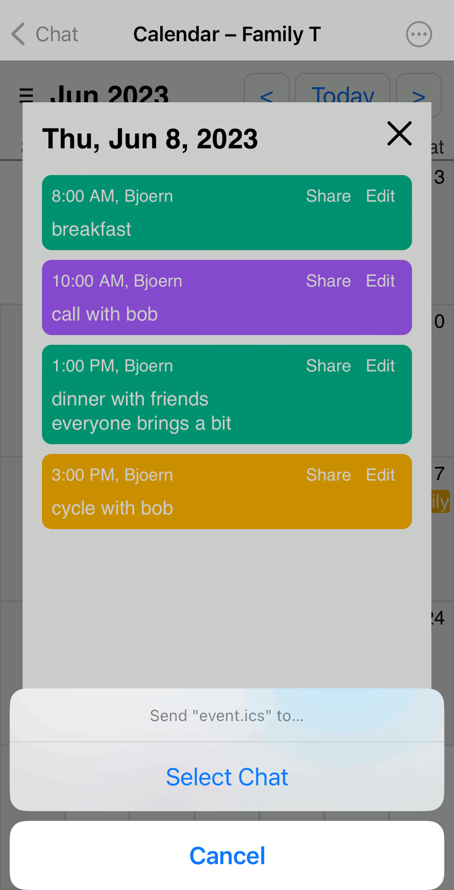

Earlier this year we worked hard to enforce [WebXDC app privacy](https://delta.chat/en/2023-05-22-webxdc-security) 
but what good is having totally private apps if there is no convenient way to exchange data with the rest of the world? 
With the Delta Chat 1.38 releases we introduced [two new WebXDC APIs](https://docs.webxdc.org/spec.html#sendtochat) 
to **safely and conveniently exchange data with other tools and apps.**

To showcase and design the new APIs we developed a little [cross-platform Calendar web app](https://codeberg.org/webxdc/calendar/) that:

- can be shared as an WebXDC app in any chat such that every member 
  can create and view calendar events without requiring any install, login or hosting, 

- allows to import invites (`.ics` files) as produced by other calendaring apps
  (tested so far with Simple Calendar, Etar, Thunderbird, Google and Apple Calendar), 

- allows to share invites to a user-selected chat or contact 
  where the recipient(s) can tap the received file 
  to import the invite into their own favorite native calendar app,

- can also run unmodified as an [Calendar online demo](https://webxdc.codeberg.page/calendar/@demo/)
  which however stops short of the actual chat-sharing activity.

You may [download the latest released Calendar app here](https://codeberg.org/webxdc/calendar/releases)
and then send the downloaded `.xdc` app file into your "Saved messages" chat (shared between all your devices) or into any group chat so that chat members can play around as well. 

In a similar way, you may also play with a little [Draw app](https://github.com/webxdc/draw/releases/latest/download/draw.xdc) 
that can be used to import and draw pictures and then share them in a chat.

Please note that both the Calendar and Draw apps were done "on the side" 
by Delta Chat developers who are not specializing into web apps. 
We actually first tried a whole host of existing calendar web widgets only to find 
that almost all are designed for Desktop usage and lack proper mobile support. 
While the Calendar WebXDC app can not fully replace current native Calendar apps 
it can be a lightweight solution for chat groups to keep a joint calendar
while offering full interoperability with other calendaring apps. 

## Improving WebXDC and moving off Github? 

If you have capacity and interest, please [contribute to WebXDC apps or docs](https://github.com/webxdc/)
to better allow us to focus on ironing out any underlying issues 
with the Delta Chat messenger app suite,
and help [other messenger developers implementing WebXDC support](https://docs.webxdc.org/spec.html#messenger-implementation).

We are interested to move WebXDC developments off Github and
could use some help with making a smooth transition.
We also have limited funds available. 
Do you have some experience and could help us? 
Please [get in contact](https://delta.chat/en/contribute) 
or checkout [cosmos.delta.chat](https://cosmos.delta.chat) for further links. 

## All fine and dandy but what about other messengers supporting WebXDC? 

In recent months we happily noticed that 
two Android XMPP-messengers, [Cheogram](https://cheogram.com/) and [Monocles](https://monocles.wiki/index.php?title=Main_Page),
added experimental support for WebXDC apps. 

We hope that the new Export/Import APIs may soon become available there as well 
so the unmodified Calendar and Draw apps would just work there. 
Earlier this year we also had in-person discussions with developers 
from [Quiet](https://tryquiet.org), 
[Briar](https://briarproject.org/) 
and [Qaul](https://qaul.net) 
who are following our WebXDC work with interest.  

## Stepping stones for an E2E "Next-Generation-Internet" 

Our work on introducing new I/O APIs for WebXDC apps was funded 
through [NLNET Zero Entrust](https://nlnet.nl/entrust/), 
in turn supported by Next-Generation-Internet funding from the European Commission. 
In particular, we are grateful to Michiel and Gerben from NLNET 
who continue to provide great guidance, critique and support for our efforts. 
Next milestones will be about offering decentralised distribution and discovery
for WebXDC apps and providing P2P-data-synchronization example apps 
as well as revamped documentation and entry points. 
