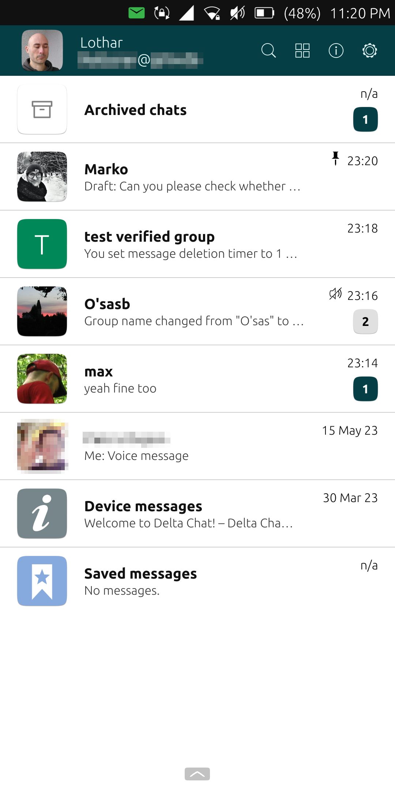
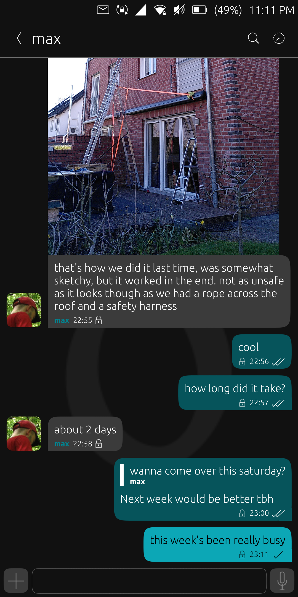
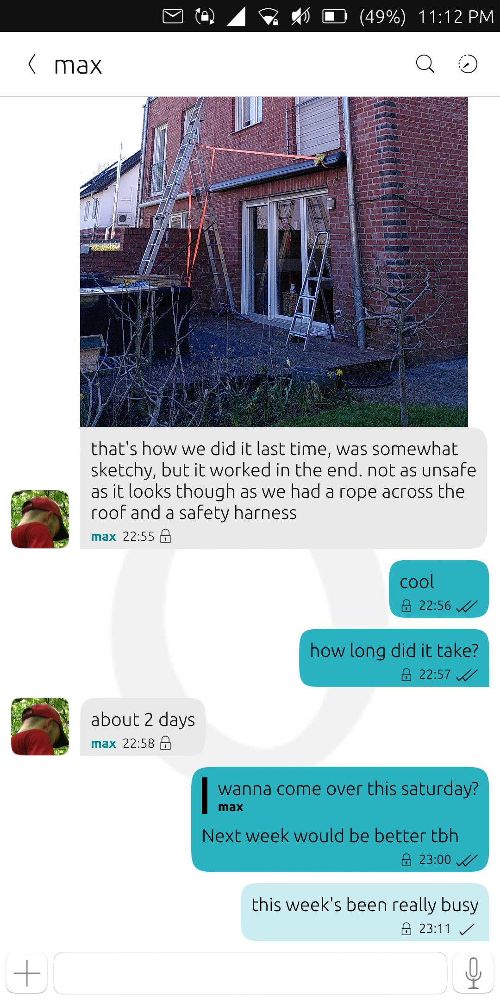
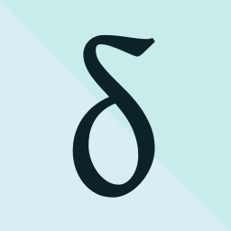

Hi, this is Lothar aka [lk108](https://social.tchncs.de/@lk108). I'm today's guest on the blog and it's my pleasure to introduce DeltaTouch, a third-party client based on deltachat-core-rust for the mobile phone OS [Ubuntu Touch](https://ubports.com) (UT). The app has just been [released on the OpenStore](https://open-store.io/app/deltatouch.lotharketterer) for both the xenial and the focal channel of UT. Here's what it looks like:

## Features

Development of the app was done by looking at the features of the official clients and implementing them one by one. Here are some examples of what's already there:
* Set up accounts by
  * logging in with username/password
  * set up second device via QR code
  * import backup
  * scan QR invitation code
* Multi-account support
* Create and manage groups and verified groups
* Pin, archive, mute chats
* Search in chats
* Rudimentary image viewer
* Rudimentary audio/voice message player
* Record voice messages, play and confirm before sending
* Export backup
* Most settings like in the official clients (show classic emails, auto-download size etc)

System notifications are possible, but require the user to disable background suspension and have the app running in the background. I haven't tested methodically how the latter affects battery life, but my first impressions are that it doesn't drain the battery very much.

Things still missing include:
* HTML emails
* Webxdc
* In-app scanning of QR codes (scanning with external app, copy to clipboard and pasting into DeltaTouch works)
* Act as primary device to add second device
* Encrypt database (may be important for UT as it currently doesn't offer encryption on OS level)
* Connectivity status
* "Seen recently" green dot
* Clear chat

These are planned to be implemented in the coming months.

## Background and History

### Why this app?

I don't have to tell you which messenger is the best, right? Unfortunately, there was no app for the only smartphone OS I have ever used. Sure, it might be possible to run the Android app via waydroid, but waydroid massively impacts battery life, blocks GPS reads for the rest of the system and for some devices, it's not available at all. Therefore, a native app is the way to go.

However, for a long time I felt that I wasn't competent to develop apps for UT, let alone something like a DC client. Granted, although it wasn't related to my main studies at all, many years ago I was able to attend an add-on computer science program at university, and I had some basic C++ skills. But I had never done anything with Qt/QML (the preferred framework for UT), and I didn't know anything about CMake or [clickable](https://clickable-ut.dev/en/latest/index.html) (the tool to build click packages as used by UT).

### How it came into being

This all changed in April 2022 when I attended the first development meeting of the [Ubuntu Teach Inititiave](https://ubports.com/en/blog/ubports-news-1/tag/app-development-newsletter-13). Over a few hours, some experienced UT developers helped me to set up a project and showed me the basics of QML. Several weeks later my first app entered the OpenStore. It's QML only and just a small tool with no connection to DC, but it opened the world of app development for me.

That's when the idea to create a DC client first crossed my mind. Just as before for app development in general, I had some doubts. Isn't this too difficult? Maybe I'm not up to the task. Nevertheless, I started looking at the [C interface of the core](https://c.delta.chat/). Two things quickly put away my doubts: The "Getting started" section at the beginning of the page of the C interface, and the general documentation of the classes and functions. After compiling libdeltachat and replicating the example in the "Getting started" section on my PC, I had the feeling that I understood the concept, so I decided to go for it.

The first task proved to be the hardest. To use libdeltachat on UT, it has to be cross-compiled for arm64 or armhf, against the libc version of UT. This took me weeks to figure out. Maybe the reason was that for it to work, it's needed to align CMake, cargo and library handling via clickable, all three with which I had no experience whatsoever. Once the lib was in place, most of the rest came surprisingly easy. When looking at a certain feature in the official clients, it was usually very clear from the C interface documentation how this was supposed to be implemented. Regarding Qt/QML, I had to get used to working with signals and slots. I also had to learn about Qt classes and their usage, but the documentation by Qt is very comprehensible as well. Of course, sometimes I got stuck and had to spend some time to find a solution to a certain problem. There are some minor issues that are still not solved, but nothing too serious to block the whole project.

A very important aspect was that even when I didn't know how to handle a certain topic, I could always count on the Delta Chat and the UT AppDev community. Shout out to [Simon (treefit)](https://fosstodon.org/@treefit), link2xt and [adbenitez](https://mastodon.social/@adbenitez) from Delta and Maciek, dobey and Jonatan from the UT community for their friendly and competent help, very much appreciated! Thanks also to [Marko](https://kanoa.de/@playforvoices) for testing and valuable suggestions.

To sum up this journey, I made my first steps with libdeltachat around September 2022. During Christmas holidays in 2022, development of DeltaTouch really took up speed. From then on I spent almost every day working on it. I didn't track the time, but on average, it was probably two hours per working day - sometimes less, but much more on the weekends. My rough guess would be that it took around 500 hours up to now.

To all of you out there who are in the same spot as I was not too long ago: If you want to get involved into development, but think you are not capable of it - yes, it takes some learning and dedication, but it's absolutely doable. Don't hesitate to ask for help, the community is very willing to respond to your questions.

## Contributing

PRs are welcome at [https://codeberg.org/lk108/deltatouch](https://codeberg.org/lk108/deltatouch). If you're not a programmer, you can still contribute bug reports on Codeberg. You can also give feedback regarding usability, layout etc. Feel free to contact me in English or German via chat or classic email - username is deltatouch, domain is mailbox followed by org.

## Download

