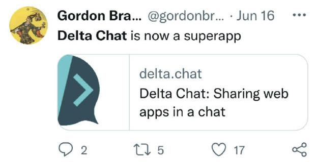
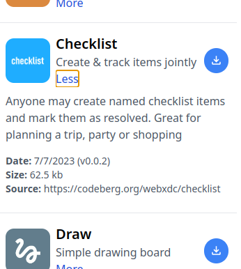

  
As [Gordon Brander](https://mastodon.social/@gordon) already stated -
with [Private Apps](help#webxdc),
Delta Chat is more than a messenger.
You can share Private Apps with any other Delta Chat user
and use them collaboratively;
for example to play chess
or to edit your household's shopping list.

<!-- toot: make fun of Musk's X-thing: while some billionaires are talking about everything-apps, we are delivering it: [xstore@testrun.org](mailto:xstore@testrun.org) -->

Now there is also an easy place to get private apps.
We just launched [xstore@testrun.org](mailto:xstore@testrun.org),
an appstore after the example
of the popular Open Source [F-Droid store](https://f-droid.org/).

## How can I download apps from xstore?

You can **scan this QR code with Delta Chat**
([*do you need a test account?*](#tryout))
to message [xstore@testrun.org](mailto:xstore@testrun.org)
and try out the store:

After scanning the QR code,
a chat with [xstore@testrun.org](mailto:xstore@testrun.org) will open.
It's the chat bot
which manages the store:

The bot will send you the store.xdc,
the private app for the store.
**Just click on "Start..."**
to see a list of private apps you can download:

With one tap you can download them,
and with another tap,
share them to any chat.
If you want to use it on your own,
just share it to your "Saved Messages" chat.

### I don't have a Delta Chat account yet, how can I play with this?  {#tryout}

To try out xstore,
you need a configured Delta Chat app.
After installing Delta Chat,
just scan this invitation code
during setup
to obtain a limited test e-mail account
and start to play:

## How does xstore work?

Usually,
private apps can not access the Internet.
That's what makes them private.
So if you share the store.xdc to another chat,
it will not work there.
Only because
[xstore@testrun.org](mailto:xstore@testrun.org)
is a chat bot which gets told by the store.xdc
which app you want to download,
it can download the app from the Internet
and send it to you in the chat.

If you deleted the store or
chose "clear chat" to clean up,
you can at any point in time just send "hi"
to [xstore@testrun.org](mailto:xstore@testrun.org) again,
and it will re-send the store to the chat.

**Note:**
if your version of Delta Chat is older than 1.38,
the store.xdc will not work properly;
you can not share downloaded private apps to a chat then.
[Just upgrade your Delta Chat app](download)
to make it work.

**And another note:**
if you use the XMPP messenger cheogram,
xstore will not work for you yet;
but with upcoming support for webxdc in XMPP/e-mail bridges
you might be able to message [xstore@testrun.org](mailto:xstore@testrun.org)
and download apps from there.

## Do I have to use the official xstore?

Of course not.
You can always share a private app from one chat to another;
without copyright protection,
without DRM,
without barriers.
Any private app is just a .xdc file
saved as an e-mail attachment.

Additionally to that,
you can also self-host the bot
we use to offer xstore.
You can find installation instructions
[in the bot's codeberg repository](https://codeberg.org/webxdc/store/#setting-up-the-bot).
It works best together with [xdcget](https://codeberg.org/webxdc/xdcget/),
a command line tool
which downloads private apps
from git repositories.

## How can I submit my own private app to xstore?

So far,
we already have more than 20 private apps in xstore.
The number is growing fast,
because it's so easy to adjust any web app
so it works as a private app in Delta Chat.

To get started with development,
you can learn more about webxdc apps on [webxdc.org](https://webxdc.org)
(`webxdc` is the technical term for Private Apps).
You can also take other private apps as an example;
in xstore you can find links to any app's source code
by clicking on "More":

If you want to make your own private app available,
just go on [codeberg.org](https://codeberg.org/webxdc/xdcget)
(a github alternative)
And open a pull request to our xdcget config file,
like [in this example](https://codeberg.org/webxdc/xdcget/pulls/50).
It's works basically like in F-Droid,
just with much less complexity.

We are looking forward to your contributions,
and hope you have fun with private apps in Delta Chat!

