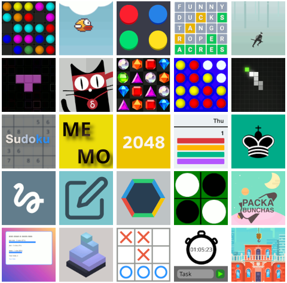
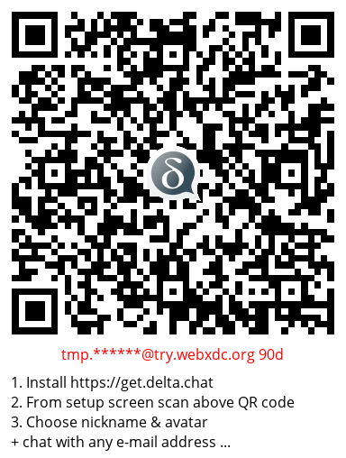

  
Others are hand-wavingly chattering about so called "super-app" or "everything app" architectures, 
but we prefer to just [deliver](2022-06-14-webxdcintro)
and [improve](2023-06-28-webxdc-import-export) them.
Today, we are happy to announce a new way to **find and start** 
[webxdc "everything" apps](https://webxdc.org), among them: 

- A Wordle/Reactle clone, 2048, and other fun games,

- calendar, poll and checklist tools,

- a first editor app – think Cryptpad but without servers. 

[Rest-assured](2023-05-22-webxdc-security), 
nobody else than your chat partners will know 
that you are running an app together.
There is no server or app-specific hosting and
not even the app developer or the xstore bot can track what you do. 
All app interactions are automatically **end-to-encrypted
and offline-first**: they all safely work in bad or no-network situations. 
Read below how to try it out,
with or without Delta Chat,
with or without chat partners and also about
how to submit your own webxdc app and 
and how the whole thing works.

## How to start

  
With Delta Chat already working it's dead simple to **start**:

1. Say "hi" to [xstore@testrun.org](mailto:xstore@testrun.org)
   and hit **Start** on the returned webxdc store app. 

2. Select a game or collaborative app for download.

3. Share the downloaded app to a chat so that all members 
   can **Start** the app without any logins, cookie or GDPR screens.

⚠️  Note that if your version of Delta Chat is older than 1.38,
the store app will not work properly;
you can not share downloaded webxdc apps to a chat then.
[Please upgrade your Delta Chat app, especially on Desktop](download). 

### I don't have any Delta chat partners yet, can i still play? 

You can test webxdc apps also just for yourself, without any chat group. 
Share the store apps with your "Saved Messages" chat to play
the occassional game without any ads or tracking. 
Or maybe also try the "add second device" feature 
to make the account work on both your mobile and desktop devices. 
A multi-device Delta Chat setup provides a 
cheap method of safely syncing notes, 
checklists or calendars between your devices
without any additional servers or accounts.

### I don't have Delta Chat yet, how can I play with this?  {#tryout}

First, visit [get.delta.chat](https://get.delta.chat)
to install from several stores and download locations. 

Second, start Delta Chat and configure an account in the setup screen: 

- Configure a Delta Chat account using a pre-existing e-mail address
  and password. 
  Note: Nobody will see your credentials except your e-mail provider. 

- On Mobile you may [tap this test account creation link](DCACCOUNT:https://mailadm.try.webxdc.org/?t=90d_f7v5c5xrtntpkqe&n=try90d) 
  in the browser which should open the Delta Chat app and offer to set
  an avatar and displayname for a new (randomized) e-mail address. 

- On all platforms you may also hit "Scan Invitation Code" 
  and hold the camera over the following QR code link;
  on Desktop you can under "more options" also load the QR image from a file.

The test e-mail account will only exist 90 days
and it does not allow to send chat mails to most "outside" e-mail addresses. 

## How can I submit my own webxdc app to xstore?

It is easy to adjust or write web apps
so they work as webxdc apps in Delta Chat.
And by exchanging updates between different Delta Chat users,
you can make them collaborative.

To get started with development,
take a look [at the docs](https://docs.webxdc.org/).
You can also take other webxdc apps as an example;
in xstore you can find links to any app's source code
by clicking on "More":

If you want to make a new webxdc app available in xstore,
onboard with [codeberg.org](https://codeberg.org/webxdc/xdcget)
(a github alternative)
to open a pull request to our xdcget config file,
like [in this example](https://codeberg.org/webxdc/xdcget/pulls/50).
Note that you don't need to have your app git-hosted on Codeberg.
It's works basically like in F-Droid,
but with less complexity 
and for all common mobile and desktop platforms. 

### Bounties for the next 23 app submissions 🎉 

  

If you submit an webxdc app and it gets included,
we'd be happy to send you "delta chat" and "webxdc" stickers by postal mail.
Also, if you need help or need some e-mail test accounts (also unrestricted ones)
you may contact us on the [webxdc support forum](https://support.delta.chat/c/webxdc/20)
or [through other channels](contribute).

It's fine to just port existing apps 
but please make sure they behave well on both mobile and desktop platforms. 
Maybe checkout the evolving [webxdc-dev](https://github.com/webxdc/webxdc-dev) 
npm-installable tool to test your app with multiple devices. 

We are looking forward to your contributions,
and hope you join the fun with webxdc apps :)

## How does xstore work? Where does it get its apps from? 

  
[xstore@testrun.org](mailto:xstore@testrun.org) is a chat bot instance.
After you send “Hi” to the bot,
you receive and start the store app,
which continues to communicate with the bot
for selecting and downloading apps.
You can not share the store app
to another chat.
That’s because
webxdc apps can not access the Internet,
the store app needs the bot to download apps.

If it was a normal website from a platform,
you could say
the store app is the frontend,
the store bot is the backend.

The xstore chat bot
collects webxdc apps from a list of “git” repository sources
and will continously offer the latest released app versions.
You can also self-host the store bot:
checkout installation instructions
in the [bot’s codeberg repository](https://codeberg.org/webxdc/store/).
It works well together with [xdcget](https://codeberg.org/webxdc/xdcget/),
a command line tool
which downloads webxdc releases
from git public repositories. 

### Important Notes:

- If you deleted the store or
  chose "clear chat" to clean up,
  you can at any point in time just send "hi"
  to [xstore@testrun.org](mailto:xstore@testrun.org) again,
  and it will re-send the store to the chat.
- Only one chat member needs to use xstore@testrun.org while
all others can just start the app they receive in the chat, 
and everyone can forward apps to other chats without restrictions,
and without any kind of central tracking. 
- If you use the XMPP messenger cheogram,
  xstore will not work for you yet;
  but with upcoming support for webxdc in XMPP/e-mail bridges
  you might be able to message [xstore@testrun.org](mailto:xstore@testrun.org)
  and download apps from there.

### November 2023 Update

We're also experimenting with a [web version](https://webxdc.org/apps) populated with the same dataset as our xstore: simply download the `.xdc` file and drop it in a chat.

## Thanks to NLNET and NGI for their support and vision!

  
Most of our efforts described above became possible
through the support
of the [NGI0 Entrust Fund](https://nlnet.nl/entrust),
established by [NLnet](https://nlnet.nl/)
with financial support
from the European Commission's [Next Generation Internet](https://ngi.eu/) programme.
Thanks a lot!

