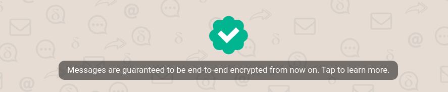

Our rolling 1.42 Delta Chat app releases introduce 
**guaranteed end-to-end encryption,**
a major security milestone that took many hundreds of hours 
of challenging work from core Delta Chat teams, experts and collaborators.
Friends from activist circles, users and operators of security-related helplines,
as well as [TeamUSEC](https://teamusec.de) 
all helped us to streamline usability and implementation issues 
for guaranteed end-to-end encryption. 

We'll first recall two main shortcomings of the [Autocrypt](https://autocrypt.org)
end-to-end encryption that Delta Chat is using
before describing how 1.42 apps overcome these issues
through the universal introduction and refinement
of the decentralized [SecureJoin](https://securejoin.delta.chat) protocols,
introducing the notion of guaranteed end-to-end encryption
which can not be broken by servers or Internet providers. 

Oh, and if you don't care much about encryption, 
just [scroll down to the "other good news" part](#a-lot-of-other-good-news-with-142)
which may have some exciting news depending on platform for you ;) 

## Autocrypt: convenient but "opportunistic" E2E security 

There are two frequent criticisms of Delta Chat's [Autocrypt](https://autocrypt.org) 
end-to-end encryption and its *opportunistic* nature: 

- [MITM attack](https://en.wikipedia.org/wiki/Man-in-the-middle_attack): 
  User's e-mail servers might try to meddle with the message encryption of their users. 
  Autocrypt Level 1 explicitly does not protect against internet providers or e-mail
  providers to start MITM attacks against their users. 
  Compromised infrastructure is arguably a stronger concern 
  for Delta Chat than Signal or Whatsapp users.
  After all, there is a not a single central 
  but many hundreds of different e-mail providers used with Delta Chat today,
  many of which are operating in surveillance oriented environments
  or are otherwise exposed to capable adversaries. 

- **Surprises because of unencrypted messages**: 
  Users can encounter an irritating lack of end-to-end encryption 
  when they send a first message or 
  if their chat partners don't consistently use Autocrypt-capable apps.
  They would send an un-encrypted message and only notice it after they sent a message. 
  In practise, this is less of a problem than many experts think 
  but it still is a valid concern. 

Both issues are addressed with the currently rolling out 1.42 Delta Chat app releases
as "Guaranteed end-to-end encryption" prevents messages 
from unexpectedly dropping end-to-end encryption,
and protects against compromised servers or networks. 
While Delta Chat already offered "verified groups" for years, 
we extended end-to-end encryption guarantees to 1:1 chats
and unified group creation along the way:
when you create a group with only green-checkmarked contacts,
your group chat will automatically get a green-checkmark 
and introduce guaranteed end-to-end encryption for all chat-members. 

## Guaranteed end-to-end encryption

Chats marked with a **green checkmark** guarantee end-to-end encryption:
You will only send and receive end-to-end encrypted messages
that can not be read or modified by hostile e-mail servers or networks.

To start a guaranteed end-to-end encrypted 1:1 chat,
you scan another user's "QR Invite code" 
which starts the automatic [SecureJoin protocol](https://securejoin.delta.chat)
resulting in a safely end-to-end encrypted chat and a green-checkmarked contact. 

If you create a group that only has green-checkmarked contacts
then this group will use guaranteed end-to-end encryption
that never degrades and can not be broken by e-mail providers or network attackers. 
Moreover, all members use guaranteed end-to-end encrypted chats with each other,
and they can add each other to more and different green checkmarked group chats. 
**Guaranteed end-to-end encryption spreads automatically and in a decentralized way.**

  

Please read more in our [revised Encryption and Security FAQ](https://delta.chat/en/help#encryption-and-security) 
which is also contained and shipped with all Delta Chat apps,
and also discusses security-relevant topics such as OpenPGP security, 
Metadata protection and ephemeral messaging. 

If you are helping others to use Delta Chat please read the FAQ entry on
[when guaranteed end-to-end encryption breaks](https://delta.chat/en/help#nocryptanymore).
The most common cause for encryption degradation is not an attack, 
but that a user re-installed the app, 
or installed it on another device without using the QR-code based multi-device setup flow.
The FAQ gives clear advise on how to proceed. 
For future releases, we'll aim to automatically prevent users 
from ending in such inconsistent multi-device setup states. 

Lastly, for folks interested in security protocols, 
you may read a lot more technical and scientific background on our 
[new SecureJoin protocols documentation site](https://securejoin.delta.chat)
which also serves to prepare an independent security audit scheduled for 2024. 

## A lot of other good news with 1.42

The 1.42 releases contain many other improvements, among them:

- 🔄 Accept/Blocked, Archived, Pinned, Mute actions are now synced across all your devices,

- 🗜️ Images are now compressed also on Desktop (unless you send them as files), 

- 🖼️ Global Gallery with your pictures, documents, media across all chats,
  now also on Desktop 

- ❤️  Reactions can be enabled in Android advanced settings 

- 🐞 Bug fixes, bug fixes and more bug fixes (all dev areas got many issues
  resolved ) -- Android went from a dozen PRs 
  and roughly [50 issues to 5!](https://github.com/deltachat/deltachat-android/issues)

For complete lists of changes see: 

- [Desktop changes](https://github.com/deltachat/deltachat-desktop/blob/master/CHANGELOG.md) 
- [Android changes](https://github.com/deltachat/deltachat-android/blob/master/CHANGELOG.md) 
- [iOS changes](https://github.com/deltachat/deltachat-ios/blob/master/CHANGELOG.md) 
- [Core Rust changes](https://github.com/deltachat/deltachat-core-rust/blob/main/CHANGELOG.md) 

On some stores, the 1.42 app releases might still take a while. 
For Desktop, the "1.41" releases on the Microsoft store are fine to use. 
We typically use even release numbers for store-releases 
and uneven ones for the many intermediate ones. 
Special thanks 💜 to Gerry, Andrea and the many other testers and
community contributors for bug hunting, triaging, discussing and helping
developers to understand and address issues. 

Please report any further bugs or issues to [the forum](https://support.delta.chat) 
or on our [core Rust issue tracker](https://github.com/deltachat/deltachat-core-rust/issues).
