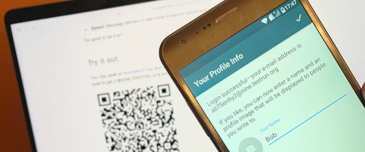

Today, we are unveiling **chatmail services**,
making onboarding with Delta Chat a breeze, with peace of mind:


- **Convenience**: Get a chatmail address in a few seconds 

- **Privacy**: No questions asked, no name, numbers or e-mail 

- **Speed**: Message delivery in well under a second, end-to-end

Too good to be true? 

## Try it out 

You may peek at [nine.testrun.org](https://nine.testrun.org),
and after installation of a Delta Chat app, 
simply tap or scan the below QR code to get a `@nine.testrun.org` address

<a href="DCACCOUNT:https://nine.testrun.org/cgi-bin/newemail.py">
    </a>

After setting your avatar and name, 
message `echo@nine.testrun.org` and observe a (rapid) reply. 



Please let us know about success and especially failure 
to help us streamline nine.testrun.org, 
the first public chatmail service 
which we aim to keep running as a community service.


## How to make e-mail spammers sad, and users safe 


`nine.testrun.org` currently allows to send 60 messages per minute for any user
and you can register multiple e-mail addresses.
Isn't this paradise for abusers wanting to send out lots of unsolicited messages? 
Wouldn't this get chatmail services insta-blocked from other e-mail providers? 

Fortunately, there is a simple twist to prevent account abuse: 
**A chatmail service doesn't allow to send un-encrypted messages 
to anyone outside the service.**
This makes spammers sad who would try to abuse open-signup chatmail addresses
because they first would need to setup OpenPGP encryption with all recipients,
a known hard problem and thus a substantial proof of work, no? :) 

  

More seriously, 
Delta Chat uses the decentralized [Autocrypt](https://autocrypt.org) standard
which does not publish or centralize encryption keys anywhere.
Moreover, today's *Internet platforms track everything except OpenPGP keys*
and so can only sell or leak to spammers profiled e-mail addresses but not encryption keys.
It's therefore a massive uphill struggle and economically un-interesting 
to abuse chatmail accounts for mass-sending unsolicited mail. 

For when this economic constraint changes, 
we may have some aces up our sleeves 
to make spammers and surveillance actors even more unhappy. 
But more about that when the time comes. 

## Use guaranteed end-to-end encryption to reach any e-mail address 

  

We generally recommend to use QR-code scans to setup 
[guaranteed end-to-end encryption](https://delta.chat/en/2023-11-23-jumbo-42) 
with other chatmail or e-mail users. 
This way, you can safely chat 
no matter what chatmail or e-mail server contacts use. 
**Setting up guaranteed end-to-end encryption minimizes the trust 
you need to have in chatmail or traditional e-mail server operators.**
Chatmail operators generally can't read the content of messages
and by design hardly know any personally identifiable data.

Chatmail services really act more as an *e-mail router* rather than an account platform. 
Anyone can get a slot but only end-to-end encrypted messages can freely travel. 


## Registering with newsletters or platforms, without privacy leaks

<a href="https://brettscott.substack.com/p/tech-doesnt-make-our-lives-easier">
  </a>

Delta Chat apps supports using multiple addresses out of the box. 
With [nine.testrun.org](https://nine.testrun.org) you can always setup
additional addresses to receive newsletters or register with websites.
Incoming messages are allowed to be un-encrypted
(this might become user-configurable in the future)
and so they are just fine for receiving e-mail messages. 

If you don't need or use an additional address anymore, 
simply delete it on your device.
We are happy to see you go and, who knows, 
maybe re-enter with a new e-mail address, possibly using Tor or a VPN?  
This way the chatmail-server never even sees your Internet address 
which is anyway only ephemerally logged and not collected. 
Speaking of not collecting data, 
please see [nine's state-of-the-art privacy policy](https://nine.testrun.org/privacy.html)
which was created by the data protection specialists and our long-term supporters
at [lexICT.de](https://lexict.de).  
One of the german classics on "Data protection at the work place" was btw
co-written by [Fabian Schmieder](https://www.lexict.de/fabian-schmieder-en.html),
our appointed privacy officer of all [testrun.org](https://testrun.org) mail services. 

## Nine.testrun.org and running chatmail services yourself 


Our just published [Chatmail repository](https://github.com/deltachat/chatmail) 
contains the executable blue-print for setting up a modern e-mail service,
of which [nine.testrun.org](https://nine.testrun.org) is the first public instance. 
It is operated by some Delta Chat project members, *on the side*. 
This mirrors how we envision chatmail services to be operated: 
by a small group or individuals
who don't need to worry much or spend a lot of time on the service,
but who enable reliable and secure chat communication for many thousands of users.
We haven't fully explored limits yet but `nine` has already served >100K accounts
and millions of messages before now going public. 
Day-to-day development of the [deltachat-core-rust library](https://github.com/deltachat/deltachat-core-rust) creates around 10 new `@nine.testrun.org` accounts per commit 
and there are many commits per day. 
In other words, availability and reliability of `nine.testrun.org` is continuously verified,
and it is maintained and refined through the public Chatmail repository. 

With some knowledge of DNS, SSH and a spare VPS (get the cheapest you can find),
you can setup and offer chatmail services yourself pretty quickly. 
A friend easily recently set it up on a Raspberry Pi for his housing project.
Chatmail servers are designed to run with minimal hardware requirements
and to be easy to tweak even from novice sysadmins or programmers. 
No permission is needed from our side to run a chatmail server. 
We might not even know you are doing it because Delta Chat has no tracking or counting. 

But we warmly welcome feedback (especially bug/success reports!) 
and contributions via the [Chatmail repository](https://github.com/deltachat/chatmail)
and also intend to do workshops and sessions at both the upcoming
[37c3 Chaos Communication Congress](https://events.ccc.de) end of the year in Hamburg,
as well around [OFFDEM](https://offdem.net/)/[FOSDEM](https://fosdem.org/) in Bruxelles beginning February 2024.

## Wait a moment, sub-second delivery? 

Yes, here are some benchmarks, run on a remote machine against `nine.testrun.org`,
with a network latency of 20-30ms per internet data packet: 

```
[nine.testrun.org]
benchmark name                 median    min    max
---------------------------------------------------
dc_autoconfig_and_idle_ready     1.17   1.14   1.18
dc_ping_pong                     0.46   0.43   1.05
dc_send_10_receive_10            2.22   1.77   2.22
```

`dc_ping_pong` measures two end-to-end encrypted device-to-device message deliveries. 
**One chat message is thus delivered end-to-end/device-to-device in a quarter of a second.**

<video style="max-width: 100%" autoplay="" muted="" loop="" playsinline="">
  <source src="../assets/blog/nine-echo.mp4" type="video/mp4">
</video>

If you don't believe that this screen-recording reflects the *actual speed* 
please verify it yourself, and scroll up to the beginning of the post :) 

Why are we not making a bolder fuzz about probably launching
the fastest e-mail service on the planet? 
The answer is twofold: 

- Discussing speed characteristics of Delta Chat and chat e-mail services
  deserves its own focused blog post. 
  It's an interesting story with some amusing surprises and bummers :)

- Many of us think that `speed` is overrated or, how the venerable 
  Brett Scott put it a few days ago, 
  [Tech doesn’t make our lives easier. It makes them faster](
  https://brettscott.substack.com/p/tech-doesnt-make-our-lives-easier). 

Yes, chatmail is blazing fast but that's not a purpose in itself. 
Making secure, interoperable, decentralized, guaranteed end-to-end encrypted 
communications available for all, is more important than sub-second delivery. 
It is not another business model that can replace Whatsapp/Meta,
at least not without becoming their mirror image. 
Only communities who sovereignly run their own infrastructures,
evading centralized control and dependencies, might free themselves. 

The e-mail network is a vast rhizomatic space which surrounds us already,
and is diversely deployed at planetary scale.
We hope many of you join the amusing journey in exploring it further :)
