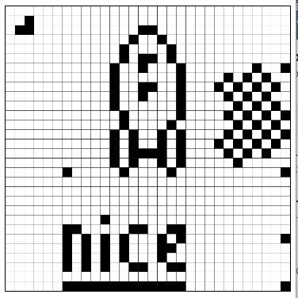
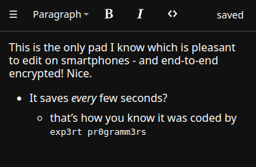
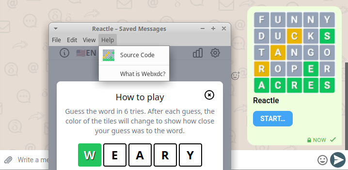

While blockchain projects hailed "decentralization" and "Web3" as a paradigm change,
spending billions of dollars and development hours in the last decade, 
they failed to create even a baseline specification for packaging and running P2P web apps
like the one [we started in 2022 with webxdc](https://delta.chat/en/2022-06-14-webxdc),
without any funding to begin with. 

[webxdc apps](https://webxdc.org/apps) are HTML5 app container files
which use the send/receive APIs provided by a supporting messenger.
Webxdc app development and deployment is fundamentally easier 
than developing for and maintaining 
an application-specific always-online HTTP server. 
But there are undeniably complications in arranging 
consistent web app state across user's devices, 
a typical issue for any Peer-to-Peer (P2P) networking system. 

The new [Shared Web Application State chapter](https://webxdc.org/docs/shared_state/index.html) 
walks you through theory and practise 
of so called "conflict-free replicated data types" (CRDTs). 
This new developer-focused chapter was mostly written by [ansuz](https://social.cryptography.dog/@ansuz)
also known for his lead development role at Cryptpad 
[for many years](https://blog.cryptpad.org/2022/12/29/stepping-down/). 
The confluence of E2EE and P2P expertise is less surprising if you consider
that any end-to-end encrypting application can not rely on 
a central authority to resolve conflicts and "tell the truth". 

## Pixel: minimal CRDT-implementation for collaborative pixel-drawing (2.8 KB)

Writing a webxdc app that offers a consistent user experience 
can be done in few code and without relying on any dependencies. 
The [Pixel](https://codeberg.org/webxdc/pixel) app allows 
to set and clear pixels for anyone in a chat,
and it resolves any concurrency conflicts by using "Lamport Clocks". 
It does that in 150 lines of plain Javascript code 
proving that CRDTs are fundamentally less complex than you might think. 

## A basic cross-platform Editor using Prosemirror and yJS (148KB)

In around 400 lines of Code, 
the [webxdc/editor](https://codeberg.org/webxdc/editor/src/branch/main/src) 
implements an end-to-end encrypting offline-first editor
that you can use in any chat group to jointly edit a document. 
The editor uses the [y-webxdc provider](https://www.npmjs.com/package/y-webxdc) 
which integrates webxdc's send/receive API with [yJS](https://yjs.dev/#features),
a leading Javascript implementation for Conflict-free-Replicable-Data-Types (CRDTs). 

## Checklist: Javascript app using automerge (98 KB) 

The widely used `checklist` app uses automerge, 
another leading CRDT implementation effort. 
Note that webxdc does not prescribe any particular framework 
or data types for how apps arrange a distributed consistent user experience. 

## More apps, all with "View Source" 

The new [webxdc.org/apps](https://webxdc.org/apps) page 
provides a straightforward search and download interface -- 
you may attach a downloaded file to a chat message, 
enabling chat-group members to run the app 
without them having to download anything themselves. 
A running app typically offers a "view source" option that directly
gets you to the development repository. Collaboration and improvements welcome!

## Longevity and hassle-free creation and use of webxdc apps 

Webxdc apps can be written once and require no accounting, registration or compliance work. 
They are [private by design and architecture](https://delta.chat/en/2023-05-22-webxdc-security) 
and thus require no GDPR policies or cookie consent. 
The first 2022 webxdc apps run unmodified on today's Delta Chat and Cheogram messengers,
as well as on any potential other messaging project 
adopting the straight forward [webxdc specification](https://webxdc.org/docs/spec/index.html). 

## Getting started developing your own app

The refined [development docs page](https://webxdc.org/docs) 
now begins with a "getting-started" page 
that allows to create and run your first web app within minutes. 
The [webxdc specification](https://webxdc.org/docs/spec/index.html)
now has table-of-content sections to ease discovery
but no worries, it's still a very small spec you can read in a quarter hour :) 

<video controls style="width:560px; max-width: 100%;"><source src="https://webxdc.org/assets/just-web-apps.mp4" type="video/mp4"><a href="https://www.youtube.com/watch?v=I1K4pBvb2pI">watch "just web apps" on youtube</a></video>

## Psst, interested to move P2P web apps forward with us? 

There are interesting webxdc developments evolving for 2024,
not the least because of crucial support from NLNET
who administers much of the EU's Next-Generation-Internet funds. 
While we generally do not pre-announce our release planning 
we already integrated [Iroh](https://github.com/n0-computer/iroh) for multi-device setup support
and have [evolving experimental branches](https://github.com/deltachat/deltachat-core-rust/pull/5041) 
to let webxdc apps use realtime P2P communication by means of [Iroh.network](https://iroh.network),
one of the most interesting Rust efforts to come out of the ashes of Web3. 

While Delta Chat developers co-evolve the webxdc spec and implementations,
they typically focus on releasing Delta Chat native messenger apps on all platforms and stores.
Developing webxdc apps themselves only happens on the "side". 
This is not meant to say anything against doing a little app on the side!
In fact, there is a carpenter by trade among us who freshly learned 
HTML and Javascript and already has three apps in the store :) 

However, more experience and focus on user-facing web apps,
including improving tooling and example apps, helping newcomers etc. 
would be very welcome and greatly help all evolving efforts. 
If you are interested, or know someone who might be interested, 
also in a paid contract, then please get in touch maybe 
[by submitting an app](https://codeberg.org/webxdc/xdcget/src/branch/main/SUBMIT.md) 
to indicate you are serious or playful -- ported casual games are also always welcome! :) 
