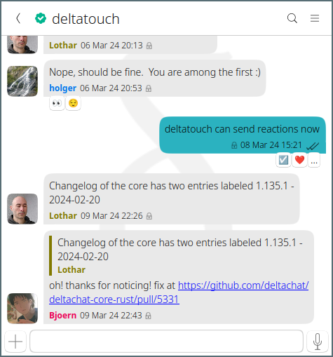

The 1.44 releases on all stores and platforms bring
several often-requested improvements.
We keep talking about each one only briefly because there are so many :) 

## Reactions ❤️  now supported on all platforms 

Android, Desktop, iOS and UbuntuTouch users can now send 
and display reactions on chat messages. 
Fun fact: we use the IETF [RFC9078](https://www.ietf.org/rfc/rfc9078.html) 
experimental standard for transmitting reactions in e-mail. 
See [Delta Chat standards](https://github.com/deltachat/deltachat-core-rust/blob/main/standards.md)
for a list of other interoperability specs we are tapping into. 

## Instant message delivery on Apple iOS devices

The new Delta Chat 1.44 iOS app features instant message delivery,
addressing the long-lasting usability issue of 
"I didn't see your message and had to open the app first!".
Note that instant message delivery is currently 
only available if you are using a chatmail address,
as provided by three independent entities currently: 
[nine.testrun.org](https://nine.testrun.org),
[mailchat.pl](https://mailchat.pl) or [mehl.cloud](https://mehl.cloud).
The new release also improves notification handling for non-chatmail addresses
but instant notifications are generally not available there. 

## New Desktop Multi-account sidebar

The Desktop apps on all platforms now have a sidebar
that shows and allows to select all your accounts,
and eases a direct overview of unread messages in any accounts. 
System notifications now work for all accounts and you can also mute less important accounts.
We also fixed many issues, including the Flathub release (which crashed when receiving messages).

## Invite links for getting in contact 

You can now send invite links via any other messenger 
or social media DM channel. 
To create an invite link go to the "QR code" icon 
and tap "share" to a link you can send via other messengers
or other private channels.
If a receiver taps on your invite link Delta chat will automatically activate
and offer to accept the invite and establish 
a [guaranteed end-to-end encrypted chat](https://delta.chat/en/2023-11-23-jumbo-42). 
Of course, you can still use the regular show/scan QR code option
if you are standing next to each other. 

## Privacy preserving statistics on Android 

Android allows to send statistics to developers in order to ensure
we weed out and prevent unneccessary "failed to decrypt" style messages. 
We want guaranteed end-to-end encryption to reliably work 
and not cause any troubles also with multi-device usage. 
Please help by going to "Advanced Settings" and then 
"Send statistics to Delta Chat's developers".
Statistics are generated as a text message which you may review and send yourself 
to the [collection bot](https://github.com/deltachat/self_reporting_bot/blob/main/self_reporting_bot.py) using guaranteed end-to-end encryption. 
No personally identifable data is kept because 
the collection bot removes the statistics message 
and thereby the relation to your e-mail address. 

## Ubuntu Touch also supports reactions and uses latest Rust core library

[Delta Touch](https://delta.chat/en/2023-07-02-deltatouch) also introduced 
reactions and uses the latest [Delta Chat core](https://github.com/deltachat/deltachat-core-rust/) that underlies the networking, encryption, contact and chat management 
of all Delta Chat apps. 

# Other useful improvements with 1.44 
 
- Delta Android now signals how many unread messages are in other accounts 

- Better and localized error messages if you try to send un-encrypted
  messages from a chatmail address that only allows outgoing mails in
  encrypted form

- Improved Desktop "settings" dialog and many other Desktop and iOS UI refinements 

- Creating contacts and changing your avatar now syncs to all your devices. 

- Many bug fixes 

For complete lists of changes see: 

- [Desktop changes](https://github.com/deltachat/deltachat-desktop/blob/master/CHANGELOG.md) 
- [Android changes](https://github.com/deltachat/deltachat-android/blob/master/CHANGELOG.md) 
- [iOS changes](https://github.com/deltachat/deltachat-ios/blob/master/CHANGELOG.md) 
- [Core Rust changes](https://github.com/deltachat/deltachat-core-rust/blob/main/CHANGELOG.md) 
- [Ubuntu Touch changes](https://codeberg.org/lk108/deltatouch/src/branch/main/CHANGELOG)

Please report any further bugs or issues to [the forum](https://support.delta.chat) 
or on our [core Rust issue tracker](https://github.com/deltachat/deltachat-core-rust/issues).
