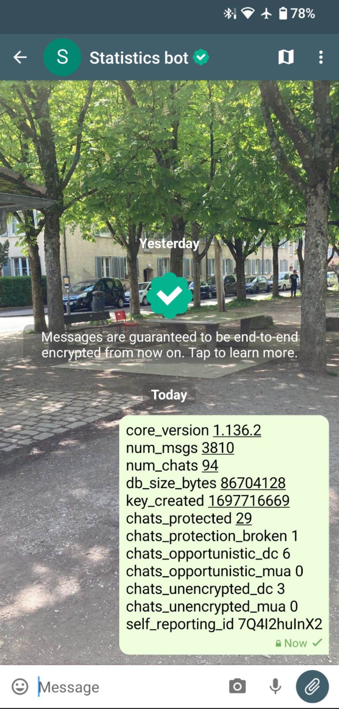

Delivery time!
The rolling Delta Chat 1.44 releases 
bring four often requested usability improvements.
Visit [get.delta.chat](https://get.delta.chat) 
to onboard and invite anyone, instantly and securely, 
and without them needing an e-mail address or a phone number first. 
Some claim no other messenger suite today is as easy to onboard and use. 
True or not? In any case, we are already busy with preparing 
next usability improvements to avoid any doubts :) 

## Reactions now supported on all platforms 

Android, Desktop, iOS and UbuntuTouch users can now send 
and display reactions on chat messages. 
Fun fact: we use the IETF [RFC9078](https://www.ietf.org/rfc/rfc9078.html) 
experimental standard for transmitting reactions in e-mail. 
See [Delta Chat standards](https://github.com/deltachat/deltachat-core-rust/blob/main/standards.md)
for a list of other interoperability specs we are tapping into. 

## Instant message delivery on Apple iOS devices

The new Delta Chat 1.44 iOS app features instant message delivery,
addressing the long-lasting usability issue of 
"Damn it, I didn't see your message, only after opening the app first!".
Note that instant message delivery is currently 
only available if you are using a [chatmail](../en/2023-12-13-chatmail) address,
available from three independent entities currently: 
[nine.testrun.org](https://nine.testrun.org),
[mailchat.pl](https://mailchat.pl) or [mehl.cloud](https://mehl.cloud).

## New Desktop Multi-account sidebar 

Desktop apps on all platforms now have a sidebar
that shows and allows to select your accounts directly,
and gives a direct overview of unread messages in all accounts. 
System notifications now work for all accounts and you may mute some accounts.
For friends of Flathub releases: we fixed the annoying "crashing on notification" issue :) 

## Sharing invite links for chats and chat groups

You can now send invite links to establish secure contact with anyone. 
Go to the "QR code" icon on the main screen and tap "share" to send an invite link 
through any other 3rd party messaging channel.
Or go to a chat group profile, tap the "QR invite" option and then "share" the link.
If a receiver taps on your invite link they will be guided into joining 
a [guaranteed end-to-end encrypted chat](../en/2023-11-23-jumbo-42).

## Privacy preserving statistics on Android 

Android allows to send statistics to help Delta Chat developers 
make guaranteed end-to-end encryption a 100% reliable and secure experience, 
across all your devices. 
You may help by going to "Advanced Settings" and 
"Send statistics to Delta Chat's developers"
which generates a text message that you can tap to send 
to the [collection bot](https://github.com/deltachat/self_reporting_bot/blob/main/self_reporting_bot.py), of course with guaranteed end-to-end encryption.
Rest assured, no personally identifiable data is collected as
the collection bot immediately detaches the report from your sender address
and sends you a "Thanks" message. 

## Ubuntu Touch also supports reactions and uses latest Rust core library

[Delta Touch](../en/2023-07-02-deltatouch) also introduced
reactions and uses the latest [Delta Chat core](https://github.com/deltachat/deltachat-core-rust/) that underlies the networking, encryption, contact and chat management 
of all Delta Chat apps. 

# Other useful improvements with 1.44 
 
- Delta Android now signals how many unread messages are in other accounts 

- Better and localized error messages if you try to send un-encrypted
  messages from a chatmail address that only allows outgoing mails in
  encrypted form

- Improved Desktop "settings" dialog and many other Desktop and iOS UI refinements 

- Creating contacts and changing your avatar now syncs to all your devices. 

- Many bug fixes 

For complete lists of changes see: 

- [Desktop changes](https://github.com/deltachat/deltachat-desktop/blob/master/CHANGELOG.md) 
- [Android changes](https://github.com/deltachat/deltachat-android/blob/main/CHANGELOG.md)
- [iOS changes](https://github.com/deltachat/deltachat-ios/blob/main/CHANGELOG.md)
- [Core Rust changes](https://github.com/deltachat/deltachat-core-rust/blob/main/CHANGELOG.md) 
- [Ubuntu Touch changes](https://codeberg.org/lk108/deltatouch/src/branch/main/CHANGELOG)

Please report any further bugs or issues to [the forum](https://support.delta.chat) 
or on our [core Rust issue tracker](https://github.com/deltachat/deltachat-core-rust/issues).
