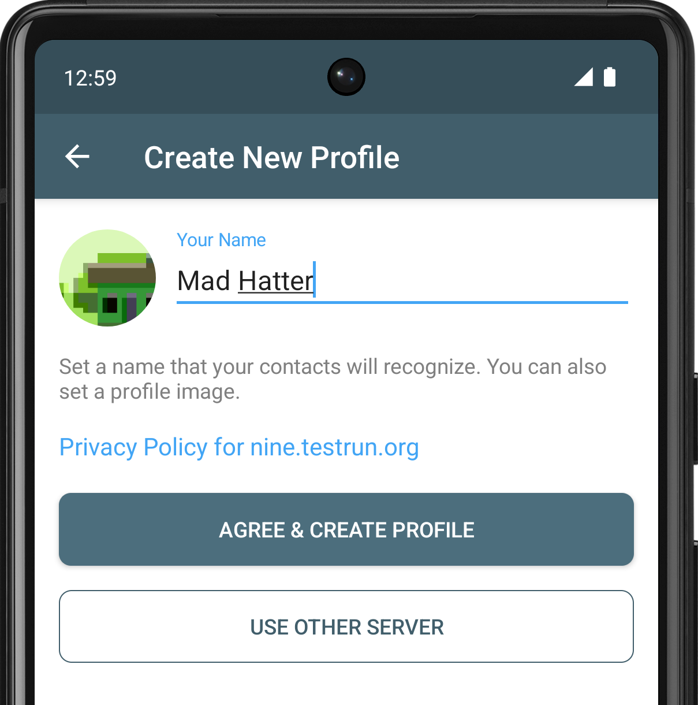
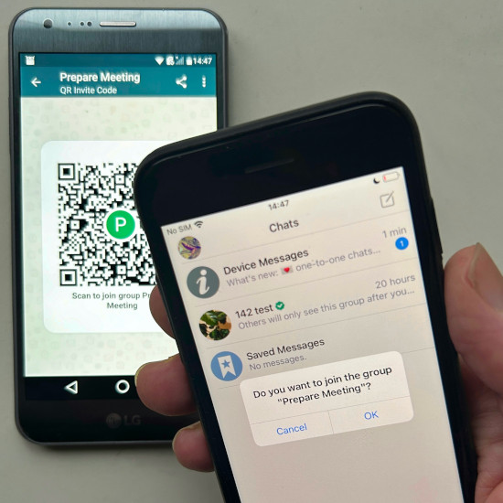
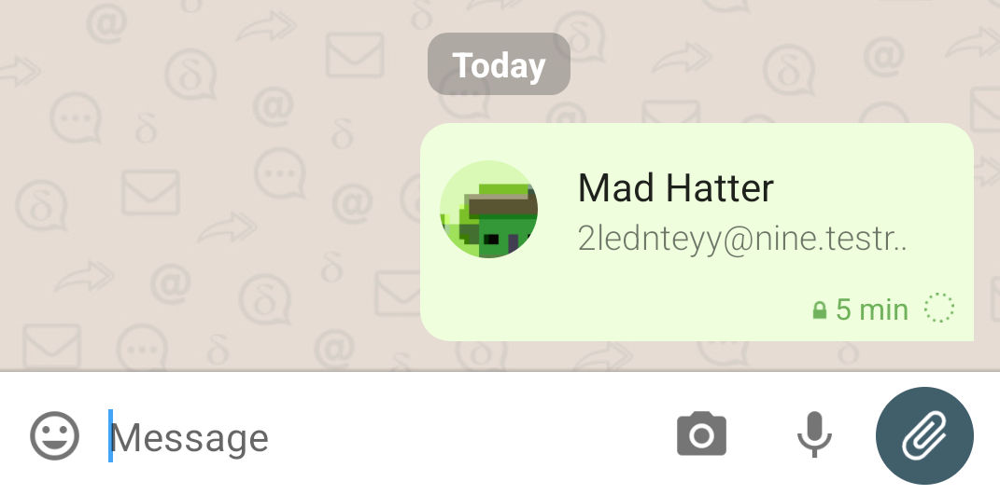

Big milestone in our 6+ years long project history: 
With the rolling 1.46 app releases you can start chatting without a pre-existing e-mail address. 
Just provide a name and then tap "Agree and continue" 
to create a chat profile using the [default chatmail server](https://nine.testrun.org/privacy.html). 
Or visit other [chatmail servers](../chatmail) and tap the invite on their home page. 

Great, a new chat profile in a few seconds, but what now? 

Getting in contact with others is indeed a fundamental problem for any non-mainstream messenger.
In the next two sections we suggest how to get in contact with some bots and humans,
before highlighting more news about the 1.46 release series,
and providing some of our thinking around the UX and UI direction of Delta Chat
and chatmail servers. 

## Getting in contact with chat bots and the experimental "DeltaFans" community

Once Delta Chat is installed, you may contact "chat bots", i.e. little helper programs 
that offer an automated conversational chat interface for Delta Chat users: 

- To verify things work, send a message to 
  [echo@nine.testrun.org bot](https://i.delta.chat/#66B77A4C5F57A670D6E86C0767F00812105D9374&a=echo%40nine.testrun.org&n=&i=m6rDyxHRShX&s=Ta7TL-JufhZ) and observe the reply arriving quickly. 

- Checkout [a "Public Bots" index](https://i.delta.chat/#9AF055DB87EC48A1C009B6CA55E3712A6F7D346F&a=botsindex%40nine.testrun.org&n=Public%20Bots&i=QpBSronexvP&s=nAfQ0q_JomN) 
  to receive a little web app to view and start interacting with a selection of bots. 
  Rest assured, no ChatGPT inside ;) 

- If you feel more adventurous you may contact [Delta
  Fans](https://i.delta.chat/#B9311CB912B04BBD2977327C53FAAF34FDAAADF4&a=deltafans%40nine.testrun.org&n=DeltaFans&i=s-x3ZriWiET&s=qebTBni-pbN), an highly-experimental "community" chat profile 
  which was recently [publically shared on the fediverse](https://mastodon.social/@adbenitez/112355770657658005) and lives on many people's devices. 

## Getting in contact with human fellows 

When using default sign-up with [chatmail servers](/chatmail) 
you can only send out end-to-end encrypted messages. 
You can setup [guaranteed end-to-end encrypted chats](https://delta.chat/en/2024-03-25-crypto-analysis-securejoin) by 

- adding a new contact through a QR code scan, or 

- sharing your own contact info as an "invite link" 
  that any receiver who has installed Delta Chat 
  can tap to start a chat with you, or 

- sharing a "group chat invite" 
  that any receiver who has installed Delta Chat 
  can tap to join the group, or

- being added to a secure group chat 
  which will allow you to message any group member. 

 

Note that setting up secure chats works just fine in mesh networks in the Amazon Rain Forest 
or in regions that are cut off from the wider Internet. 
No central key server or other global infrastructure is required. 

## New: Introduce a contact to chat partners 

With the 1.46 releases you can now "attach" a contact to a chat message, 
and any receiver can tap it to start chatting with the attached contact. 
The contact attachment has the [vcard format](https://www.rfc-editor.org/rfc/rfc6350)
and contains your name, avatar, e-mail address and encryption information 
so that the initial message can be end-to-end encrypted to the contact,
allowing it to travel to other chatmail and e-mail servers safely. 

## New: Instant push notifications for Android 

Instant message delivery through push notifications is not only 
available for iOS but now also for Android devices,
without giving Google and Apple any access to user data. 
Check out [our new push notifications FAQ section](https://delta.chat/help#instant-delivery) for more details. 

## Chat profiles: on your device and in your hand 

Delta Chat does not store or keep data at e-mail servers 
but only uses them for ephemeral message transport. 
When first onboarding with Delta Chat you'll create a "Chat profile"
which initially consists of your chosen name and avatar,
and an automatically generated encryption-setup, e-mail address and password. 
If you tap "use other server" and "manual login" 
you can manually specify an existing e-mail address and password. 

Over time, your chat profile accumulates 
contacts, chat groups, messages and media files. 
You can transfer or duplicate your chat profile to another device,
either by a QR code scan or by exporting it to a file 
and then importing and using it on any other device. 
Chat profiles are literally "in your hand" and stored on your device(s). 
No chat profile data is stored on any server,
also not in encrypted or PIN-protected form. 
Chat profiles use servers only for end-to-end encrypted message transport. 

## Are we turning our back on classic e-mail? 

No. 

Firstly, chatmail servers are fully interoperable e-mail servers, 
but they do away with spam-checking and unneccessary rate-limits,
allow anonymous sign-up without requiring any private data,
and are faster and more efficient than classic e-mail servers. 

Secondly, chatmail servers run the popular [postfix](https://postfix.org) 
and [dovecot](https://dovecot.org) server software in a minimal configuration,
with small tweaks for optimized onboarding, speed and security. 
Both systems are proven Free and Open Source software 
used by tens of thousands of e-mail providers for billions of messages per day. 

Thirdly, you can still use your existing e-mail address and
there are many [providers](https://providers.delta.chat) 
with which Delta Chat works well,
apart from the lack of push notification support. 

Lastly, while Delta Chat aims to offer easier onboarding than Whatsapp, Signal or Telegram 
you can also use and regard it as an e-mail app. 
All Delta Chat apps offer multi-profile support 
which means you can have a profile for instant chat messaging 
*and* another profile with a pre-existing e-mail address for classic e-mail purposes. 

## Are we de-emphasizing e-mail addresses in the user interface? 

Yes. 

We aim to make Delta Chat more approachable for the many folks 
who do not care about or are even critical of "e-mail". 
With some likelyness that's not you because you are reading this post here :) 
But you probably know people who don't rejoice when hearing "e-mail"
but who might appreciate that Delta Chat 

- provides a convenient and reliable messaging experience,

- does not require a phone number or any other personal data, 

- offers privacy, censorship resistance and free choice of server,

- offers in-chat games like 2048, chess or hextris,
  and in-chat tools like an editor, a calendar and a checklist. 

In light of all these features, we prefer to not require 
would-be-users first to understand what "e-mail" has to do with anything. 
As a 20-year old woman once fed back "E-mail? Isn't e-mail just there for spam and work?"
E-mail in the form of chatmail is so much more than that 
but we still think it's good to let 
e-mail addresses recede into the background of Delta Chat 
just like phone numbers typically recede into the background of classic phone-based messengers. 

## Chatmail makes e-mail cheap again 

With our new chatmail-based instant onboarding system, 
e-mail addresses are becoming, like in the early 2000s, cheap and virtually free. 
But this time around, there is no company posturing to "do no evil" 
luring everyone to their central "ethical" service and then drop the pretense soon after. 
[Running a chatmail server](https://delta.chat/en/2023-12-13-chatmail) is a cheap activity 
that we want people to be able to do on the side 
and on low-end hardware all across the world. 
Chatmail is best described as an ephemeral end-to-end encrypted 
messaging routing system running at Internet-scale. 

## Internet standards FTW or: e-mail strikes back!

How often have you heard "E-mail is dead" or 
"here is this brand new thing to replace e-mail" 
from marketing pushes throughout the last two decades? 
How often have you heart "The Web is dead and replaced by mobile apps"
only to find most mobile apps being a thinly veiled web view, anyway? 

By contrast, Delta Chat fully embraces both E-mail and Web standards 
to avoid the pitfalls and failures of past and present 
"inventing a new standard to replace e-mail / the Web" efforts.
Our new "Instant onboarding" relies on chatmail servers that operate
as part of the existing massively distributed e-mail network
to provide a fast and secure basis for decentralized instant messaging. 

In other words, 
Delta Chat is the only messenger that fundamentally heeds the warning of XKCD 927 :) 

<figure> <a href="https://xkcd.com/927/"><figcaption>XKCD 927</figcaption> </a></figure>

