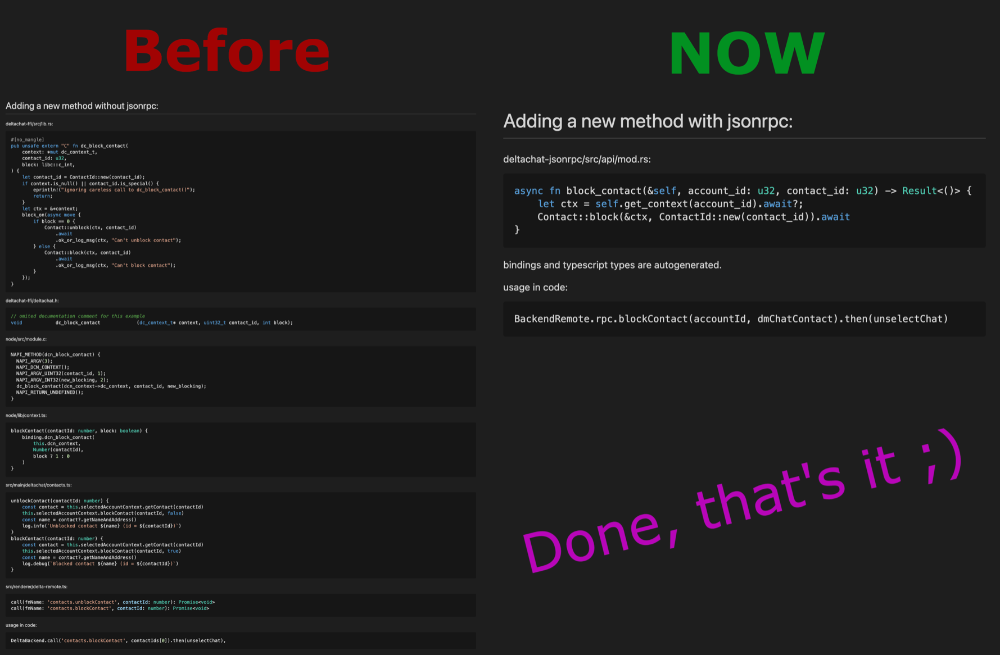

> Foremost this is a quite technical post, read our other blog posts if you want to read something more targeted at end users.

If you have not yet looked at the Delta Chat source code, you might not know yet that we have a core library that is used by all UI implementations.
This means the core features like encryption, email protocols, chat and message management are using the same code on in all our apps (desktop, Android, iOS).
This has the following benefits:

- Because our Core library does all the heavy work and exposes easy methods such as `getAccounts`, `getChatlist`, `getChatContacts` and so on, it's much less work maintaining our apps on all platforms, because they basically only need to implement the UI.
- The core library is thoroughly tested with rust unit tests and integration tests in Python that actually transfer e-mails.
- The core library can easily be used to write bots and new apps/clients (like deltatouch, a client for Ubuntu touch made by a community member in about a year, read the [blog post](./2023-07-02-deltatouch)).

## The C Foreign Function Interface

The C Foreign Function Interface short CFFI was the first way to link to core.
It was introduced back when Björn started the Delta Chat project.
He wrote the [core in C](https://github.com/deltachat/deltachat-core) and forked the Signal android app for the UI,
which is written in Java, so the core is connected via CFFI[^CFFI] and [JNI](https://github.com/deltachat/deltachat-android/blob/main/jni/dc_wrapper.c) (java native interface).
Later [when we moved the core to rust](https://delta.chat/en/2019-05-08-xyiv#the-coming-delta-chat-rustocalypse) the CFFI stayed,
and that fact that its API stayed the same is also one of the reasons why the migration from c to rust went so well.

[^CFFI]: the header file [deltachat.h](https://github.com/deltachat/deltachat-core-rust/blob/main/deltachat-ffi/deltachat.h) is an easy way to get an idea of the API

The advantage of a CFFI is that most programming languages have a built-in way to bind to it.

A peek into how the CFFI methods look like (from [`deltachat.h`](https://github.com/deltachat/deltachat-core-rust/blob/main/deltachat-ffi/deltachat.h)):

```c
#define DC_CONNECTIVITY_NOT_CONNECTED        1000
#define DC_CONNECTIVITY_CONNECTING           2000
#define DC_CONNECTIVITY_WORKING              3000
#define DC_CONNECTIVITY_CONNECTED            4000
int dc_get_connectivity(dc_context_t* context);

typedef struct _dc_chatlist  dc_chatlist_t;
dc_chatlist_t* dc_get_chatlist(
  dc_context_t* context,
  int flags,
  const char* query_str,
  uint32_t query_id
);
size_t    dc_chatlist_get_cnt(
  const dc_chatlist_t* chatlist
);
uint32_t  dc_chatlist_get_chat_id(
  const dc_chatlist_t* chatlist,
  size_t index
);
uint32_t  dc_chatlist_get_msg_id(
  const dc_chatlist_t* chatlist,
  size_t index
);
dc_lot_t* dc_chatlist_get_summary(
  const dc_chatlist_t* chatlist,
  size_t index,
  dc_chat_t* chat
);
void      dc_chatlist_unref(
  dc_chatlist_t* chatlist
);
```

The majority of methods provide a pointer to a rust structure, which can be used to access its properties through specialized methods.
After using it you need to free it using the `_unref` methods (like `dc_chatlist_unref`), otherwise you will create memory leaks.

<a id="why-implement-a-new-way"></a>
## Why implement a new way to talk to core? 

While using the cffi in android and iOS was working fine, in the desktop version which is based on electron it had some problems.

The main problem was that Electron is a full browser which uses multiple processes,
and you can't easily pass pointers to C-structs over process boundaries,
ignoring that this would a bad idea[^bad-idea]. On Android and iOS you can just call Delta Chat core from the UI thread. So we ended up writing a JSON API on top of the Node.js NAPI bindings on top of the C bindings, more about that below in the comparison.

[^bad-idea]: Why is passing memory pointers across process boundaries potentially dangerous?
Two main reasons: you still need to free/cleanup the remote resource after using it
and common tools will be unable to remind you of the need to do this, because they won't understand what you are doing.
Another potential issue lies in implementation, if you just do the easy thing and pass raw memory locations as numbers,
then congratulations you just added really big security issue,
since most exploits begin by accessing memory that they were not supposed to
(use after free, access to out of bounds memory and so on). Though if you're lucky it just crashes. 

The other problem in desktop that it is basically single threaded and while Delta Chat core uses async rust, 
the CFFI blocks on nearly all calls (note the `block_on`):

```rust
pub unsafe extern "C" fn dc_get_fresh_msg_cnt(
    context: *mut dc_context_t,
    chat_id: u32,
) -> libc::c_int {
    if context.is_null() {
        eprintln!("ignoring careless call to dc_get_fresh_msg_cnt()");
        return 0;
    }
    let ctx = &*context;

    block_on(async move {
        ChatId::new(chat_id)
            .get_fresh_msg_cnt(ctx)
            .await
            .unwrap_or_log_default(ctx, "failed to get fresh msg cnt") as libc::c_int
    })
}
```

In android and iOS you can easily start threads or offload blocking tasks to other threads,
but on desktop each call blocked the main process **and** led to an unresponsive experience.
Even though the communication between our main and UI process was already using async electron IPC,
electron froze the UI process every time the main process was blocked.

Out of these and other frustrations the idea for a new way to talk to core was born.
First there was only talk, like there were discussions of what wire format to use: CBOR, message-pack or just plain JSON.

## The history of our jsonrpc interface

Then treefit started writing a deltachat-command-API project which was passing requests and answers over json.
There were two goals: make desktop development easier and to make the experiment of a KaiOS client possible [^kaios].

[^kaios]: KaiOS is an OS for small feature phones with T9 keyboard.
KaiOS has a similar problem: Only webapps are allowed, so there also is a process boundary.
 - BTW: treefit still plans to make that experimental client for KaiOS.  

After he got the [first prototype](https://github.com/Simon-Laux/delta-command-api) working,
[Frando](https://github.com/Frando) cleaned up and rewrote the code to make it more
[idiomatic and professional](https://github.com/deltachat/deltachat-jsonrpc/pull/14).
He also factored out the jsonrpc library and procedural macro into a dedicated rust crate,
so that it can also be used by other projects, which was named [yerpc](https://github.com/deltachat/yerpc).

Then we merged our temporary "deltachat jsonrpc" repo into the core repo
and moved desktop over to use the new jsonrpc API,
which was easy thanks to the generated typescript bindings that gave good auto-completion.
Though it still used the cffi and node bindings as transport(see picture below), until May 17, 2024,
when treefit migrated it to use the deltachat-rpc-server binary that uses stdio as a transport[^jsonrpc-pr].

[^jsonrpc-pr]: The pr: [use stdio binary instead of dc node & update electron to 30 & update min node to 20 #3567](https://github.com/deltachat/deltachat-desktop/pull/3567).

Desktop architecture versions:

<figure>

<figcaption>
Figure 1: When adding a new method we need to touch the code for the components shown in red, grey means that it is not touched, and green means the api code is generated and you can directly use call it in the UI code.
</figcaption>
</figure>

## The benefits of jsonrpc over CFFI

### Less Code to write - Simplify development



As you can see in this "meme", adding a method with jsonrpc is much simpler than adding a method to the CFFI.
This is thanks to 2 factors:

- A new method does not need to be specified at every stage. (see also the "Desktop architecture versions" diagram above)
- Code generation: typescript client wrapper code and [OpenRPC](https://open-rpc.org/) definition are auto generated from the rust code. (including documentation comments)

### Error handling

Error handling in c requires much discipline:
a common pattern in C is to return a status code and write results to a pointer that was provided as an argument to the function.
Take this example from [libimobiledevice](https://libimobiledevice.org/)'s [`lockdown.h`](https://docs.libimobiledevice.org/libimobiledevice/latest/lockdown_8h.html):

```c
enum lockdownd_error_t {
  LOCKDOWN_E_SUCCESS = 0,
  LOCKDOWN_E_INVALID_ARG = -1,
  LOCKDOWN_E_INVALID_CONF = -2,
  LOCKDOWN_E_PLIST_ERROR = -3,
  LOCKDOWN_E_PAIRING_FAILED = -4,
  // ...
}
lockdownd_error_t lockdownd_client_new (idevice_t device, lockdownd_client_t *client, const char *label)
```

In our cffi we are not as strict, we mostly use 0 or `NULL` pointers to indicate errors:

> [dc*contact_t * dc*get_contact ( dc_context_t * context, uint32_t contact_id )](https://c.delta.chat/classdc__context__t.html#a36b0e1a01730411b15294da5024ad311) > \[...]
> Returns
> The contact object, must be freed using dc_contact_unref() when no longer used. NULL on errors.

> [int dc_may_be_valid_addr ( const char \* addr )](https://c.delta.chat/classdc__context__t.html#a78f5a96398b3763bde51b1a057c84903) > \[...]
> Returns
> 1=address may be a valid e-mail address, 0=address won't be a valid e-mail address

That seems straight forward, but we had a serious bug with an experimental feature because of this.

#### The error handling bug that lead to lost accounts

At the time there was a bug in the iOS app where accounts went missing seemingly randomly. Later we found out that **only experimental** encrypted accounts were affected by this issue.

The bug was basically that Delta Chat ios thought locked accounts would be unconfigured, because **unconfigured** and **error** **both** did return value `0`.
And if an account was unconfigured the welcome screen was shown, which has a back button that deleted the unconfigured new accounts.
But this account was not new, only dc-iOS thought it was because `dc_is_configured()` returned `0`.

We fixed it by adding a call to `dc_is_open()` to the welcome screen[^ios-issue]:

```diff
         let selectedAccount = dcAccounts.getSelected()
-        if !selectedAccount.isConfigured() {
+        if selectedAccount.isOpen() && !selectedAccount.isConfigured() {
             _ = dcAccounts.remove(id: selectedAccount.id)
             if self.dcAccounts.getAll().isEmpty {
                 _ = self.dcAccounts.add()
```

[^ios-issue]: The [issue](https://github.com/deltachat/deltachat-ios/issues/1504#issuecomment-1172894639) and the [solution](https://github.com/deltachat/deltachat-ios/pull/1638), for those that are interested.

<br />

#### Getting more information about errors than just the fact that an error occurred

As written above, you mostly get to know that and error happened but not what error. So where do we get the error from?

- For [`dc_configure()`](https://c.delta.chat/classdc__context__t.html#adfe52669a5bed893df78a620566dd698), you can listen for the [`DC_EVENT_CONFIGURE_PROGRESS`](https://c.delta.chat/group__DC__EVENT.html#gae047f9361d57c42d82a794324f5b9fd6) event, if progress/`data1` is 0 then comment/`data2` contains the error message.
- For the other cases you can use [`dc_get_last_error()`](https://c.delta.chat/classdc__context__t.html#a84c9f09e57c2985fd1c47809eea01969) to get the last error sting from the last error event - without possible races from waiting for or looping through events.
  - But if you do many operations from different threads there can still be races, at-least in theory.

#### How jsonrpc solves these issues

There are two kinds of responses to a jsonrpc requests: a response or an error, the error contains an error code and an error message string.

```
--> {"jsonrpc": "2.0", "method": "foobar", "id": "1"}
<-- {"jsonrpc": "2.0", "error": {"code": -32601, "message": "Method not found"}, "id": "1"}
```

In Delta Chat we currently only use the error string.
Our jsonrpc clients (JavaScript and python) automatically convert these error responses to errors in the target language and return/throw them:


So we always know what call an error belongs to and we don't have the risk of mixing boolean return value and error.

### Named fields in events

In the cffi you have the following functions to get the data from events:

| Return Type | Call Signature                                                                                                                                                              |
| ----------- | --------------------------------------------------------------------------------------------------------------------------------------------------------------------------- |
| int         | [dc_event_get_data1_int](https://c.delta.chat/classdc__event__t.html#a900f267609b9768610ecbb5f833ead0e) ([dc_event_t](https://c.delta.chat/classdc__event__t.html) \*event) |
| int         | [dc_event_get_data2_int](https://c.delta.chat/classdc__event__t.html#a189a61d211040263eb9c19582539c941) ([dc_event_t](https://c.delta.chat/classdc__event__t.html) \*event) |
| char \*     | [dc_event_get_data2_str](https://c.delta.chat/classdc__event__t.html#a65954ff569082bf7c2f2f3f1ea1ef401) ([dc_event_t](https://c.delta.chat/classdc__event__t.html) \*event) |

To know what the `data1` and `data2` are about and if `data2` is a string or integer you need to look at the event's documentation: https://c.delta.chat/group__DC__EVENT.html

```c
/**
 * Emitted when SMTP connection is established and login was successful.
 *
 * @param data1 0
 * @param data2 (char*) Info string in English language.
 */
#define DC_EVENT_SMTP_CONNECTED           101
```

With the typescript bindings on the other hand you get named and typed properties.

Examples of events in jsonrpc:

```json
[
  {
    "kind": "SmtpMessageSent",
    "msg": "Message len=2402 was SMTP-sent to example@nine.testrun.org"
  },
  {
    "kind": "MsgDelivered",
    "chatId": 34,
    "msgId": 1342
  }
]
```

Usage in typescript:

```ts
dc.on("SmtpMessageSent", ({ msg }) => {
  console.log(msg);
});
dc.on("MsgDelivered", ({ chatId, msgId }) => {
  console.log(chatId, msgId);
});
```

This works very well with IDE auto-completion and "IntelliSense" (hover to get documentation).

### Async usage in Delta Chat desktop

As described in the [beginning](#why-implement-a-new-way), before jsonrpc we had issues with desktop getting unresponsive when there was a bit more api traffic, for example on fetching a lot of messages.
While the cffi is blocking, you never block on a single method call with jsonrpc since you just have one bidirectional stream of jsonrpc messages.
This really speed up desktop and made it more responsive.

### Easier to use than cffi over process boundaries

CFFI needs to be linked, which also means it will become part of the process that linked it,
JSON-RPC on the other hand requires no linking and is transport independent.
At the moment 3 transport implementations exist (electron ipc, stdio, websocket) and it is easy to create new ones.

You could even use the new [webxdc realtime api](https://webxdc.org/docs/spec/joinRealtimeChannel.html) to connect to a remote Delta Chat instance on another computer, similar to the idea of implementing some remote desktop webxdc app.
The webxdc realtime api is also an interesting topic in of its own, read the its [announcement blog-post](./2024-11-17-webxdc-realtime) to learn more.

## Current Usage

Obviously we use this API in desktop, but we already use it sometimes to add new APIs also on iOS, android and for writing bots.
We have no autogenerated wrapper/client for any language besides typescript yet, so it is not as cool as it could be.
Though it is still easier to add new methods to jsonrpc than to the C-FFI, especially where core returns complex struct with many fields: In C-FFI you would need to create a new opaque struct, accessor functions for the properties and an unref function and wrappers for those functions; in jsonrpc you don't need all that, just write the rust struct & method and process the returned JSON in the client.

For this purpose, the C-FFI API embeds the jsonrpc API and provides both synchronous and asynchronous access to it[^jsonrpc_in_cffi].
(These APIs were also used in desktop before we switched to the stdio-rpc-server binary.
see the graphic above in "The history of our jsonrpc interface",
we did this to provide a way to move in an incremental fashion instead of moving all methods at once)

[^jsonrpc_in_cffi]: JSON-RPC API in the C-FFI: [`dc_jsonrpc_instance_t`](https://c.delta.chat/classdc__jsonrpc__instance__t.html)

## What's Next?

Currently we only have autogeneration for the typescript bindings,
it would be great to also have autogenerated bindings for atleast Swift, Java and Python.
Also the documentation should be improved.
The code documentation part can easily be done by copying the great documentation from the cffi and adapting it to fit to the jsonrpc api
(this is a good-first-issue, if you, dear reader, want to help; improving documentation is easy to get into and is always welcome).

## Further reading

**Documentation:**

- <https://jsonrpc.delta.chat/>
- [list of all functions](https://js.jsonrpc.delta.chat/classes/RawClient.html)

**Source code:**

- where the jsonrpc api methods are defined: [deltachat-core-rust/deltachat-jsonrpc/src/api/types/mod.rs](https://github.com/deltachat/deltachat-core-rust/blob/main/deltachat-jsonrpc/src/api/types/mod.rs)
- yerpc, the jsonrpc library: <https://github.com/deltachat/yerpc>
- cffi header file, that is the source for the documentation site on <https://c.delta.chat>: [deltachat-core-rust/deltachat-ffi/deltachat.h](https://github.com/deltachat/deltachat-core-rust/blob/main/deltachat-ffi/deltachat.h)
- implementation of cffi functions: [deltachat-core-rust/deltachat-ffi/src/lib.rs](https://github.com/deltachat/deltachat-core-rust/blob/main/deltachat-ffi/src/lib.rs)
