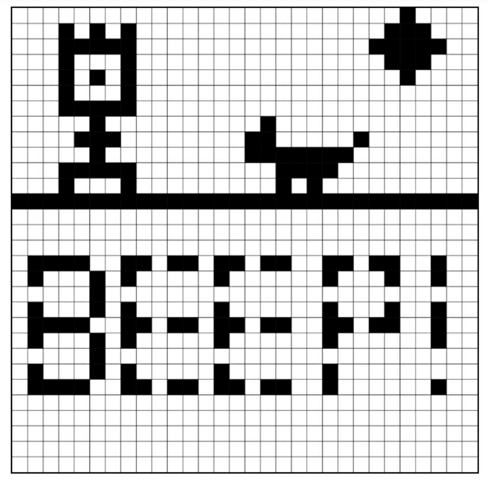
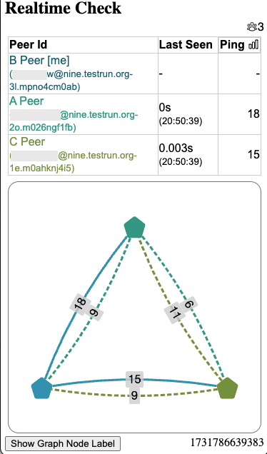

Are you interested in enshittification-resistant application development? 
After almost two years of collaboration 
with the wonderful [Iroh team](https://iroh.computer),
and years of discussions with numerous experts in the decentralization space, 
we are happy to announce that **Delta Chat 1.48 apps on all platforms 
contain state-of-the-art Peer-to-Peer networking support**,
including [hole punching](https://en.wikipedia.org/wiki/Hole_punching_(networking))
and [forward-secret end-to-end encryption](https://en.wikipedia.org/wiki/Forward_secrecy).
Concretely, Delta Chat now establishes private Peer-to-Peer 
[gossipping](https://en.wikipedia.org/wiki/Gossip_protocol) networks 
between users who start a [webxdc app](https://webxdc.org/apps)
that uses the new [joinRealtimeChannel() API](https://webxdc.org/docs/spec/joinRealtimeChannel.html). 

<video controls style="width:560px; max-width: 100%;"><source src="https://merlinux.eu/webxdc-realtime-148.mp4" type="video/mp4"></video>

In the following sections, we discuss the "Pixel app" shown in the video 
and other realtime example apps, before providing more technical background 
and a closing note on the importance of protocols and specifications in our endeavours. 
If you want to try out any webxdc app, including the realtime ones:

0. Install Delta Chat, create a profile and establish a chat with someone

1. [Tap this invitelink to the xstore bot](https://i.delta.chat/#37DC2B704A2AE2F6A96235CE0C3A0EBCA4F5801D&a=xstore%40testrun.org&n=&i=-1IGtynaivZ&s=JqHsvvcDmnW)
   and wait for receiving the store frontend 

2. Start the store app, pick an app for download and then share it to any chat

## Pixel app: small, offline-first and realtime 

The [source code of the pixel app](https://codeberg.org/webxdc/pixel/src/commit/8331769a5b3020a11ea789b311585e42c59c123b/script.js) shown in the above [video](https://merlinux.eu/webxdc-realtime-148.mp4)

- consists of 241 lines of Javascript (including all dependencies),

- offers collaborative realtime pixel-drawing

- and is offline-first as it does not require users to be online at the same time. 

The pixel app achieves its hybrid offline-first and realtime connectivity 
by using two separate webxdc messaging APIs:

- [webxdc.sendUpdate](https://webxdc.org/docs/spec/sendUpdate.html) 
  to relay "application updates" through the regular host messenger channel 
  (e-mail for Delta Chat, XMPP message for Cheogram and Monocles). 

- [realtimeChannel.send](https://webxdc.org/docs/spec/joinRealtimeChannel.html#realtimechannelsenddata)
  to relay ephemeral application messages to any P2P-connected chat partner. 

To learn the theory behind how the pixel app achieves "eventual synchronization for all users",
we suggest to dive into our [Shared Web Application state chapter](https://webxdc.org/docs/shared_state/index.html)
and then re-read [the 241 lines of Javascript](https://codeberg.org/webxdc/pixel/src/commit/8331769a5b3020a11ea789b311585e42c59c123b/script.js) with a particular eye to "Lamport Clocks" -- 
no framework or dependency needed to use this science-fiction-sounding technology ;) 

If you want to improve the app, please fork and [submit your variant](https://codeberg.org/webxdc/xdcget/src/branch/main/SUBMIT.md). 
There already is a [ColorPixel app](https://github.com/DeltaZen/pixel) fork
where each participant draws pixels in a different color. 

## Pong app: realtime-only and implements clock synchronization

<video controls style="width:150px; max-width: 50%;float:right;margin-left:5px;" autoplay muted loop playsinline><source src="../assets/blog/2024-11-pong2.mp4" type="video/mp4"></video>
The [pong app repository](https://codeberg.org/webxdc/pong/src/branch/main) 
provides a simple two-player implementation of the [classic pong game](https://en.wikipedia.org/wiki/Pong). 
UX-wise it's rudimentary but it does implement basic "clock synchronization" 
which is an important consideration for any realtime networked gaming app.  

Wouldn't it be nice to have more original or more modern versions of Pong? 
Maybe also with sounds and colors? 
Also, to provide a "rollback algorithm" you might look at 
a 3rd party [WebRTC-based Pong development writeup](https://mitxela.com/projects/webrtc-pong)
to understand what's involved. 

In any case, if you want to improve on this little Pong classic game, 
please fork and [submit your variant](https://codeberg.org/webxdc/xdcget/src/branch/main/SUBMIT.md). 

## Realtime Editor: cursor positions and immediate collab 

<video controls style="width:150px; max-width: 50%;float:right;margin-left:5px;" autoplay muted loop playsinline><source src="../assets/blog/2024-11-realtimeditor.mp4" type="video/mp4"></video>
The [realtime editor app](https://codeberg.org/jagtalon/editor)
is a collaborative editor that can show realtime cursors and changes. 
However, it's also behaving as an offline-first app, similar to the pixel app above. 
If you join a chat-shared realtime editor app later, 
you'll see all changes consistently combined. 
The realtime editor is a fork of the [basic webxdc editor](https://codeberg.org/webxdc/editor) 
but with realtime capabilities added. 

Wouldn't it be nice if there would be coloring of edits? 
Maybe provide a slider that allows to go back in document history? 
Or maybe a way to import a picture into the realtime pad? 

Again, if you can improve this editor tool you are more than welcome. 
Please fork and [submit your variant](https://codeberg.org/webxdc/xdcget/src/branch/main/SUBMIT.md). 

## Unix terminal app: realtime with a chat bot 

<video controls style="width:150px; max-width: 50%;float:right;margin-left:5px;" autoplay muted loop playsinline><source src="../assets/blog/2024-11-xdcterm2.mp4" type="video/mp4"></video>
The [xdcterm app demo](https://github.com/link2xt/xdcterm) allows
to run a chat bot in Javascript and then establish contact with it
from your chat profile. 
The bot will create a group where you can add more members 
all of which can see a shared terminal (it's as if screen-sharing is built-in). 

If you want to play with or improve this rudimentary terminal app,
please fork and feel free to let us know. 
You can not submit it to the webxdc app store 
because it requires a running chat bot on some unix-ish server. 

## Live Chat: realtime chat in a chat :)

<video controls style="width:150px; max-width: 50%;float:right;margin-left:5px;" autoplay muted loop playsinline><source src="../assets/blog/2024-11-livechat2.mp4" type="video/mp4"></video>
The [LiveChat app](https://github.com/deltazen/live-chat) 
provides ephemeral chatting with realtime typing-indicators
between anyone in a chat group who starts the live chat. 
Messages are not persisted and all history is cleared
when you close the app. 
If all users have closed the app all content is gone. 
There you go. Fully ephemeral, end-to-end encrypted P2P chat at your fingertips :) 

You may use a Live Chat app in a larger existing chat group 
to host a fast "ephemeral side conversation" that will not cause any network traffic
for other chat group members who don't join the live chat. 

## Get ready, player two!

To get started on webxdc app development, we recommend the following readings: 

- [Getting started on developing your own app](https://webxdc.org/docs/)

- [Shared Web Application state](https://webxdc.org/docs/shared_state/index.html)

- [Webxdc (Psst!) reclaiming Peer-to-Peer Web
  technology](https://delta.chat/en/2024-02-15-webxdc-m3)

- [Bringing E2E privacy to the Web: 4th security audit 😅](https://delta.chat/en/2023-05-22-webxdc-security)

Please don't hesitate to get back to our fediverse account, 
the [webxdc support forum category](https://support.delta.chat/c/webxdc/20)
or other contact addresses. 

## Technical background on our Iroh/P2P integration 

A joint focus with the Iroh team has been to support all platforms reliably,
including mobile platforms. 
For the last half year Delta apps had an opt-in experimental "webxdc realtime" setting
which, after extensive testing and bug fixing, is now enabled by default. 

### How private P2P networking is established 

Only if you start an app that uses the 
[webxdc.joinRealtimeChannel() API](https://webxdc.org/docs/spec/joinRealtimeChannel.html)
will Delta Chat initiate participation of your device in a P2P network. 
Delta Chat will send an end-to-end encrypted "system" chat message to a group chat
that contains an [Iroh Ticket](https://www.iroh.computer/docs/concepts/tickets). 
When receiving devices also join the realtime channel, 
they can establish a direct connection immediately because the ticket is already on record. 
No lookup in a global [distributed hash table](https://en.wikipedia.org/wiki/Distributed_hash_table)
slows down or complicates the initial connection. 
**The federated e-mail system is used to bootstrap an ephemeral Peer-to-Peer network.**

You may download the [Realtime Check app](https://apps.testrun.org/webxdc-realtime-check-v1.0.5.xdc)
and share it into a chat to perform network latency analysis between realtime messaging peers. 
You can already run it in "Saved Messages" between two devices in a multi-device setup. 

To establish a direct P2P connection, 
two interested devices will use an [Iroh Relay](https://www.iroh.computer/docs/protocols/net#relays) 
which typically runs on every [chatmail server](https://delta.chat/chatmail),
mirroring the existing e-mail federation. 
If your chat profile is using a classic e-mail server
then a global default relay is used, operated from the Iroh team. 

The Iroh relay server combines both [Stun](https://en.wikipedia.org/wiki/STUN)
and [TURN](https://en.wikipedia.org/wiki/Traversal_Using_Relays_around_NAT) functionality,
to allow peers to discover and directly connect and to 
facilitate relaying of messages as long as no direct connection is established. 
For more details please check our 
[Rust deltachat::peer_channels docs](https://rs.delta.chat/deltachat/peer_channels/index.html). 

### Identity on the P2P network is ephemeral, and encryption is forward-secret 

Delta Chat uses ephemeral cryptographic identities for any P2P messaging. 
When Delta Chat is closed or stopped by the operating system,
then a new ephemeral identity will be created on the next start. 
Moreover, Iroh uses [QUIC](https://en.wikipedia.org/wiki/QUIC) on the networking layer 
which implements [Forward-Secrecy](https://en.wikipedia.org/wiki/Forward_secrecy) 
or "Deletable Encryption" as one of our long-term collaborators prefers to term it. 

Ephemeral identities and forward-secret encryption shield against 
an attacker that collects encrypted network traffic 
and later compromises your device to try to decrypt past recorded traffic. 
Not only the Live Chat app but all realtime webxdc apps benefit 
from the ephemeral, end-to-end-encrypted and forward-secret P2P messaging
provided by the Iroh stack and its Delta Chat integration on all platforms. 

### A privacy note on IP-addresses

Delta Chat does not store IP-addresses permanently anywhere 
and it does not expose IP addresses in the user interface or to webxdc apps. 
Iroh relay servers do not see all the IP addresses 
that user devices advertise to each other (for example relays don't see peer's WLAN addresses),
and relays also do not store any IP addresses when facilitating a P2P connection. 

However, chat partners may learn about your IP address if they deploy
some network monitoring tool or use a modified version of Delta Chat. 
If using webxdc apps with a potentially hostile chat partner is a concern for you 
you may disable the "webxdc realtime" setting in "advanced settings" to be sure 
that Delta Chat will never attempt any Peer-to-Peer connection with anyone. 
Don't forget to then also be careful when clicking on any HTTPS-link in a chat 
as a hostile sender could use it to extract your IP-address as well. 

## Specifications, protocols and the freedom to exit

When other webxdc-supporting XMPP messengers like [Cheogram](https://cheogram.com) and [Monocles](https://monocles.eu/more/) implement the new webxdc realtime API,
they are not required to use Iroh but can instead 
use other existing XMPP ephemeral messaging capabilities. 

The [webxdc.joinRealtimeChannel() API](https://webxdc.org/docs/spec/joinRealtimeChannel.html)
is a minimal high-level API 
that is easier to use than the [classic WebRTC Browser P2P API](https://developer.mozilla.org/en-US/docs/Web/API/RTCPeerConnection)
because a [webxdc messenger implementor](https://webxdc.org/docs/spec/messenger.html)
carries the burden to manage all dynamic connectivity, discovery and network routing aspects. 

In fact Delta Chat apps themselves 
could evolve to use a different implementation for webxdc realtime communications. 
We've noted in the Fediverse lately that [Protocols and specifications provide freedom of exit](https://chaos.social/@delta/113492052382161817) 
and the new realtime API specification is a practical example for that. 

## Thanks to NLNET and NGI for support and vision!

  
Our introduction of the webxdc realtime API has been 
supported by [NLnet](https://nlnet.nl/)
themselves funded by the European Commission's [Next Generation Internet](https://ngi.eu/) programme.

