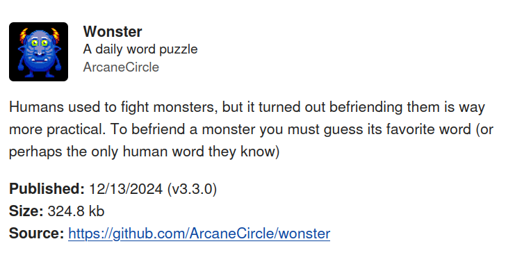

How can we evolve and deploy web apps without allowing developers or operators to become a "billionaire in the middle"? 
There are many ways to try to answer this challenge and some are technical. 
The "Web", and the HTTP protocol in particular, 
arguably played a crucial part in producing tech billionaires
with their possibly unprecedented power and money concentrations today. 

Joined by XMPP-messengers [Cheogram](https://cheogram.com) and [Monocles](https://monocles.eu), 
and supported by many contributing experts in the background, 
we are playfully addressing the no-billionaire-platforms challenge with 
[webxdc](https://webxdc.org), a container format and API for "chat-shared web apps". 
Technically, webxdc apps are HTML5 apps but instead of the HTTP protocol 
they use [Peer-to-Peer send/receive APIs](https://webxdc.org/docs/spec/sendUpdate.html) 
implemented by webxdc-capable messengers,
allowing to rebase relations between developers and users by saying

- **Bye Bye to surveillance capitalism**:
  users have both the code and the data of their web apps in their hands 
  and benefit from end-to-end encrypted messaging not only during regular chat messaging 
  but also during their private web app usage.

- **Bye Bye to user policing (logins, passwords, OAUTH, TOS and privacy policies etc.)**: 
  Web app developers never obtain or touch any user data or user identities,
  and can have peace of mind of not being responsible for any data, 
  and not having to program identity management and social discovery UIs. 
  Messengers already provide all of this through arranging chat groups or rooms. 

- **Bye Bye to depending on a corp or org that enshittifies**: 
  Messengers, as decentralized runners of webxdc apps in chat groups, 
  can not hold web app developers, their users or data hostage. 
  Consult [Cory Doctorow's "Ulysses Pact"](https://pluralistic.net/2024/11/02/ulysses-pact/)
  for why this is a good idea. 

This all sounds too good to be true, right? 
But what if another reality is possible by just stretching out our hands and grabbing it? 

Let's look at some recent webxdc community advances,
new webxdc app capabilities along with updates to the [webxdc specification](https://webxdc.org/docs/spec/index.html),
and finally at some webxdc apps already in everyday use,
as working approximations on how to replace whole Venture-Capital platforms with a ZIP file :)

## Integrated and streamlined webxdc app discovery 

There is a curated collection of apps available at [https://webxdc.org/apps](https://webxdc.org/apps) which got a thorough UX/UI streamlining by Jag Talon, 
a former DuckDuckGo frontend designer. 
It's a static web page offering "tool" and "game" search 
with short descriptions and per-app URLs so you can point people to a particular app.
The web page sources its content from this [json app list file](https://apps.testrun.org/xdcget-lock.json),
generated by commits to the [codeberg submission repository](https://codeberg.org/webxdc/xdcget/). 
Anyone can run their own curation pipelining and [re-use the web interface](https://github.com/webxdc/website/tree/main/website/apps). 

The new webxdc "app-store" web view was designed to integrate well
with webxdc-supporting messengers through an "attach-app" action of the chat message input field. 
Apart from Cheogram, Monocles and the mainline Delta Chat apps, 
also [ArcaneChat (a soft Android-fork)](https://arcanechat.me/) and [DeltaTouch (a Lomiri-based UI for UbuntuTouch phones and some desktop environments)](https://delta.chat/en/2023-07-02-deltatouch) 
offer this new instant attach-app action. 
Delta Chat apps run the app-picker with cached data so it works during offline times. 
Most messengers also allow to configure a different URL for an alternative app-picker web page. 

Note that webxdc app store sites *seed* apps but don't control anything afterwards. 
They can not collect any metadata or content data about their usage. 
It's like distributing `.exe` files in former times, 
only [safer](https://delta.chat/en/2023-05-22-webxdc-security)
and more convenient through permission-free and decentralized web-app curation sites. 
Sorry GAFAM, not sorry. 

## Webxdc apps can cause instant notifications 

We collectively specified and implemented a new webxdc notification mechanism so that apps like
[Chess](https://webxdc.org/apps/#arcanecircle-chess) can cause a system-level notification between app users aka "it's your turn",
and the calendar can notify about "your chat partner added a new meeting date". 
Webxdc app developers re-use the existing push notification machinery of their host messengers 
without having to scream at Google or Apple compliance bureaucracy themselves. 
For webxdc apps to "notify" users they need to specify a list of *identities*
when [sending application updates](https://webxdc.org/docs/spec/sendUpdate.html). 
The [`webxdc.selfAddr` spec](https://webxdc.org/docs/spec/selfAddr_and_selfName.html#selfaddr) 
describes the details of the new carefully designed "per-app" identity scope. 

## Webxdc apps can query sending rate limits 

Different messengers and transport servers have different "send rate limits",
namely how many messages are allowed to be sent per time duration,
and how many bytes an application update can carry. 
The [updated editor app](https://webxdc.org/apps/#webxdc-editor) now respects 
[sendUpdate limits](https://webxdc.org/docs/spec/sendUpdate.html#messaging-layer-limits-for-sendupdate),
providing for a smoother transport-adaptive user experience. 
The [recently introduced webxdc realtime channels](https://delta.chat/en/2024-11-20-webxdc-realtime) have a specified 128KB size limit for ephemeral application updates. 
Ephemeral realtime application updates 
are only distributed between devices actively running a webxdc app
that called the [joinRealtime API](https://webxdc.org/docs/spec/joinRealtimeChannel.html). 

## Webxdc apps can be placed on mobile home screens

On Delta Chat Android and iOS phones you can now add a running webxdc app to your home screen. 
Tapping a webxdc app on your mobile home screen will directly start it,
and everything remains responsive also while offline. 
Remember, there is no HTTP server for webxdc apps. 
All webxdc app state is local, and each webxdc app sends and receives updates 
by interacting with "localhost" only, 
leaving all actual network message routing to messengers,
while being itself
[blocked from leaking anything to the Internet](https://delta.chat/en/2023-05-22-webxdc-security). 

# Replacing VC-funded platforms with a ZIP file ... 

There is no shortage of Venture-Capital fueled mediator platforms that 
offer "free" web apps or mobile apps (mostly web-apps in disguise) 
to mediate interactions between private circles. 
What if you could run such apps in your private chats without needing any mediator,
sign-ups, logins etc?
Here are a few fun candidate apps to try out. 

[Split Bill](https://webxdc.org/apps/#jagtalon-splitbill)
allows everyone in a chat group to register "expenses" and provides a "balance" view
of who owes/is owed currently. 
Anybody who enters an expense becomes part of the bill but
you can also "join the bill" if you don't add expenses. 
Split Bill intentionally provides a basic UI. 
If you feel inclined to add features like a "settle up" button, 
please fork [from the codeberg split-bill repository](https://codeberg.org/jagtalon/split-bill/),
maybe tell Jag about it, and submit a new app to the webxdc collection. 
Or maybe you have an idea how to evolve the split-bill app to become a "solidarity-party" 
app to help accounting when organizing monetary support for people in need? 

[Shopping List](https://webxdc.org/apps/#shoppinglist)
allows families, friends and other collectives to easily arrange for daily shopping. 
The "Shopping list app" provides a simple view for entering "missing" items 
which can be "checked" when someone bought it. 
It's recommended to have a special-purpose "Shopping" chat group/room 
to ask aboutor clarify specifics of shopping items. 
There even is a "dark mode" and an icon to disable/enable "chat notifications"
when the shopping-todo-list changes. 

Who doesn't love todo-lists, the bane of modern existence?  
Now you can do them nicely in a chat group.
Or maybe you prefer the classic [checklist](https://webxdc.org/apps/#webxdc-checklist),
one of the first webxdc apps back in 2023. 

[Wonster](https://webxdc.org/apps/#arcanecircle-wonster)
is a popular daily family puzzle challenge. 
Every chat group gets their own unique Wonster challenge. 

## "Finished Software" could be a thing again!

Webxdc app developers may improve an app over time or they may call it a day. 
The webxdc specification aims to provide long-term backward-compatibility.
Once written apps are to work for a long time. 
Say Bye Bye to broken dependencies, "forced API level upgrades", new toolchains 
or crazy buereaucracy like 
"your app will be delisted if you don't declare compliancy with X" etc. 
Nothing can prevent using an app with friends if you have the zip-file on your disc, 
and a webxdc-capable messenger with a chat group/room to "run" it. 
No worries about VPS or web hosting, DNS or SSL certificates. Peace!

Curious and interested to join some "replace-VCs-with-ZIP-files" fun? 
[Getting started with webxdc development](https://webxdc.org/docs/) 
provides tutorial material and introduction chapters on what is involved
when replacing HTTP with Peer-to-Peer protocols. 

## Thanks to NLNET and NGI for their support and vision!

  
Much of our efforts described above became possible
by the vision and support of [NLnet-managed funds](https://nlnet.nl/),
financially supported by the European Commission's 
[Next Generation Internet](https://ngi.eu/) programme.

