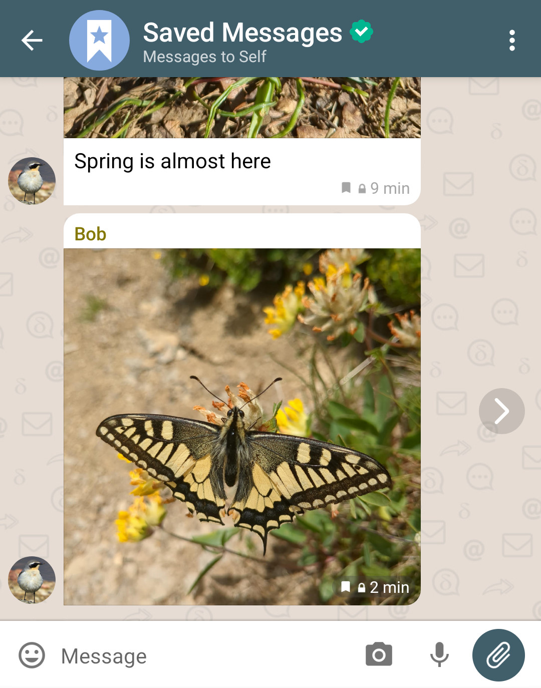
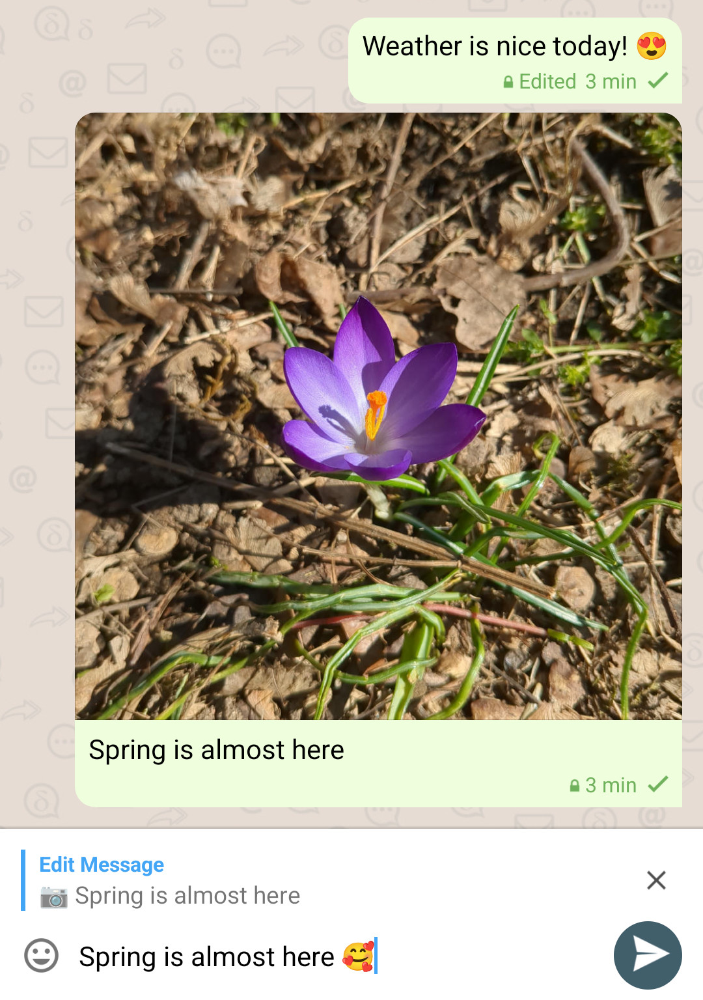
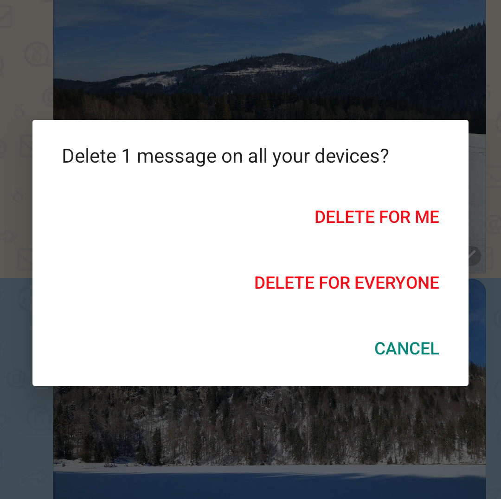

The spring is not here yet but some long-awaited Delta Chat features are blooming already!
In less than three months of 2025 three major new features are already available:

## Improved Saved Messages

The "Saved Messages" feature got an upgrade! Now when you forward a message to the "Saved Messages" chat
the message will preserve the context (sender etc.) and a button to jump to the original message.
Messages you saved will have a small bookmark icon in the chat so you can easily recognize that you already saved them.
There is also a new option when you select a message to easily save it in "Saved Messages" or un-save it.
The messages and other notes you save in the "Saved Messages" chat are also smoothly (and end-to-end encrypted) synchronized across all your devices.
This feature on its own has a lot of potential to make your life easier and save you a lot of time boosting your productivity and organization.

## Editing Messages

Being able to edit messages has been a long-cherished Utopian dream of some Delta Chat users.
Some considered it technically impossible since you can't edit messages in e-mail, the underlying technology powering Delta Chat.
Nonetheless, we still decided to push the boundaries, approaching the problem in a practical way and implemented message editing on top of e-mail!

**Note:** For this feature to work properly, make sure your contacts upgrade to the latest version of Delta Chat.

## Delete them all

In the past every time you deleted a chat or a message from one device you would need to go to all your other devices and manually repeat the process over and over.
Now message and chat deletion is seamlessly synchronized across all your devices without breaking a sweat.

Furthermore, now you can delete/retract your messages for everyone in the chat!
Notice that Delta Chat is an app for private chats with family and friends, not to "chat with the enemy",
in any platform someone with bad intentions can find ways to preserve your message with a manipulated client app or take screenshots,
so while most of the time it is good enough, you shouldn't blindly relay in this feature in chats with people you don't trust.

**Note:** For this feature to work properly, make sure your contacts upgrade to the latest version of Delta Chat.

## More to come

The year is just kicking off, and there are still several features we would like to deliver to our dear users to help them navigate the unpredictable future.
If you would like to support our work, please consider [donating or contributing](/contribute)
