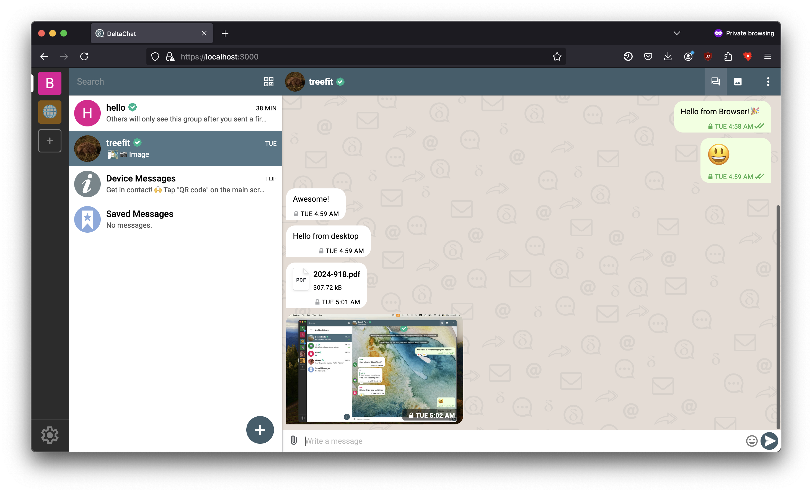
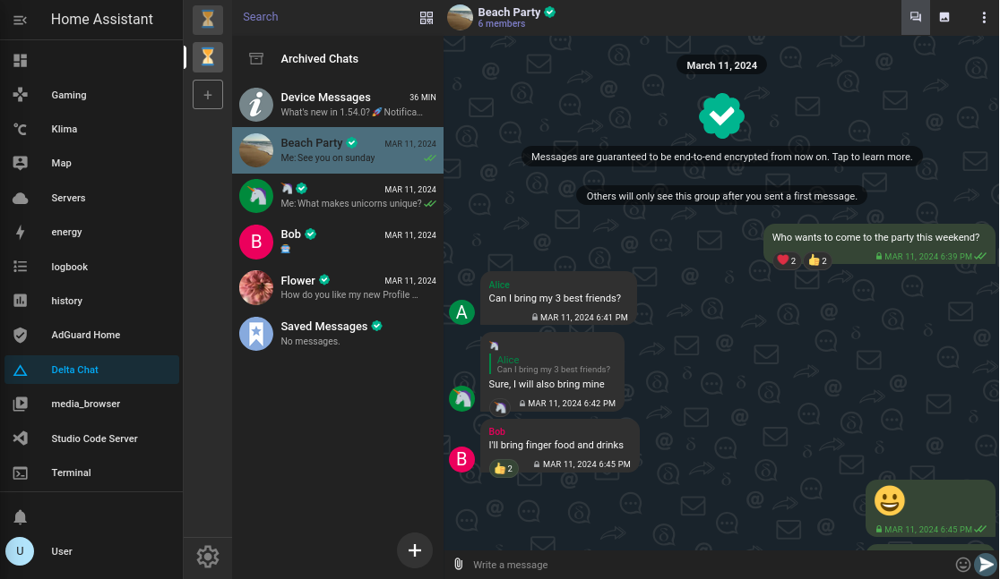
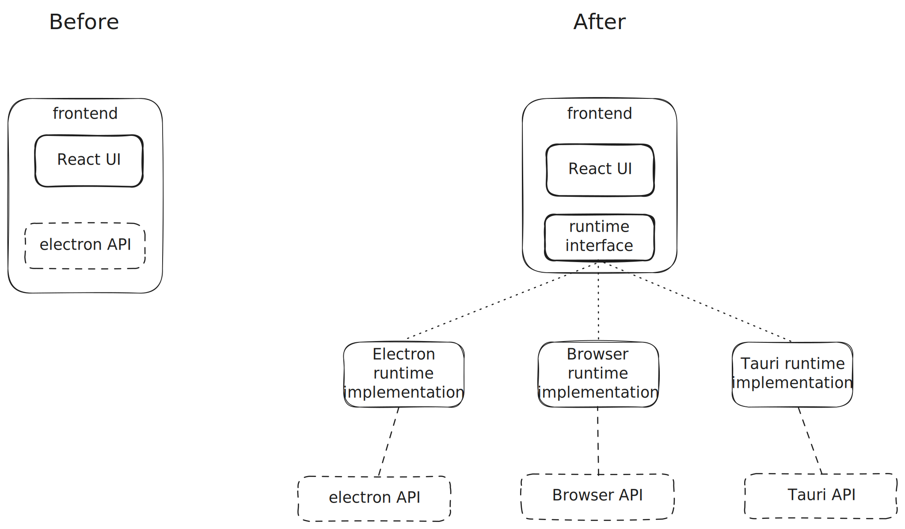

Over the years, many people have asked this question. Until recently the answer was "no", now it is "kinda". In the following blog post, we will explore this idea.

> With running in the browser we mean a delta chat web, like WhatsApp web or telegram web.
>
> Another way to understand web chat is through support or sales chats on websites.
> This post is not about those, but if you are looking for those you may be interested in the support chat system [chatwoot](https://github.com/chatwoot), for which we made a [deltachat plugin](https://github.com/deltachat-bot/deltawoot/). Our plugin allows your clients to contact you securely over delta chat.

As part of the project to port delta chat desktop from electron to Tauri[^3], we made a version of the delta chat desktop user interface that runs in a browser.

<figure>
    
    <figcaption>
        Delta Chat, running in the Firefox Browser
    </figcaption>
</figure>

Features:
- ☑️ Basic functionality (such as sending and receiving messages)
- 📎 Sending attachments
- 🔔 Notifications (while the tab is open)
- 1️⃣ Badge counter (number in tab title)
- 🦊🧭🏐 Works in Firefox, Safari, and Chrome
- 🔐 HTTPS with self-signed certificate
- 🔑 Password Protection
- ⬇️ Download attachments or open in browser (useful for PDF)
- ℹ️ Local Help also works
- 🌐 Language based on Browser

Here is a video that shows the Browser Version in action:

<video controls style="max-width: 100%;" alt="Demo video of the Delta Chat Web version in action"><source src="https://chatmail.at/video/browser-edition-blogpost-demo.mp4" type="video/mp4"></video>

Though it is not standalone, it still needs a server component because chatmail core[^1] can not yet be compiled into a web assembly to run fully in the browser, but more on that later.

### Why we made a Browser Edition

So why did we make it? We had three reasons:
1. As proof that the delta chat desktop react-based user interface is not dependent on electron anymore (an important stepping stone to the tauri[^3] version).
2. To help us to improve and develop the web-based user interface by giving us access to the development tools and add-ons on all browsers.
3. To bring back automated integration testing for Delta Chat desktop.

### Possible future use cases {#future-usecases}

There are many more ways this web version could be used besides the ones already mentioned:

-  "delta chat web" - run core on an Android device, connect to it from a computer over a local network for a WhatsApp web-like experience.
- delta chat as a service (for example, a company could host instances for all their employees).
- It could be a way to port Delta Chat to special operating systems[^2] that have a browser and rust support, but have no support for electron or tauri[^3].
- run delta chat web on your Raspberry Pi / home server connect from your devices
	- treefit already made a [plugin for running it on home assistant](https://codeberg.org/treefit/deltachat-homeassistant-addon)

<figure>
    
    <figcaption>Delta Chat Web inside of Home Assistant</figcaption>
</figure>

### Technical Details for the Interested

To make the Web UI of delta chat desktop independent of electron, we needed to make our code more modular:

- We switched to the JSON-RPC API, which we explored in detail in a [previous blog post](https://delta.chat/en/2025-02-11-why-jsonrpc-bindings-exist).
- We created a new `Runtime` interface and moved all direct calls to electron into a `ReuntimeElectron` class that implements this interface.
- We also moved nearly all the logic to the frontend/UI code, so the runtimes are even simpler to make and maintain because they contain less and simpler code.

This way, the web-based UI of the desktop client became fully independent of electron.
To add a new Runtime you just need to implement the runtime interface and load it when you start the app.

The code of the runtime interface: <https://github.com/deltachat/deltachat-desktop/blob/main/packages/runtime/runtime.ts#L29>

    
Downsides and Caveats of the Current Browser Version

    
The current approach has the following caveats that you should to keep in mind

    <ol>
        <li>
            If you host the server component on a VPS, then the VPS will become the place where the messages are decrypted, so you break the premise of the end-to-end encryption: "end device to end device".
        </li>
        <li>
            You need to host the server component for each user, so you need to build management software if you want to use this for a SaaS project/product.
        </li>
        <li>
            Currently, only one client can connect to the chatmail core at a time, because there is only a single event queue.   But there are ideas to change this in the future to allow for more concurrent event listeners. (If you would connect multiple clients right now, then they would steal events from each other.).
        </li>
    </ol>
    

    Also, not all features are implemented yet in the browser version, mainly maps/location-streaming, webxdc mini apps, and viewing HTML emails. But those are not impossible to implement; we just need some considerations about sandboxing.
    

### What's next?

While we have no immediate plans for the browser version (besides using it for more e2e testing), there are many ideas on what it could be used for ([Possible future use cases](#future-usecases)).

Ideally, the web version shouldn't need this local server component. To make that work, we need to compile our core library to wasm. It should be possible since our core library is written in rust, and rust is one of the most popular languages for compiling to web assembly, but there are a few challenges (missing TCP support in browsers, a fast SQLite database, fast file storage, threading, and more).
If you want to help, here is the forum discussion about it: [What would be needed for a standalone web version without a server component? | Delta Chat Forum](https://support.delta.chat/t/what-would-be-needed-for-a-standalone-web-version-without-a-server-component/3789).

If you want to try the experimental browser version yourself, then you can find the instructions at <https://github.com/deltachat/deltachat-desktop/blob/main/packages/target-browser/Readme.md>.

[^1]: formerly known as delta chat core. It is the core library all our UI implementations use.

[^2]: I'm thinking BSD flavors, Haiku, or other rare enthusiast operating systems here

[^3]: Tauri is an alternative to electron that is smaller, because it uses the web view provided by the operating system instead of including a whole Chromium browser. It is also written in the memory-safe compiled language rust, which offers security and speed benefits. There will be another blog post going into more detail soon; in the meantime, you can learn more at <https://tauri.app/>.
