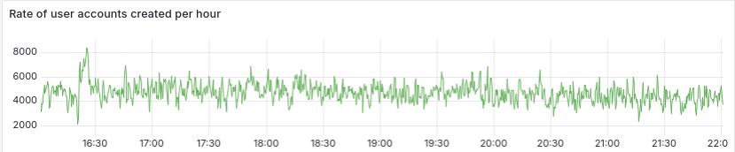
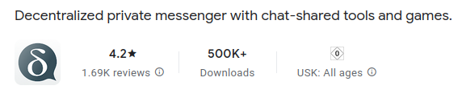

Beginning June we witnessed a sudden surge of Delta Chat usage especially in the US and Cuba. 
We don't know the social dynamics behind it but it probably helps that 
Delta Chat apps resiliently work on all platforms and offer a pleasing user interface 
which increasingly many families, groups and communities appreciate. 
Be that as it may, let's look at some indicators of the recent surge, 
then highlight centralization risks and our mitigation efforts. 

## 5000 new users per hour on the default chatmail relay 

Fun fact: after some performance adjustments to Dovecot, 
the small physical server keeps humming along 
at 20% CPU and 20% IO pressure without consuming noticeable disk storage. 

## 1.8 Million Google/Apple push notifications per day 

This daily number reflects the incoming messages for chatmail users 
who installed their app from Google Play or Apple store. 
F-droid, Desktop or classic e-mail users are not reflected in this number.
Number of daily push notifications was around 350K end of February 2025. 

## Google Play Android downloads crossed 500K downloads 

Note that we generally recommend F-droid or other non-Google sources of installing Delta Chat apps
and only have a somewhat informed guess that at most half of Android users use non-Google sources. 

## Funding for a globally scaled chatmail relay network 

There are many community-operated [chatmail relays](https://chatmail.at/relays) on all continents 
but most new users choose the default onboarding relay in Germany,
reproducing **the known problem of formally decentralized but centralized in practice** offerings. 
We are engaging in two key Research and Development areas 
to fundamentally mitigate this centralization tendency 
and achieve distributed scale, along with improved resiliency and privacy:

- **Cryptographic hardening**: Using e-mail addresses as transport but not as a
  source of identity; hiding cryptographic identities from transports; 
  and further minimizing visibility of meta-data in messages. 

- **Multi-transport**: Allowing a chat profile to use multiple chatmail relays 
  interchangeably, releasing users and operators from making "life-long choices" 
  in favor of "as long as it works" choices. 

However, public funding for these key infrastructure efforts suddenly dried up earlier in 2025,
disrupting our ability to follow through with our always usability-driven work. 
We are now seeking to finance key development work through donations,
aiming to provide decentralized secure messaging infrastructure at global scale,
all open to third parties joining the fun in a permission-free manner. 
A Minecraft-like world for messaging. 

<a href="https://opencollective.com/chatmail" class="cta-button">Donate to the new chatmail infrastructure OpenCollective (Europe)</a>

<a href="../../en/donate" class="cta-button">Donate to Delta Chat app developments (Libera, BTC, IBAN, OC)</a>

## Nothing like in-person cross-project gatherings: DIFF!

Last but not least, if you are interested in more technical details 
and want to engage with our various contributor teams and communities,
the place to be is [DIFF in the Black Forest starting this weekend](https://delta.chat/en/2025-05-12-diff-invitation) 
or, else, for now, sorting your way through our development repositories
and the twisted maze of community and contributor chat groups :) 
