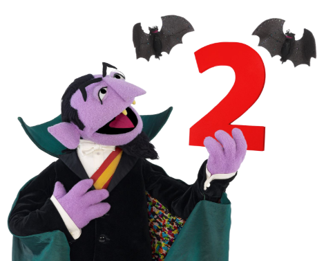
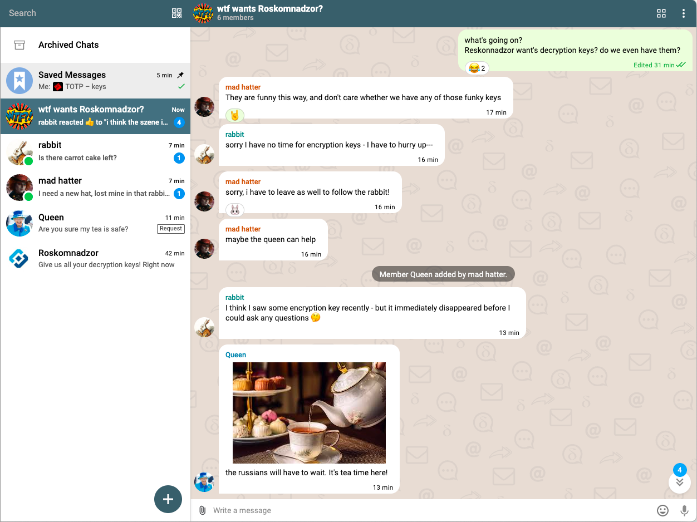
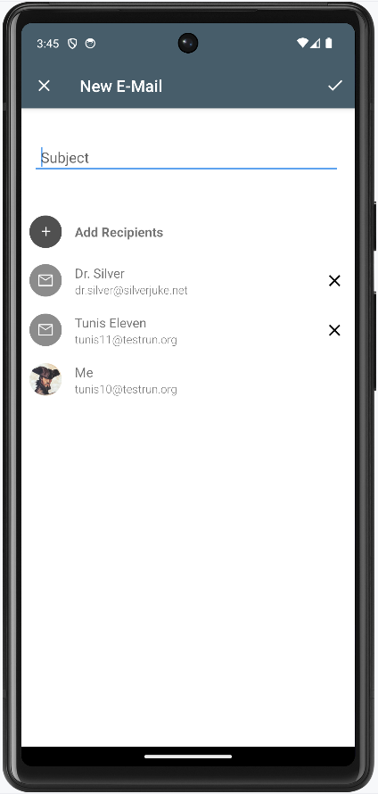
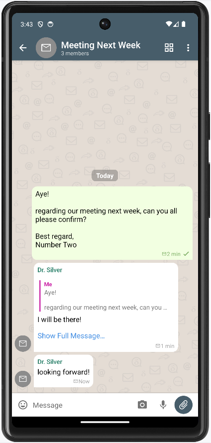
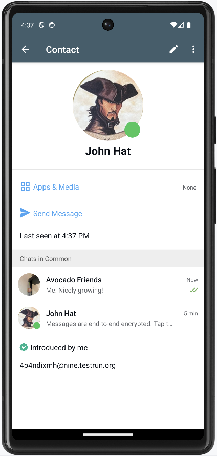
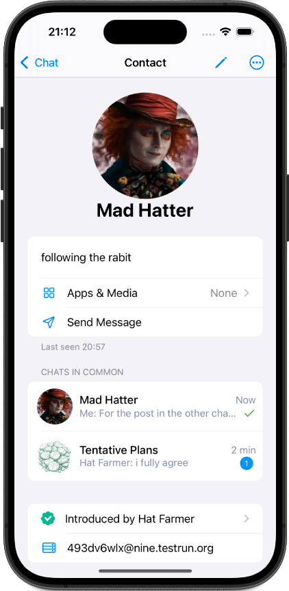
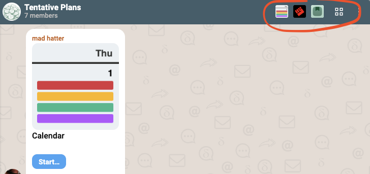

**With Delta Chat Version 2, chats are end-to-end encrypted, always and by default.**
Previously it was possible that chats without green checkmarks could contain messages without end-to-end encryption. 
Not anymore. 
Consequently, Version 2 drops all lock icons, most green checkmarks and a few "decryption problem" dialogues,
simplifying the user interface and raising the floor for real-world security outcomes. 
After all, most users don't want to engage in theorizing and checking end-to-end encryption.
They have actual lives to live, and enough challenges to tackle already. 
They *just* want a reliable fun-to-use messenger that keeps their chats, messages and contacts private. 
The decade long discourse on how to achieve this "just" is ongoing, and V2 releases are our contribution to it.
Working code is hard to argue with, let alone by claiming "it can't work" :) 

## Rolling out major security-upgrades into federated ecosystems

V2 releases maintain compatibility with older releases, 
even though they roll out a major security upgrade
across many hundred thousand devices, across dozens of apps and bots, 
who all upgrade at some random time in the future (or never). 
During 8 years of development, we never needed to ask users or developers for "co-ordinated upgrades" 
like for example [Matrix](https://matrix.org/blog/2025/07/security-predisclosure/) 
and [Session](https://getsession.org/blog/groups-v2-how-to-upgrade) did in 2025.
But how could we avoid asking for such painful coordination, when other federated messaging projects struggle?

First of all, the planetary-scale email system is mature 
and has separation between transport protocols and message formats. 
There are no sudden changes in the SMTP protocols which deliver 360 billion messages per day. 
There are many battle-tested server implementations. 
Upgrading any of the many [chatmail clients](https://chatmail.at/clients) 
is largely unrelated to how servers upgrade. 

Second, Delta Chat and all other chatmail clients 
use a *centrally implemented* [chatmail core Rust library](https://github.com/chatmail/core/blob/main/README.md). 
This means there is a single place where "moving the ecosystem" can be implemented. 
The [key v2 work in the chatmail core Rust library](https://github.com/chatmail/core/pull/6796) 
added 4969 and removed 6299 lines of code, netting a **removal of 1330 Lines of Code**. 
It fundamentally changed how "identity" is handled in chatmail V2 messaging. 
Chatmail clients, though? 
They don't need to do much more than pulling in a V2 core version, drop some UI elements, adapt some APIs
and enjoy compatibility and consistency benefits. 
It's as relaxing as it sounds. 

Third, low-level chatmail core developments are moored to UI and UX goals,
and involve [ongoing usable security research into federated messaging systems](https://passthesalt.ubicast.tv/videos/always-more-secure-analyzing-user-migrations-to-federated-e2ee-messaging-apps-trimmed/). 
Our protocol- and cryptography-experts accept constraining their designs 
so that they fit actual UI and UX goals, not the other way round. 
And providing smoothly distributed upgrading across the ecosystem is a key UX goal, if there ever was one. 

Fourth, luck. We may have been just lucky, all things considered :) 

"Nothing works all the time" is a long-running meme in chatmail circles, with a double meaning. 
It was probably coined around the second [10-day gathering in Kyiv 2019](https://delta.chat/en/2019-05-08-xyiv). 

## Chatmail relays: a second layer of E2E enforcement

[chatmail relays](https://chatmail.at/relays) are used for default onboarding of Delta Chat users and 

- provide random interoperable email addresses without asking for any private information, 

- enforce OpenPGP end-to-end encryption with metadata-minimization for all sent and received emails, 

- enforce strict Transport Layer Security (TLS) and Domain signing (DKIM)

In other words, chatmail apps and relays each independently enforce transport and end-to-end encryption
across the world-wide growing [chatmail](https://chatmail.at) ecosystem. 

## Classic email usage was enhanced but requires opt-in

You can not receive or send messages without end-to-end encryption
when onboarding with [chatmail relays](https://chatmail.at/relays),
but you may manually setup a classic email account, also as an additional profile. 
Messages without end-to-end encryption will then be marked with a mail icon. 
Only classic email profiles offer the new "new email" UI action 
that allows to set a subject and add email address recipients
before sending a cleartext email. 
With Version 2 releases, emails without end-to-end encryption 
are generally easier to recognize because chat avatars will also use the same boring mail icon
and chat messages in mail chats will never become end-to-end encrypted. 

## Contact Profiles are more beautiful on all platforms

While users have few problems navigating identities in small private circles,
the new more beautiful contact profiles aim to help navigate larger chat circles 
where members frequently get added or removed. 
The new contact profile aims to help users 
to identify group members and chat partners more easily. 

## Shortcuts to recently used apps in chats 

All Delta Chat clients now provide direct access in the chat title bar to recently used [webxdc apps](https://webxdc.org).
For more background, we recently wrote about refined app discovery, notifications and home screen integration 
at [Replacing billionarish platforms with zip-files](https://delta.chat/en/2025-01-23-webxdc-no-billionaires),
and about the introduction of [realtime Peer-to-Peer networking](https://delta.chat/en/2024-11-20-webxdc-realtime),
followed by [running a Quake multiplayer game co-ordinated between chatmail peers](https://chaos.social/@delta/114517181096683376). 

## PS: the chatmail ecosystem is moving

In 2016, Moxie Marlinspike claimed in [the ecosystem is moving](https://signal.org/blog/the-ecosystem-is-moving/)
that federated systems, and email in particular, can fundamentally not do end-to-end encryption: 

> So while it’s nice that I’m able to host my own email, that’s also the
> reason why my email isn’t end-to-end encrypted, and probably never
> will be. By contrast, WhatsApp was able to introduce end-to-end
> encryption to over a billion users with a single software update. So
> long as federation means stasis while centralization means movement,
> federated protocols are going to have trouble existing in a software
> climate that demands movement as it does today. (Moxie Marlinspike July 25, 2017) 

Challenge accepted :) 
Today, the [chatmail](https://chatmail.at) ecosystem of apps, servers and bots 
is living proof that email based end-to-end encrypted messaging is not only possible, 
but even rolling out big security changes throughout a federated system can work. 
But here is the fun twist with any irony not being lost on us: 
[chatmail Rust core](https://github.com/chatmail/core/blob/main/README.md) 
*beats* Signal in terms of being one centralized codebase 
that is used in all [chatmail clients](https://chatmail.at/clients)
with a single database schema, whereas Signal's Android, iOS and Desktop versions 
each use different databases (making migration between platforms hard)
and different languages to implement higher level data structures 
or even cryptographic properties like "Sealed Sender". 

In the cryptographic machine rooms,
chatmail efforts co-evolve with the security-audited [rPGP Rust library](https://github.com/rpgp/rpgp)
which implements state-of-the-art end-to-end encryption protocols and algorithms. 
Few know that Delta Chat uses the same Ed25519 Rust signing crate as Signal,
that chatmail only uses a *minimal carefully selected subset* of OpenPGP,
and that current-day OpenPGP collaboration between various players is pretty enjoyable. 

To make a longer story short, we recently posted about [our commitments to Federation](https://chaos.social/@delta/114710708299242142): 

> We are basically doing what #signal and in particular Moxie refused to do, or declared impossible: federation. 
>
> Both the #email and #activitypub ecosystems are all about federation.  
>
> However, #deltachat is vertically centralized in that all UIs use the same #rust core which implements all networking, encryption, chat/group/message logic in a single centralized place. The now 40+ #chatmail mail relay network is driven by centralized code.  
>
> At each level, replication and federation is built in.

## PPS: What some of you may be curious about

We revised our [Encryption and security FAQ](https://delta.chat/en/help#e2ee) 
and include notes on [Forward Secrecy](https://delta.chat/en/help#pfs),
[Sealed Sender](https://delta.chat/en/help#sealedsender)
and [Post Quantum Cryptography](https://delta.chat/en/help#pqc). 
To hear about our conceptions of usable security and future plans
you may watch [two security talks from June 2025](https://chaos.social/@delta/114794093068029745).

## PPPS: What regular end-users wonder about :)

A while ago, a contributor's parent and long-time Delta Chat user
got back saying: "Everything is fine! But why does each message have a hand bag?"

