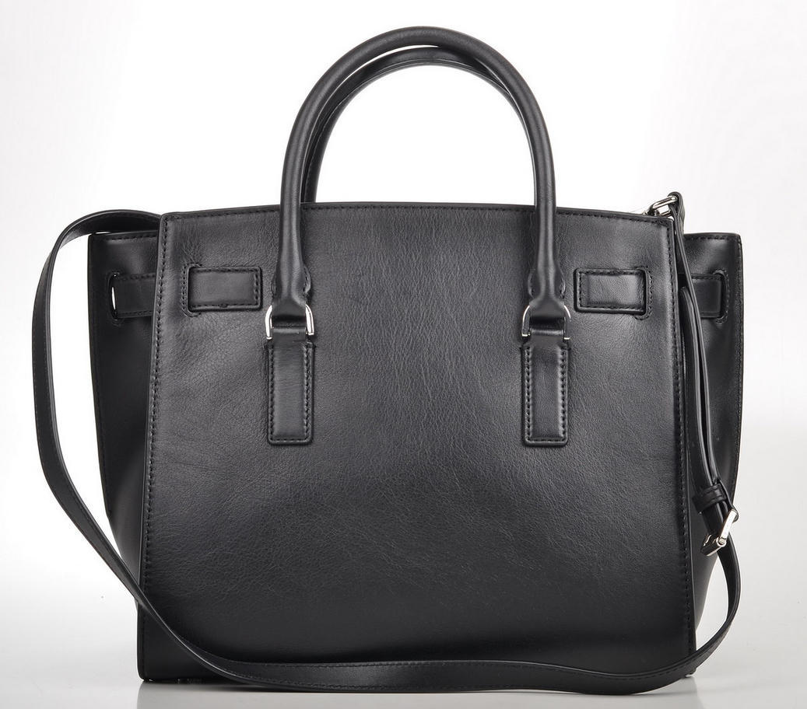

Delta Chat Version 2 upgrades chats to become robustly end-to-end encrypted by default, 
complementary to [chatmail relays](https://chatmail.at/relays) 
enforcing end-to-end encryption with metadata-minimization for all messages. 
V2 app releases internally migrate contacts to be identified by cryptographic keys rather than e-mail addresses. 
End-to-end encrypted chats can thus not degrade after creation anymore
because potential network attackers, including e-mail providers, have no say about encryption setups anymore. 
The new releases carefully maintain compatibility with older releases
because we much prefer to not urge users or developers 
for simultanous "co-ordinated upgrades". 

True story: a while ago, a contributor's mom who had used Delta Chat for years 
got back saying "Everything is fine! But why does each message have a hand bag?". 
She refered to the lock icon decorating each end-to-end encrypted message. 
Delta Chat Version 2 is geared to her and many others who don't engage in theorizing end-to-end encryption
but want to use a reliable messenger that keeps their chats, messages and contacts consistently private. Period. 

## Less is more: robust end-to-end security for all messages by default 

XXX screenshot of a desktop chatlist + message list without any green checkmarks or padlocks in messages 

Many experienced developers will know: 
the best code or UI element in any sufficiently complex system is the one which can be removed 
while simultanously improving overall functionality for users. 
The [massive "keycontacts" rework in the central chatmail core Rust library](https://github.com/chatmail/core/pull/6796) 
added 4969 and removed 6299 lines of code, netting to removal of 1330 LOCs overall. 
In turn, it allowed Delta Chat apps on all platforms 
to remove pad locks, green checkmarks (mostly) and "encryption broken" dialogues from chats,
resulting in a robust and consistently default end-to-end encrypted user experience. 

For more technical details and background, including discussion of so called "forward secrecy" and "sealed sender" features, 
please visit the [Revised Encryption and Security FAQ section](help#encryption-and-security)
or watch [two recent related June 2025 security talks](https://chaos.social/@delta/114794093068029745). 

## Classic e-mail usage is also enhanced but requires manual opt-in 

XXX screenshot of "new email" compose window 
XXX screenshot of "email chat" showing mail icon as avatar

While it's impossible 
to receive or send messages without end-to-end encryption
when onboarding automatically with [chatmail relays](https://chatmail.at/relays)
you can alternatively manually setup classic e-mail accounts. 
Messages without end-to-end encryption will then be marked with a "mail icon". 
There also is an additional "new email" UI action 
that allows to set a subject and add e-mail address recipients
before sending a cleartext e-mail message. 
With Version 2 releases, e-mail messages without end-to-end encryption 
are generally easier to recognize because chat avatars will also use the same boring "mail icon". 

## Contact Profiles are more beautiful on all platforms

XXX screenshosts of contact profiles on multiple platforms 

XXX missing paragraph(s) 
