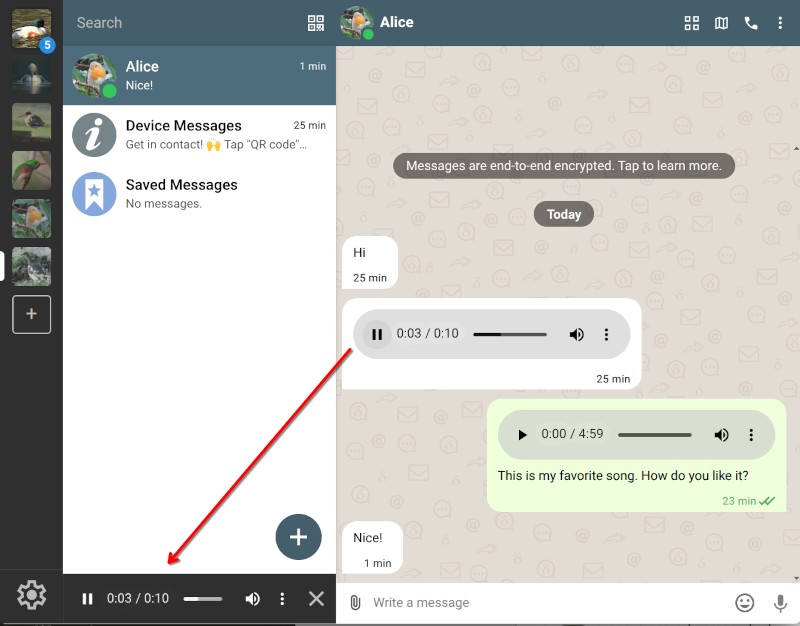

**With the latest 2.48+ releases,
a chat message reveals close to zero metadata to servers.**
For cryptographers and messenger enthusiasts, here are the key points on how we turned email very close to zero-metadata:

- **No cleartext Auto-Submitted or threading headers.**
  In addition to Subject, To, and group membership headers, we're now also protecting
  Auto-Submitted, References, and In-Reply-To.
  This means that all meaningful header metadata now lives exclusively in the encrypted part of messages,
  implementing full [Header Protection (RFC 9788)](https://datatracker.ietf.org/doc/rfc9788/).
  Transport servers only see a minimal so-called outer envelope.
  See [this chatmail core PR](https://github.com/chatmail/core/pull/7935)
  for an example how it was done.

- **Securejoin v3 hides cryptographic identities.**
  When the user scans a QR code or clicks on an invite link,
  multiple administrative messages are exchanged
  in order to establish a chat and verify the public keys.
  The [new securejoin protocol (link contains beautiful hand drawings!)](https://github.com/chatmail/core/issues/7396)
  encrypts all of these initial messages.
  Previously, the very first securejoin message was sent unencrypted,
  leaking the joiner's cryptographic fingerprint to the server.
  No more.
  The linked pull request also provides a masterclass in
  how to evolve a protocol to be both forward- and backward-compatible,
  thus avoiding any friction for users.

- **No cryptographic key information in OpenPGP messages anymore.**
  We have finally [enabled anonymous OpenPGP key IDs](https://github.com/chatmail/core/issues/7384)
  after waiting five months to give everyone time to upgrade their chatmail clients first.
  Make sure all your devices, and at best those of your contacts, are up to date with, at the very least, 1.60.6 apps (released June 2025).
  Together with our Securejoin v3 work this completes our long-term goal of hiding
  cryptographic identities from the message transport layer,
  after [we robbed servers of the ability to perform machine-in-the-middle attacks in August 2025](https://delta.chat/en/2025-08-04-encryption-v2).

- **Randomized Date header.**
  The outer Date is 5-day randomized, preventing timestamp-correlation
  from attackers with access to temporary server message archives.
  Delta Chat would not need this header at all,
  but we decided to maintain end-to-end compatiblity with other encrypting email apps,
  and classic email servers,
  which often require this outer date header to function at all.

- **No "Sealed Sender" yet,** but also no phone numbers or private data
  recorded at chatmail relays.
  Chatmail profiles are created with random addresses
  and without asking for any personal information.
  Don't fret, though.
  We are aiming to land "Sealed Sender" eventually,
  maybe along with [Autocrypt2 support](https://autocrypt2.org),
  which is to provide Post-Quantum-Cryptography and Reliable Deletion ("Forward Secrecy").

 _orange: random, green: hidden, everything else: no meaningful data_

## Native calls on Android and iOS!

Audio and video calls on Android, iOS 
now behave like native phone calls:
you can keep a call running in the background
while switching to a different chat or even another app.
Under the hood, calls use peer-to-peer [WebRTC](https://github.com/deltachat/calls-webapp)
with signaling via regular Delta Chat messages.
The feature is still behind the "debug calls" setting.

## Native video calls on DeltaTouch (UbuntuTouch)

which is why we are supporting developments on alternative mobile ecosystems
to the best of our abilities and resources.
Luckily, there are some rich and friendly people supporting the "UbuntuTouch" ecosystem
and DeltaTouch in particular,
a pretty much feature-parity Delta Chat client, based on the Lomiri toolkit.
And the lead devs recently landed full audio/video calls for "DeltaTouch".
If you have C++ and QT knowledge and interest,
please feel free to head over to the [codeberg deltatouch repository](codeberg.org/lk108/deltatouch).

XXX screenshots of a video/audio call on DeltaTouch

## Group and channel descriptions

Groups and broadcast channels now support [descriptions](https://github.com/chatmail/core/pull/7829)
that members see in the group profile.
Descriptions are end-to-end encrypted and synced with member additions,
making it easy to tell new members what a group is about.

XXX 

## Background audio message player

For those of us who like interacting via audio messages, this is golden:
both Desktop and Android now support playing audio messages in the background.

## Download on demand revamped, improved push notifications

XXX more info on pre-messages and our push notification efforts

## "At-risk" user needs: 1. availability 2. telegram 3. security

For over a decade, security-oriented messengers have been urged to match the
latest cryptographic protocols, with Signal often cited as the gold standard.
While we continuously work to close the security and privacy gaps between
Delta Chat and Signal, we'd like to remind everyone that Telegram has reached one billion users.
Many people prioritize user experience and UI features,
happily providing their message content and interaction metadata to the billionaire
hands of Mr. Pavel Durov, who offers nothing more than a "Trust me, bro!" attitude.
Talk about masterclasses in "security" propaganda!

Delta Chat has always been a pragmatic, down-to-earth, UI-oriented project.
Even with limited resources compared to tech giants, our newest
releases continue to drive usability and modern UI features forward.
We aim to provide the features users expect without centralization and monopoly traps.
Our [public 'find a messenger with more convenient onboarding' challenge](https://chaos.social/@delta/115479392746850836)
remains open for submissions :)

As we enter 2026, the rise of authoritarianism makes communication resilience
critical for an increasing number of "at-risk" users.
If a tool is "theoretically superior" but blocked or unavailable,
its security or networking features provide zero practical benefit.
Availability is the very foundation of security in emergency situations.

## Maximizing availability and resilience through multi-path delivery

Single-path messaging systems suffer from a fundamental flaw:
if your primary server is blocked or goes down, communication stops.
Centralized services like Signal, WhatsApp, or Telegram are easily targeted
and if they go down themselves, there is no remedy whatsoever.
Even decentralized systems like Matrix often require depending on a single home server,
creating a persistent single point of failure.

Our new releases introduce resilient multi-path message delivery.
Each profile can now use multiple relays or mail servers for sending and receiving messages.
If one is blocked, messages automatically flow through another.
Tapping into the [growing network of chatmail relays](https://chatmail.at/relays),
Delta Chat users can finally achieve true transport-layer redundancy,
and transport operators can sleep better
knowing that if their relay goes down it will not prevent users from chatting.
For Rust experts interested in the implementation,
start from the ["multi-relay" development issue](https://github.com/chatmail/core/issues/7357).

Currently, adding secondary relays is a manual step in "Advanced Settings -> Relays".
**Ensure all your devices are upgraded to version 2.48 or later before enabling this feature**.

After conducting more research and iterative streamlining of multi-path operations,
we aim to automate the onboarding process so that profiles learn about new relays organically.
We are setting ourselves the mad goal of
providing an unstoppable, planetary-scale and very private Internet messaging experience,
while using and improving IETF Internet messaging (email) protocols,
with room for community developments, adaptations and variations at every level.

If you would like to support our efforts, please consider
[contributing or donating](https://delta.chat/en/contribute),
running a [chatmail relay](https://chatmail.at/relays),
or explore the enjoyable wilderness of using or creating [secure mini-apps](https://webxdc.org),
without depending on any app store or hosting servers.

♥ thanks for following and helping us along ♥
