**With the latest 2.48+ releases,
a chat message reveals close to zero metadata to servers.**
For cryptographers and messenger enthusiasts, here are the key points on how we turned email very close to zero-metadata:

**No cleartext Auto-Submitted or threading headers.**
In addition to Subject, To, and group membership headers, we're now also protecting
Auto-Submitted, References, and In-Reply-To.
This means that all meaningful header metadata now lives exclusively in the encrypted part of messages,
implementing full [Header Protection (RFC 9788)](https://datatracker.ietf.org/doc/rfc9788/).
Transport servers only see a minimal so-called outer envelope.

**Randomized Date header.**
The outer Date is 5-day randomized, preventing timestamp-correlation
from attackers with access to temporary server message archives.
Delta Chat would not need this header at all,
but we decided to maintain compatibility with other encrypting email apps,
and classic email servers,
which often require this outer Date header to function at all.

**SecureJoin v3 hides cryptographic identities.**
When the user scans a QR code or clicks on an invite link,
multiple administrative messages are exchanged
in order to establish a chat and verify the encryption setup.
The [new SecureJoin protocol (link contains more beautiful hand drawings!)](https://github.com/chatmail/core/issues/7396)
encrypts all initial messages,
and also shows
how to skilfully evolve a protocol to be both forward- and backward-compatible,
thus avoiding any friction for users.

**No cryptographic key information in OpenPGP messages anymore.**
We have finally [enabled OpenPGP anonymous recipients](https://github.com/chatmail/core/issues/7384)
after waiting five months to give everyone time to upgrade their chatmail clients first.
Please make sure all your devices, and those of your contacts, are using at least
[the v2 security-upgrade releases from August 2025 ](https://delta.chat/en/2025-08-04-encryption-v2).
Especially apps older than June 2025 might encounter "unable to decrypt" messages otherwise.

**No "Sealed Sender" yet,** but also no phone numbers or private data
recorded at chatmail relays.
Chatmail profiles are created with random addresses
and without asking for any personal information.
We have some ideas about eventually implementing "Sealed Sender",
but are more likely to aim for [Autocrypt2 support](https://autocrypt2.org) first,
a new IETF specification draft for Post-Quantum-Cryptography and Reliable Deletion ("Forward Secrecy").

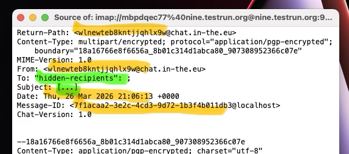 _orange: random, green: hidden, everything else: no meaningful data_

## Native calls on Android and iOS!

Audio and video calls on Android, iOS
now behave like native phone calls:
you can keep a **call running in the background**
while switching to a different chat or even another app.
Another useful use case is to **talk while playing** in-chat games like chess!
Under the hood, calls use peer-to-peer [WebRTC](https://github.com/deltachat/calls-webapp)
with signaling via regular Delta Chat messages.
The feature is still behind the "debug calls" setting but probably not in the next release anymore.

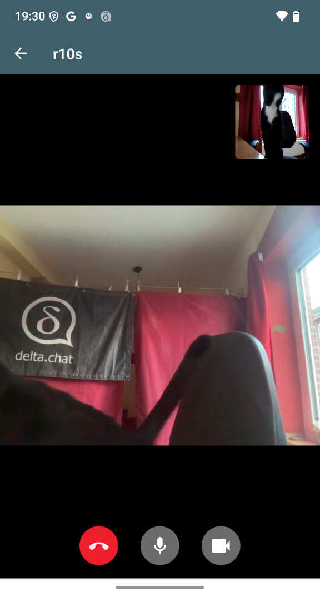
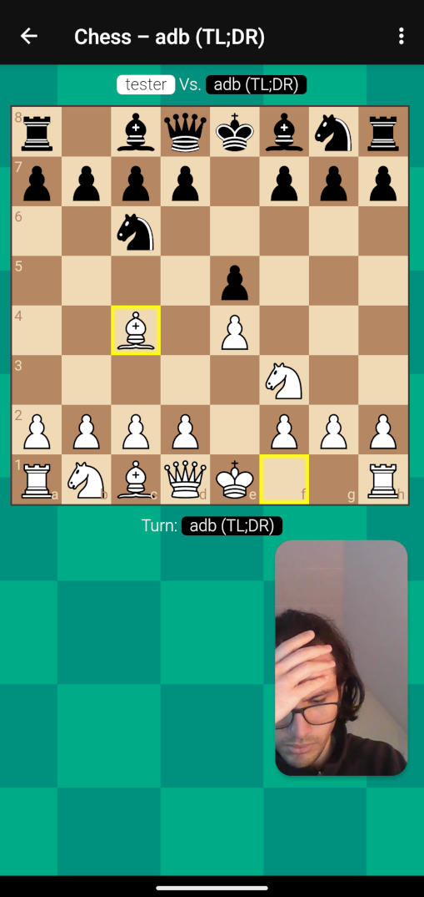 &nbsp; &nbsp;
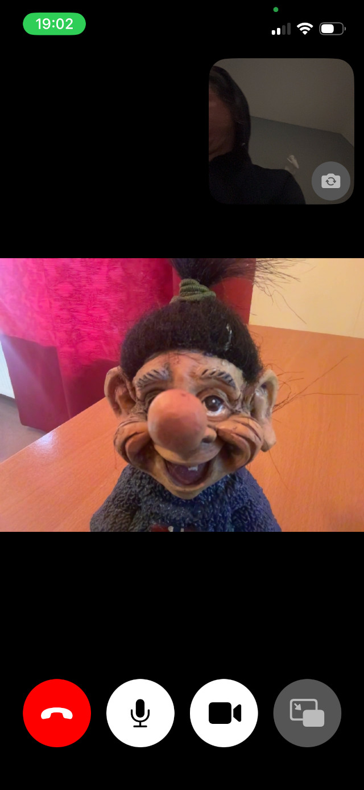
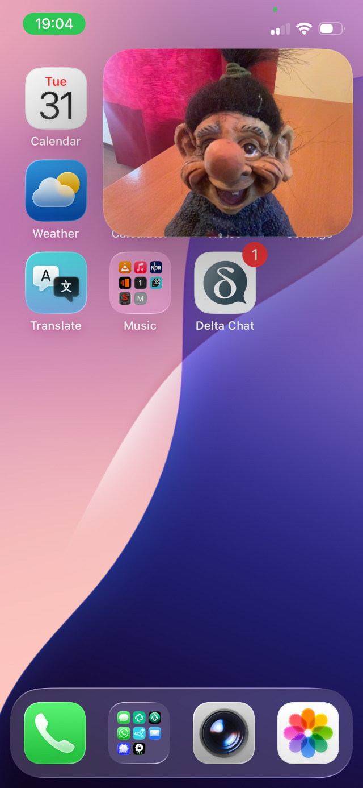

## Native video calls on DeltaTouch (Ubuntu Touch)

Google and Apple are highly problematic centralized authorities for the mobile ecosystem,
which is why we are supporting developments on **alternative mobile ecosystems**
to the best of our abilities and resources.
Luckily, there are some private donors supporting development of DeltaTouch in particular,
a pretty much feature-parity Delta Chat client available on many "Lomiri" platforms.
DeltaTouch recently also landed **audio/video calls, compatible with Delta Chat and all other chatmail clients**.
If you have C++ and QT knowledge and interests,
by all means consider helping in the [Codeberg DeltaTouch repository](https://codeberg.org/lk108/deltatouch),
and the friendly and skillful developers behind it.

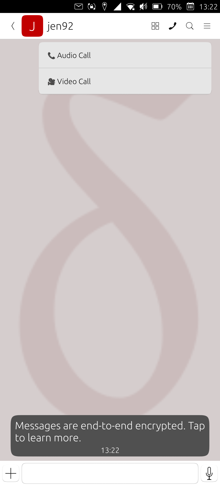 &nbsp;
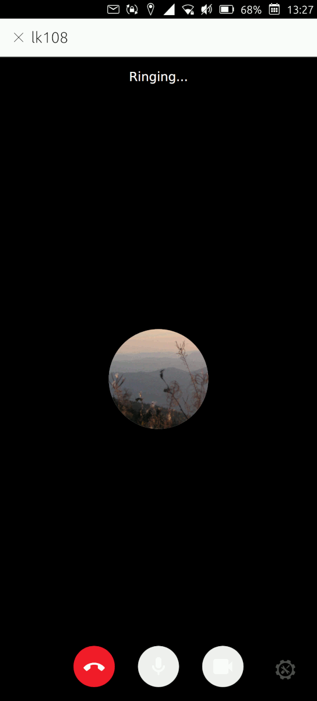 &nbsp;
 &nbsp;
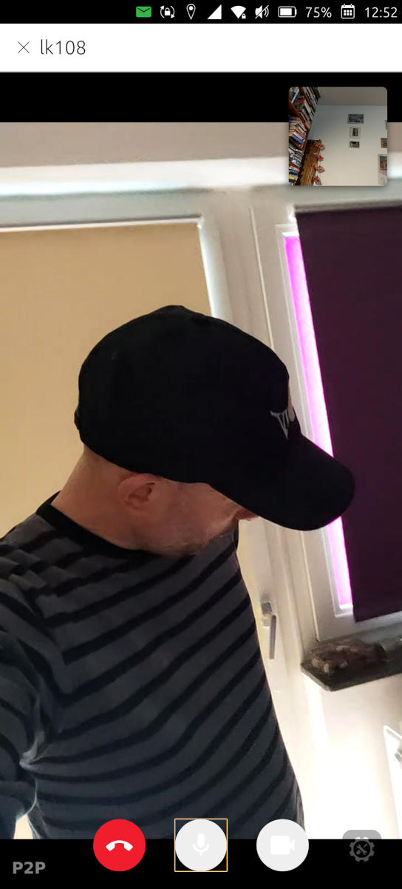

## Group and channel descriptions

Groups and broadcast channels now support [descriptions](https://github.com/chatmail/core/pull/7829)
that members see in the group profile.
Descriptions are end-to-end encrypted and synced with member additions,
making it easy to tell new members what a group is about.

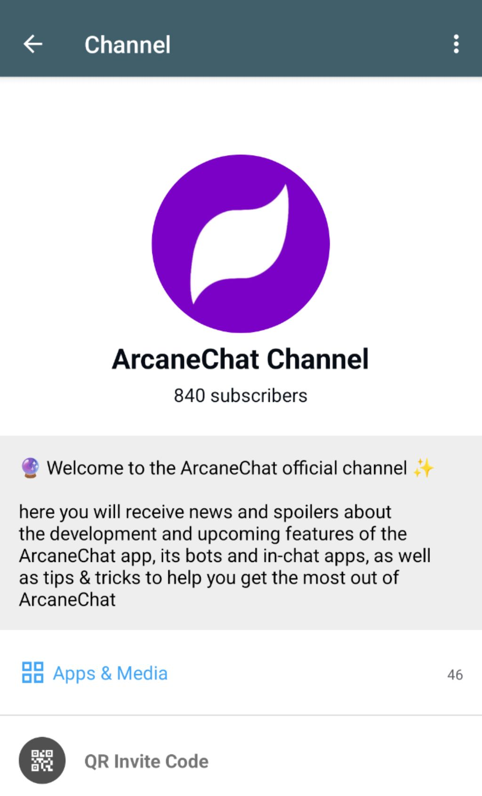 &nbsp;
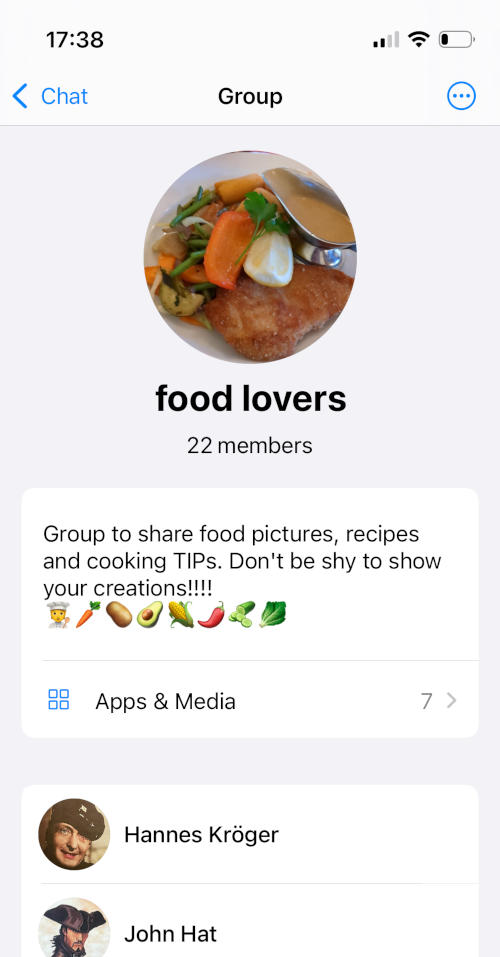

## Background audio message player

For those of us who like interacting via audio messages, this is golden:
both Desktop and Android now support **playing audio messages in the background.**

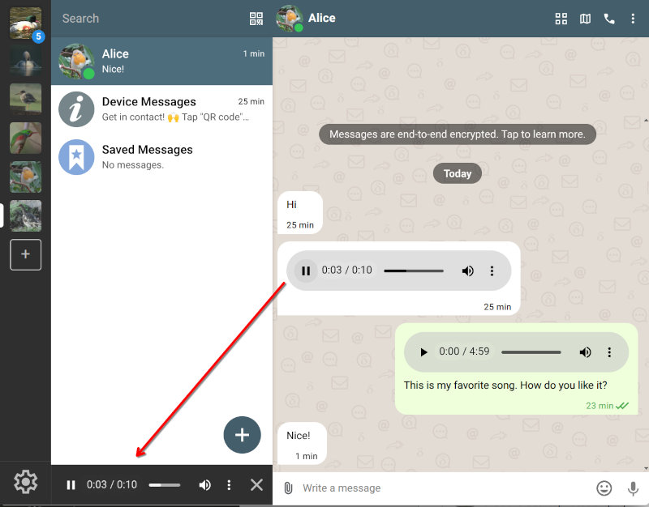
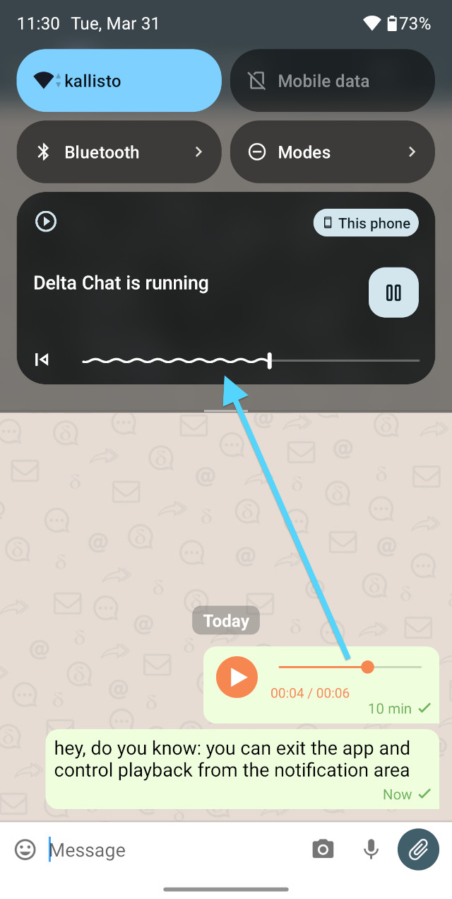

## Download on demand revamped (what a journey!)

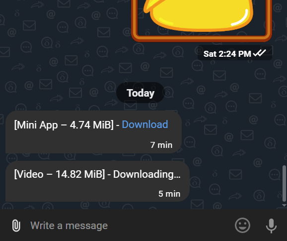

We had to fundamentally re-implement the years-old "download on demand" feature,
because it was relying on "cleartext headers" that aren't available anymore (see the intro on zero-metadata above).
For larger messages, and messages with an attachment,
Delta is now internally sending two messages, one small and one large.
This provides receivers the choice to first download all small messages,
and automatically or optionally download the larger ones:

- Calls can get through without first downloading potentially megabytes of attachments.

- Delta Chat iOS notifications work without crashing on large messages.

- Not yet fully downloaded messages are correctly placed in chats (instead of weird 1:1 email messages).

We still know about a few shortcomings but it should mostly just work fine.
For those interested in the breadth of past and ongoing implementation efforts,
[search for 'pre-messages'](https://github.com/chatmail/core/issues?q=pre-message)
and pray the apparently increasingly vibe-coded GitHub infrastructure grants you results.

## "At-risk" user needs: 1. availability 2. telegram 3. security

For over a decade, security-oriented messengers have been urged
to match the latest cryptographic protocols, with Signal often cited as the gold standard.
With the current releases we are closing in on the security and privacy gaps between Delta Chat and Signal. 
But we'd like to kindly remind everyone that Telegram has reached more than one billion users.
One billion people! Many of whom prioritize user experience and UI features,
happily providing message content and metadata to the billionaire hands 
of Mr. Pavel Durov, who offers nothing more than a "Trust me, bro!" attitude.
His skills in security propaganda are second to nobody!

<a href="https://chaos.social/@delta/116243542449596112">
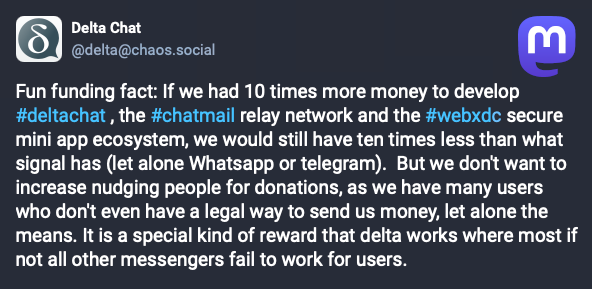
</a>
Delta Chat has always been a pragmatic UI-oriented project.
We aim to provide the **features users expect without centralization and monopoly traps**.
Even with limited resources compared to tech giants
our newest releases continue to drive usability and modern UI features forward.
An impossible dream for Telegram channels users,
Delta Chat's **encrypted broadcast channels are** evolving to provide **a more secure and private alternative**.
Also, our [public 'find a messenger with more convenient onboarding' challenge](https://chaos.social/@delta/115479392746850836)
remains open for submissions. No strong competitors emerged so far :)

As we enter 2026, the rise of authoritarianism makes communication resilience
critical for an increasing number of "at-risk" users everywhere.
**If a tool is blocked or unavailable,
its features, security or otherwise, provide exactly zero benefit.**
Real-world availability is the very foundation of security in emergency situations,
and in this regard, Delta Chat apps are likely second to none.
Even the [New York Times seems to agree](https://www.nytimes.com/2026/03/31/world/europe/russia-internet-restrictions.html)
and we are not quite done yet developing more resiliency features ...

## Maximizing availability and resilience through multi-path delivery

Single-path messaging systems suffer from a fundamental flaw:
if your primary server is blocked or goes down, communication stops.
Centralized services like Signal, WhatsApp, or Telegram are easily targeted
and if they go down themselves, there is no remedy whatsoever.
Also the decentralized Matrix requires depending on a single home server,
creating a persistent single point of failure.

Our new releases introduce **resilient multi-path message delivery.**
Each profile can now use multiple relays or mail servers for sending and receiving messages.
If one is blocked, messages automatically flow through another.
Tapping into the [growing network of chatmail relays](https://chatmail.at/relays),
Delta Chat users can finally achieve true transport-layer redundancy,
and transport operators can sleep better
knowing that if their relay goes down it will not prevent users from chatting.
You may imagine it as providing multiple evasive paths for those
seeking to evade the All-Seeing Eye of centralized surveillance and control.
For Rust experts interested in the implementation,
start from the ["multi-relay" development issue](https://github.com/chatmail/core/issues/7357).

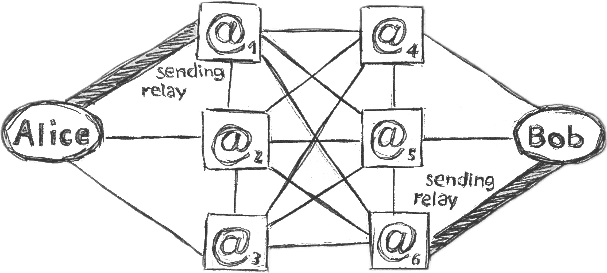 
_any of two relays of Alice or Bob can fail, but chatting works_ &nbsp;

Currently, adding secondary relays is a manual step in "Advanced Settings -> Relays".
**Ensure all your devices are upgraded to version 2.48 or later before enabling this feature**.

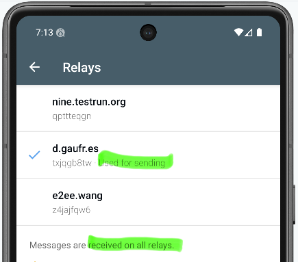

After conducting more research and iterative streamlining of multi-path operations,
we aim to automate the onboarding process so that profiles learn about new relays organically.
We are setting ourselves the mad goal of
providing an unstoppable, planetary-scale and very private Internet messaging experience,
while using and improving IETF Internet messaging (email) protocols,
with room for community developments, adaptations and variations at every level.

If you would like to support our efforts, please consider
[contributing or donating](https://delta.chat/en/contribute),
running a [chatmail relay](https://chatmail.at/relays),
or explore the enjoyable wilderness of using or creating [secure mini-apps](https://webxdc.org),
without depending on any app store or hosting servers.

♥ **thanks for following and supporting us** ♥
