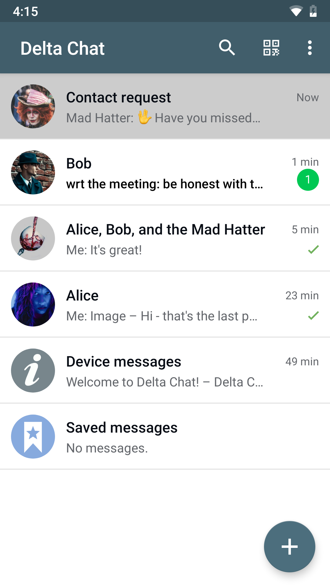

# Četuj přes e-mail a pojď s námi zpět do budoucnosti!

**Delta Chat je jako Telegram nebo Whatsapp, ale bez sledování a centralizované kontroly.**
Delta Chat nepotřebuje tvé telefonní číslo. Přečti si [prohlášení o soukromí](gdpr).

**Delta Chat neprovozuje 쮂멳né vlastní servery** ale pou쮂셨치 nejmasivnější a nejkošatější otevřený systém 
jaký kdy existoval pro zasílání zpráv: síť e-mailových serverů.

**Hovoř s kýmkoli na koho máš e-mailovou adresu, nemusí si instalovat DeltaChat!** 
Jediné co potřebuješ je standardní e-mailový účet.

Přečti si [reakce u쬴vatelů](user-voices) 游닊

# Snímky ze zařízení Android, Desktop a iOS

 
 

 

 

Podívej se na [get.delta.chat](https://get.delta.chat) a na [náš blog](blog)
kde najdeš informace o nejnovějších verzích a událostech. 

Delta Chat je [otevřený](https://cs.wikipedia.org/wiki/Otevřený_software)
a [svobodný](https://cs.wikipedia.org/wiki/Svobodný_software) software. 
M콢쬰코 se do něj podívat, u쮂셨at, měnit, a sdílet ho s kým chceš.
