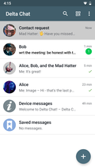

# Delta Chat ist ein Messenger, der über E-Mail funktioniert

💬 Sende Nachrichten an jeden, der eine E-Mail-Adresse hat, [selbst wenn sie nicht Delta Chat nutzen](https://www.youtube-nocookie.com/embed/8LbrGXKZN70).

🥳 Entdecke interaktives Chatten mit [webxdc Apps](https://webxdc.org).

🔒 Ende-zu-Ende-Verschlüsselung mit [Autocrypt](https://autocrypt.org) und [CounterMITM](https://countermitm.readthedocs.io/en/latest/new.html) Protokollen und [mehreren Sicherheitsüberprüfungen](https://delta.chat/en/2023-03-27-third-independent-security-audit). 

# Verfügbar für Mobil- und Desktopgeräte

 

 

 

[Herunterladen](https://get.delta.chat){: .cta-button}

[Quelloffene](https://de.wikipedia.org/wiki/Open_Source)
und [freie Software](https://de.wikipedia.org/wiki/Freie_Software), basierend auf [Internet-Standards](https://github.com/deltachat/deltachat-core-rust/blob/master/standards.md). 

Sieh dir [Erfahrungsberichte und Meinungen](user-voices) an.
