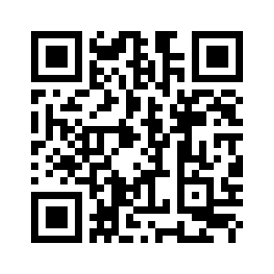

# Delta/Android Downloads (Beta)

Delta/Android is the most feature-rich and stable Delta Chat app. 

* [Download from F-Droid](https://f-droid.org/app/com.b44t.messenger)
* [Download from Google Play Beta Channel](https://play.google.com/store/apps/details?id=chat.delta)
* [Download APK](https://github.com/deltachat/deltachat-android/releases) (experienced users only)
* [View Changelog](), [contribute to the Android repo](https://github.com/deltachat/deltachat-android/). 

# Delta/Desktop Downloads (Beta)

Delta/Desktop is well usable and can be operated standalone or in conjunction with Android or iOS. 

* [download for Ubuntu 16.04-19.10 (click "assets")](https://github.com/deltachat/deltachat-desktop/releases/)

* [download for Mac from our github release page (click "assets")](https://github.com/deltachat/deltachat-desktop/releases/).  

* [download for Linux from flathub](https://flathub.org/apps/details/chat.delta.desktop)

* Windows support pending, help welcome! 

* [FAQ multiclient](help#multiclient) page on how to synchronize Desktop with another Delta app. 

* [View Changelog](https://github.com/deltachat/deltachat-desktop/blob/master/CHANGELOG.md),
  [contribute to Desktop repository](https://github.com/deltachat/deltachat-desktop/). 

# Delta/iOS on TestFlight (Beta)

Delta/iOS supports basic functionality but not all features offered by Android or Desktop. 
Betas are distributed via Testflight. 

- [testflight invite page](https://testflight.apple.com/join/WVoYFOZe) for your iPhone or iPad.

- [contribute to iOS development](https://github.com/deltachat/deltachat-ios/). 

- Scan this QR code with the camera app of your iPhone/iPad

  

# Verify Downloads

For Android, you can verify the signing certificate on the APK matches one of the following SHA256 fingerprints:  

* For F-Droid downloads:  
  ``

* Other APK downloads:  
  ``

To print the SHA256 fingerprints of the APK signing certificate you can use eg.  
`keytool -list -printcert -jarfile <APK-file>`

