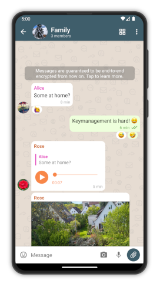
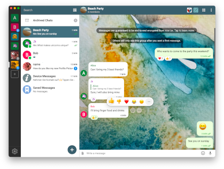

# Delta Chat es una aplicación de mensajería descentralizada y segura {#homepage-heading}

💬 Mensajería instantánea fiable con soporte de múltiples perfiles y dispositivos

⚡️ Regístrate en [servidores chatmail seguros y rápidos](chatmail) o utiliza [servidores de correo clásicos](https://providers.delta.chat/)

🥳 Aplicaciones web interactivas en chats para juegos y colaboración

🔒 Cifrado de extremo a extremo auditado, seguro contra ataques de red y servidor

👉 Software libre (FOSS), construido sobre [estándares de Internet](https://github.com/deltachat/deltachat-core-rust/blob/master/standards.md), evitando [xkcd927](https://xkcd.com/927/) :)

<a href="../assets/home/screenshots/android1.png">
<picture>
<source srcset="../assets/home/screenshots/android1-thumbnail.webp" type="image/webp" />
<source srcset="../assets/home/screenshots/android1-thumbnail.png" type="image/png" />

</picture>
</a>

<a href="../assets/home/screenshots/android2.png">
<picture>
<source srcset="../assets/home/screenshots/android2-thumbnail.webp" type="image/webp" />
<source srcset="../assets/home/screenshots/android2-thumbnail.png" type="image/png" />

</picture>
</a>

<a href="../assets/home/screenshots/desktop.png">
<picture>
<source srcset="../assets/home/screenshots/desktop-thumbnail.webp" type="image/webp" />
<source srcset="../assets/home/screenshots/desktop-thumbnail.png" type="image/png" />

</picture>
</a>

<a href="../assets/home/screenshots/ios.png">
<picture>
<source srcset="../assets/home/screenshots/ios-thumbnail.webp" type="image/webp" />
<source srcset="../assets/home/screenshots/ios-thumbnail.png" type="image/png" />

</picture>
</a>

[Descargar](https://get.delta.chat){: .cta-button}

Disponible en móvil y escritorio.

