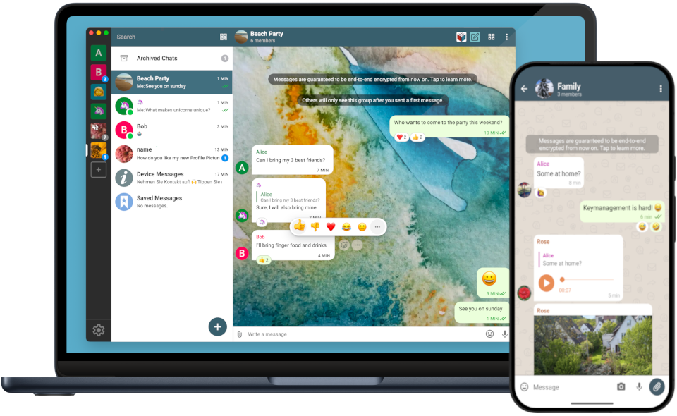

# Decentralized & Secure Messaging {#homepage-heading}

<picture>
<source srcset="../assets/home/screenshots/desktop-and-mobile-thumbnail.webp" type="image/webp" />

</picture>

<a href="https://get.delta.chat" class="download-btn">Get Delta Chat</a>

💬 پیام‌رسان فوری قابل اتکا با پشتیبانی از چند دستگاه و نمایه

⚡️ در [رله‌های امن گپ‌نامه](https://chatmail.at/relays) که با یک دیگر تعامل دارند ثبت‌نام کنید

🥳 [مینی برنامه‌های تعاملی تحت وب](https://webxdc.org/) در چت برای بازی کردن و همکاری

🔒 [رمزنگاری سراسری بررسی شده از لحاظ فنی](help#security-audits) که در مقابل حمله‌های شبکه و کارساز امن است.

👈 نرم‌افزار [آزاد](https://fa.wikipedia.org/wiki/نرم‌افزار_آزاد) و [متن‌باز](https://fa.wikipedia.org/wiki/نرم‌افزار_متن‌باز) که بر روی [استاندارد‌های اینترنت](https://github.com/deltachat/deltachat-core-rust/blob/master/standards.md) ساخته شده تا از [xkcd927](https://xkcd.com/927/) جلوگیری کند :)
