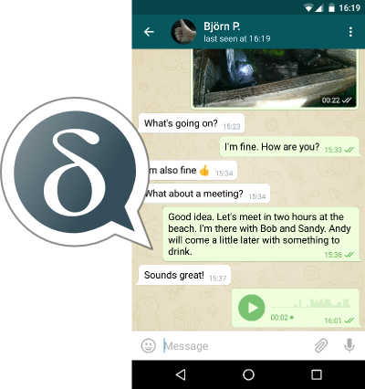

# Que propose Delta Chat

Delta Chat est une nouvelle messagerie instantanée, comme un email mais dans une style moderne. Simplement mieux, plus sûr et plus convivial.

Choisissez la **sécurité maximale** et atteignez vos contacts **sans** vous forcer à **dépendre** d'un service spécifique. Vous ne partagerez plus le contenu de votre carnet d'adresses à des entreprises tierces

Ces avantages ne sont offertes par aucune autre messagerie instantanée.

**Commencez immédiatement** Vous avez seulement besoin d'une adresse e-mail, avec cela, vous pouvez joindre n'importe quel contact email.

## Profitez des nombreux avantages suivants:

- Delta Chat est la messagerie avec la **plus grande base d'utilisateurs au monde**: tout client de messagerie sur n'importe quel système d'exploitation est compatible
- Architecture distribuée: il n'y a pas **de serveur central** Delta Chat
- Indépendant: vous n'êtes **pas dépendant** de service ou serveur externe, Delta Chat utilise uniquement votre serveur de messagerie.
- Votre compte n''est pas dépendant d'un numéro de téléphone portable
- Rapide: envoyer vos messages **instantanément** - Interface rapide
- Puissant: messages **illimités**, images, vidéos, messages audio et bien plus, compatible avec d'autres clients
- Gratuit: Delta Chat sera toujours: **Gratuit** - Open Source, **sans publicités** et utilisable sans abonnement
- Sûr: **chiffré** avec tous les meilleurs algorithmes récents - Ouvert pour l'examen du code source
- Protégé: Delta Chat vous protège contre les **spam**
- Loyal: Votre **annuaire téléphonique** reste sur votre smartphone - Il est **pas téléchargé** partout
- Anonyme: les **métadonnées** comme _Qui_ communique avec _Qui_, _Quand_ et _Ou_ ne sont **pas collectées**
- Dynamique: Delta Chat propose des **discussions de groupe**

## Plus d'informations

Détails sur les fonctions et l'implémentation dans [FAQ](../fr/help) 
D'autres raisons et motivations peuvent être trouvées dans l'article de blog en anglais: [Delta makes chatting better](https://delta.chat/en/2017-05-31-delta-makes-chatting-better).