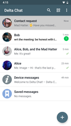
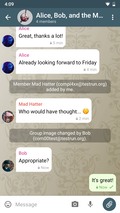
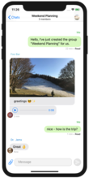

# Delta Chat is a decentralized and secure messenger app {#homepage-heading}

💬 Reliable instant messaging with multi-profile and multi-device support

💨 Sign up to [secure fast chatmail servers](chatmail) or use [traditional e-mail servers](https://providers.delta.chat/)

🥳 Interactive [web apps in chats](https://webxdc.org/) for gaming and collaboration

🔒 [Audited end-to-end encryption](https://delta.chat/en/2024-03-25-crypto-analysis-securejoin) safe against network and server attacks

👉 [F](https://en.wikipedia.org/wiki/Free_software)[OSS](https://en.wikipedia.org/wiki/Open-source_software) software, built on [Internet Standards](https://github.com/deltachat/deltachat-core-rust/blob/master/standards.md), avoiding [xkcd927](https://xkcd.com/927/) :)

<a href="../assets/blog/screenshots/2019-12-17-delta-chat-google-play-release-chat-list-light.png">
<picture>
<source srcset="../assets/blog/screenshots/2019-12-17-delta-chat-google-play-release-chat-list-light-thumbnail.webp" type="image/webp" />
<source srcset="../assets/blog/screenshots/2019-12-17-delta-chat-google-play-release-chat-list-light-thumbnail.png" type="image/png" />

</picture>
</a>

<a href="../assets/blog/screenshots/2019-12-17-delta-chat-google-play-release-group-light.png">
<picture>
<source srcset="../assets/blog/screenshots/2019-12-17-delta-chat-google-play-release-group-light-thumbnail.webp" type="image/webp" />
<source srcset="../assets/blog/screenshots/2019-12-17-delta-chat-google-play-release-group-light-thumbnail.png" type="image/png" />

</picture>
</a>

<a href="../assets/home/screenshots/desktop.png">
<picture>
<source srcset="../assets/home/screenshots/desktop-thumbnail.webp" type="image/webp" />
<source srcset="../assets/home/screenshots/desktop-thumbnail.png" type="image/png" />

</picture>
</a>

<a href="../assets/blog/screenshots/2020-01-09-delta-chat-iOS-weekend-group-chat.png">
<picture>
<source srcset="../assets/blog/screenshots/2020-01-09-delta-chat-iOS-weekend-group-chat-thumbnail.webp" type="image/webp" />
<source srcset="../assets/blog/screenshots/2020-01-09-delta-chat-iOS-weekend-group-chat-thumbnail.png" type="image/png" />

</picture>
</a>

[Télécharger](https://get.delta.chat){: .cta-button}

Available on mobile and desktop.

