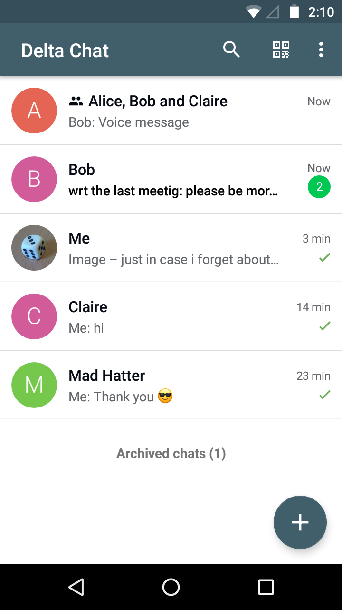
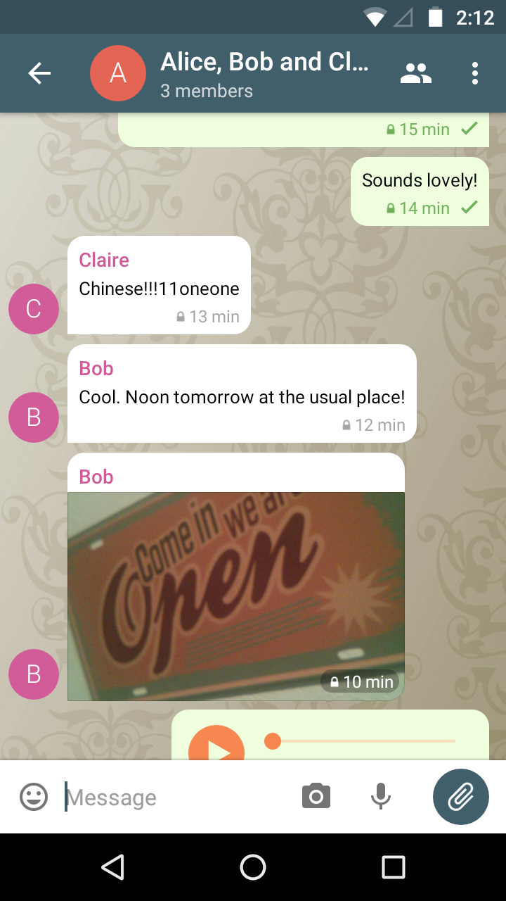
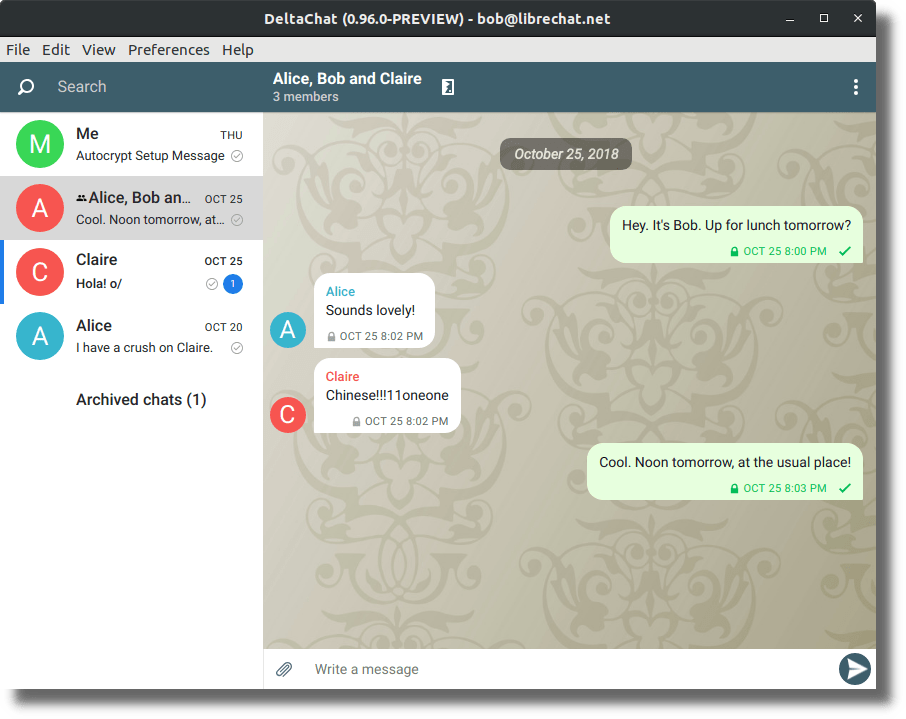
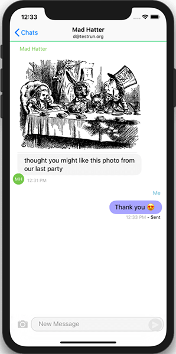

<!-- GENERATED FILE -- DO NOT EDIT -->

# Tchattez par courriel et retournez vers l'avenir avec nous !

**Chat Delta est comme Telegram ou Whatsapp mais sans surveillance ni contrôle central.**
Delta Chat n'a pas besoin de votre numéro de téléphone. Consultez notre [déclaration de confidentialité](rgpd).

**Delta Chat ne dispose d'aucun serveur** mais il utilise le système de messagerie ouverte le plus massif et le plus diversifié qui soit : le réseau des serveurs de messagerie électronique déjà existant.

**Tchattez avec n'importe qui si vous connaissez son adresse de courriel, pas besoin pour eux d'installer DeltaChat!**
Tout ce dont vous avez besoin, c'est d'un compte de courriel standard.

# Captures d'écran Android, Ordinateur de bureau et iOS

Veuillez consulter [get.delta.chat](https://get.delta.chat) et les [derniers messages du blog](blog) pour obtenir des renseignements sur les versions et événements en cours. 

