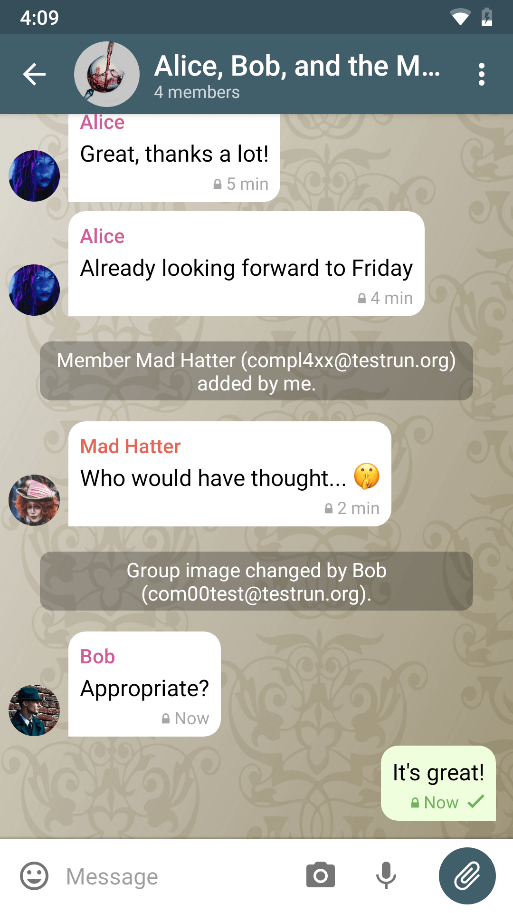

# Delta Chat adalah aplikasi perpesanan yang bekerja melalui email

💬 Kirim pesan kepada siapa pun dengan alamat email [bahkan jika mereka tidak menggunakan Delta Chat](https://www.youtube-nocookie.com/embed/8LbrGXKZN70).

🥳 Nikmati pengalaman obrolan interaktif melalui [aplikasi webxdc](https://webxdc.org).

🔒 Semua data Anda tetap ada di perangkat dan akun email Anda.

# Tersedia di seluler dan desktop

 
 

 

 

<a class="download-button" href="https://get.delta.chat">Unduh</a>

[Sumber Terbuka](https://en.wikipedia.org/wiki/Open-source_software)
dan [aplikasi gratis](https://en.wikipedia.org/wiki/Free_software), dibuat di atas [Standar Internet](https://github.com/deltachat/deltachat-core-rust/blob/master/standards.md). 

Lihat [cerita dari para pengguna](user-voices).
