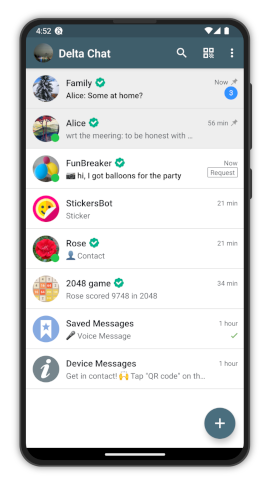
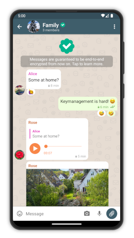
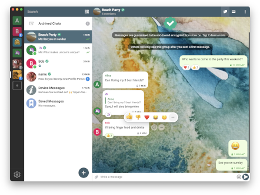
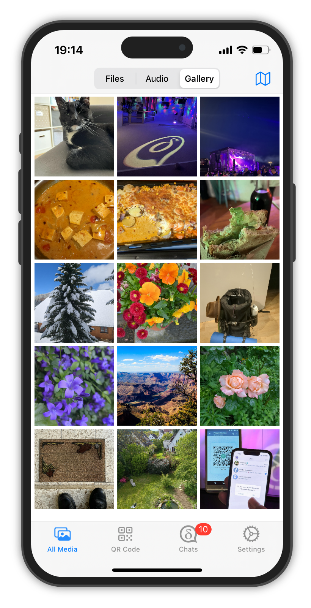

# Delta Chat to zdecentralizowany i bezpieczny komunikator {#homepage-heading}

💬 Niezawodny komunikator z obsługą wielu profili i wielu urządzeń

⚡️ Sign up to secure and interoperable [chatmail relays](https://chatmail.at/relays)

🥳 Interaktywne [aplikacje internetowe w czatach](https://webxdc.org/) do gier i współpracy

🔒 [Audytowane szyfrowanie end-to-end](https://delta.chat/en/2024-03-25-crypto-analysis-securejoin) zabezpieczające przed atakami sieciowymi i serwerowymi

👉 Oprogramowanie [F](https://pl.wikipedia.org/wiki/Wolne_oprogramowanie)[OSS](https://pl.wikipedia.org/wiki/Otwarte_oprogramowanie), stworzone w oparciu o [standardy internetowe](https://github.com/deltachat/deltachat-core-rust/blob/master/standards.md), unikające [xkcd927](https://xkcd.com/927/) :)

<a href="../assets/home/screenshots/android1.png">
<picture>
<source srcset="../assets/home/screenshots/android1-thumbnail.webp" type="image/webp" />
<source srcset="../assets/home/screenshots/android1-thumbnail.png" type="image/png" />

</picture>
</a>

<a href="../assets/home/screenshots/android2.png">
<picture>
<source srcset="../assets/home/screenshots/android2-thumbnail.webp" type="image/webp" />
<source srcset="../assets/home/screenshots/android2-thumbnail.png" type="image/png" />

</picture>
</a>

<a href="../assets/home/screenshots/desktop.png">
<picture>
<source srcset="../assets/home/screenshots/desktop-thumbnail.webp" type="image/webp" />
<source srcset="../assets/home/screenshots/desktop-thumbnail.png" type="image/png" />

</picture>
</a>

<a href="../assets/home/screenshots/ios.png">
<picture>
<source srcset="../assets/home/screenshots/ios-thumbnail.webp" type="image/webp" />
<source srcset="../assets/home/screenshots/ios-thumbnail.png" type="image/png" />

</picture>
</a>

[Pobierz](https://get.delta.chat){: .cta-button}

Dostępne na urządzenia mobilne i komputery stacjonarne.

