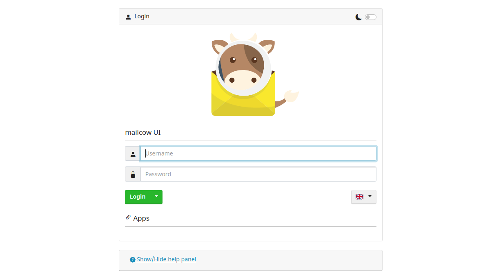

# Jak skonfigurować serwer pocztowy dla Delta Chat

Delta Chat jest komunikatorem, który działa w oparciu o e-mail. Oznacza to, że możemy użyć dowolnego serwera e-mail do uruchomienia kont Delta Chat. Jednym z serwerów e-mail, który jest łatwy do skonfigurowania i zarządzania, a także od razu współpracuje z Delta Chat, jest [Mailcow](https://mailcow.email).

Możesz go uruchomić razem z [mailadm](https://mailadm.readthedocs.io), który oferuje twoim użytkownikom łatwy sposób na utworzenie konta e-mail i bezpośrednie logowanie za pomocą Delta Chat. Jest to również zawarte w tym przewodniku.

Potrzebujesz do tego:

- podstawowej znajomości wiersza poleceń
- nazwę domeny i dostęp do jej ustawień DNS
- dostęp SSH do serwera linux
  - z publicznym adresem IP,
  - minimum 10 GB miejsca na dysku,
  - i minimum 2 GB RAM

## Zainstaluj Dockera

Jako warunek wstępny musisz zainstalować [docker i
docker-compose](https://docs.mailcow.email/i_u_m/i_u_m_install/).

### Jeśli docker.com jest zablokowany:

W zależności od kraju, w którym znajduje się twój serwer, docker.com może być zablokowany. Możesz również uzyskać docker i docker-compose z innych źródeł, które mogą działać:

- Oficjalne repozytorium apt Ubuntu zwykle zawiera przestarzałą wersję dockera; to nie jest najlepszy pomysł.
- [snap](https://docs.docker.com/engine/install/ubuntu/) to inny sposób na zainstalowanie dockera, ale dla docker-compose wariant snap nie działa. Zauważ, że jeśli zainstalujesz docker przez snap, nie działa on w systemd, ale w snap.
- Możesz spróbować pobrać binarny docker-compose [z GitHub](https://github.com/docker/compose/releases/download/v2.12.0/docker-compose-linux-x86_64) i skopiować go do [właściwej lokalizacji](https://docs.docker.com/compose/install/linux/#install-the-plugin-manually)
- Na koniec możesz spróbować uzyskać dostęp do serwera poza swoim krajem, utworzyć proxy HTTPS i użyć go do zainstalowania dokera i docker-compose. To trudne, ale może zadziałać. Możesz [skontaktować się](mailto:mailadm@testrun.org) z nami, jeśli napotkasz problemy.

## Utwórz wpisy DNS

Jeśli nie masz jeszcze domeny, możesz skorzystać z usługi takiej jak [njal.la](https://njal.la), aby kupić domenę .net lub .org za 15 € rocznie. Możesz zapłacić za pomocą PayPal, Bitcoin lub Monero.

Załóżmy, że:
-  kupiłeś przyklad.org. Na razie chcesz mieć tylko serwer pocztowy, ale myślisz o tym, żeby później umieścić na nim stronę internetową https://przyklad.org.
- twój serwer ma adres IPv4 24.48.100.24 - możesz to sprawdzić poleceniem `ip` i poszukać podobnie wyglądającego numeru (który nie zaczyna się od 127 lub 172).
- twój serwer ma adres IPv6 7fe5:2f4:1ba:2381::3 (możesz go znaleźć w `ip`, 2 linijki poniżej adresu IPv4. Zignoruj /64 na końcu. Nie używaj tego zaczynającego się od fe80, to się nie liczy).

Teraz możesz skonfigurować ustawienia domeny dla przyklad.org w następujący sposób:

| Typ  | Nazwa            | Dane                                                 | TTL  | Priorytet |
|-------|-----------------|------------------------------------------------------|------|----------|
| A     | mail            | 24.48.100.24                                         | 5min |          |
| AAAA  | mail            | 7fe5:2f4:1ba:2381::3                                 | 5min |          |
| MX    | @               | mail.przyklad.org                                     | 5min |    10    |
| CNAME | autoconfig      | mail.przyklad.org                                     | 5min |          |
| CNAME | autodiscover    | mail.przyklad.org                                     | 5min |          |
| CNAME | mailadm         | mail.przyklad.org                                     | 5min |          |
| TXT   | @               | "v=spf1 mx -all"                                     | 5min |          |
| TXT   | _dmarc          | v=DMARC1;p=quarantine;rua=mailto:mailadm@przyklad.org | 5min |          |

Możesz ustawić klucz DKIM po skonfigurowaniu mailcow,
w System>Configuration>Options>ARC/DKIM keys.

Możesz ustawić więcej niż 5 minut, ale jeśli zauważysz, że coś jest nie tak, krótki czas pomaga naprawić błędny wpis.

## Skonfiguruj Mailcow

### Ustaw opcje Mailcow

Najpierw sklonuj repozytorium git mailcow - jeśli twój serwer nie ma dostępu do github.com, możesz wykonać ten krok kiedy indziej i użyć `scp` do skopiowania go na swój serwer.

```
sudo apt install -y git
git clone https://github.com/mailcow/mailcow-dockerized
cd mailcow-dockerized
```

Teraz należy uruchomić `./generate_config.sh`, aby wygenerować plik mailcow.conf. Jeśli twój serwer nie ma dostępu do github.com, najpierw musisz usunąć ze skryptu wszelkie polecenia git. Wpisz opcje w taki sposób:

```
Mail server hostname (FQDN) - this is not your mail domain, but your mail servers hostname: mail.example.org
Timezone [Europe/Berlin]: UTC
Which branch of mailcow do you want to use?


Available Branches:
- master branch (stable updates) | default, recommended [1]
- nightly branch (unstable updates, testing) | not-production ready [2]
Choose the Branch with it´s number [1/2] 1
```

Powinieneś określić następujące zmienne w mailcow.conf:

```
ADDITIONAL_SAN=mailadm.example.org
SKIP_CLAMD=y
SKIP_SOLR=y
SKIP_SOGO=y
```

Ostatnie 3 opcje usuwają usługi, które nie są potrzebne do minimalnej konfiguracji.

Następnie musimy uruchomić `printf "#\n" > data/conf/dovecot/global_sieve_before`.

### Skonfiguruj Mailadm NGINX

`mailadm.przyklad.org/new_email` musi być osiągalny, aby żądania HTTP działały. Najpierw więc utwórz plik `data/conf/nginx/server_name.active` i zapisz w nim `mailadm.przyklad.org` - oznacza to, że nginx będzie nasłuchiwał żądań dla tej domeny.

Następnie dodaj następujący blok do `data/conf/nginx/site.mailadm.custom`:

```
  location /new_email {
    proxy_pass http://24.48.100.24:3691/;
  }
```

Pamiętaj, aby zastąpić ten przykładowy adres IP adresem IP swojego serwera.

Spowoduje to przekazanie później wszystkich żądań do `mailadm.example.org/new_email` do kontenera mailadm.

### Pobierz kontenery mailcow

Teraz uruchom `sudo docker compose pull`, aby pobrać kontenery mailcow. Jeśli na tym etapie nie masz dostępu do witryny docker.com, możesz [użyć proxy HTTP](https://elegantinfrastructure.com/docker/ultimate-guide-to-docker-http-proxy-configuration/).

### Uruchom Mailcow

Teraz uruchom mailcow za pomocą `sudo docker compose up -d`.

### Wyłączanie IPv6 dla mailcow

Jeśli twój serwer nie ma adresu IPv6, powinieneś [wyłączyć IPv6](https://docs.mailcow.email/post_installation/firststeps-disable_ipv6/).

### Adding Domain in Mailcow

Now you can login to the mailcow web interface at https://mail.example.org. The
default username is `admin` and the password is `moohoo`. You should change
this password to something more secure.



Next, add a domain in the web interface under "E-Mail > Configuration > Domains".
Somethings like this makes sense:

- domain: example.org
- max. mailboxes: 999999
- default mailbox quota: 3076 (it doesn't matter, mailadm will override this)
- max. mailbox quota: 17240 (basically a bit less than your free disk space)
- domain quota: 17240 (basically a bit less than your free disk space)


After this, you can go to "E-Mail > Configuration > Mailboxes" and create a first account.
You can try it out with Delta Chat now.

#### Optional: Add Additional DNS Entries

In "E-Mail > Configuration > Domains", on the right next to your domain, you can see a blue
"DNS" button. It provides further reccomendations for DNS entries which might
help if you have problems getting your e-mails delivered to other servers.


## Setting up mailadm

Now we can set up mailadm - with this tool you can generate QR codes, which
people can scan from Delta Chat to create an e-mail account on your server. It
is probably the easiest way for users to get started with Delta Chat.

### Downloading mailadm

You can use these commands to download mailadm:

```
cd ~
git clone https://github.com/deltachat/mailadm
cd mailadm
mkdir docker-data
```

### Building mailadm

Now you can build the mailadm docker container with
`sudo docker build . -t mailadm-mailcow`.

#### If docker.com or pypi.org is Blocked

If your server can't reach docker.com, dl-cdn.alpinelinux.org, or pypi.org,
this will fail. But you can build the docker container on a different machine
and copy it to the VPS:

```
sudo docker build . -t mailadm-mailcow
sudo docker save -o mailadm-image.tar mailadm-mailcow
scp mailadm-image.tar example.org:
ssh example.org
sudo docker load --import mailadm-image.tar
```

### Getting an API token from the web interface

Now you can go to https://mail.example.org/admin again, to get a mailcow API
key.

You have to activate the API (Make sure to use the "Read-Write Access API" and
not the "Read-Only Access API"!) and enter your server's br-mailcow interface
IP address under "Allow API access from these IPs/CIDR network notations". You
can find out the IP address with `ip a show br-mailcow`.

Check the checkbox "Activate API and then click on "Save Changes" and copy the
API key.

### Configuring mailadm

Then, in the mailadm directory, create a `.env` file and configure mailadm like
this:

```
MAIL_DOMAIN=example.org
WEB_ENDPOINT=https://mailadm.example.org/new_email
MAILCOW_ENDPOINT=https://mail.example.org/api/v1/
MAILCOW_TOKEN=238473-081241-7A78B1-B7098C-E798BA
```

At `MAILCOW_TOKEN`, enter the API key which you just got from the mailcow web
interface.

If you are unsure how to choose the values in .env, take a look at the
[documentation](https://mailadm.readthedocs.io/en/latest/#configuration-details)
of mailadm.

### Add mailadm alias

Now to make it easier to run mailadm commands, add this alias:

```
alias mailadm="$PWD/scripts/mailadm.sh"
echo "alias mailadm=$PWD/scripts/mailadm.sh" >> ~/.bashrc
```

### Start mailadm

Then you can initialize the database and setup the bot mailadm will use to
receive commands and support requests from your users:

```
mailadm init
mailadm setup-bot
```

Then you are asked to scan a QR code to join the Admin Group, a verified Delta
Chat group. Anyone in the group can issue commands to mailadm via Delta Chat.
You can send “/help” to the group to learn how to use it.

Now, as everything is configured, we can start the mailadm container for good:

```
sudo docker run -d -p 3691:3691 --mount type=bind,source=$PWD/docker-data,target=/mailadm/docker-data --name mailadm mailadm-mailcow gunicorn -b :3691 -w 1 mailadm.app:app
```

This starts a `mailadm` docker container. You can restart it with `sudo docker
restart mailadm`, should you ever want to.

#### First steps with mailadm

That's it! You can now get started with creating tokens and users with mailadm.
Best look at the documentation for the [first
steps](https://mailadm.readthedocs.io/en/latest/#first-steps) - it also
contains hints for troubleshooting the setup if something doesn't work.

## Optional: Disable POP3

Delta Chat uses only SMTP and IMAP,
so if all of your users use Delta Chat,
you can disable POP3.

To do this, add the following to `mailcow.conf`:

```
POP_PORT=127.0.0.1:110
POPS_PORT=127.0.0.1:995
```

Then apply the changes with `sudo docker compose up -d`.

## Optional: Redirect all HTTP traffic to HTTPS

By default,
the nginx server also responds unencrypted
on port 80.
This can be bad,
as some users might enter passwords
over this unencrypted connection.

To prevent this,
create a new file `data/conf/nginx/redirect.conf`
and add the following server config to the file:

```
server {
  root /web;
  listen 80 default_server;
  listen [::]:80 default_server;
  include /etc/nginx/conf.d/server_name.active;
  if ( $request_uri ~* "%0A|%0D" ) { return 403; }
  location ^~ /.well-known/acme-challenge/ {
    allow all;
    default_type "text/plain";
  }
  location / {
    return 301 https://$host$uri$is_args$args;
  }
}
```

Then apply the changes with `sudo docker compose restart nginx-mailcow`.

## Optional: No Logs, No Masters

Mailcow logs the IP addresses of your users for debugging purposes, so if you
don't want to keep this critical information on your server, you might want to
disable logging. Note that this makes debugging of issues considerably harder.
Nobody but you can guess whether this is necessary in your environment.

Mailcow keeps some logs in redis, so you can show it in the web interface - but
if you add `command: '--save ""'` to the redis-server container in
docker-compose.yml, it keeps them only in the RAM, which is hopefully not saved
by a potential attacker.

To point the actual log files in `/dev/null`, aka Nirvana, you can:

Add the following lines to each container in
`mailcow-dockerized/docker-compose.yml`:

```
      logging:
        driver: "syslog"
        options:
          syslog-address: "udp://127.0.0.1:514"
          syslog-facility: "local3"
```

Now you can configure rsyslog to listen on that port for log input. Uncomment
the following lines in `/etc/rsyslog.conf`:

```
module(load="imudp")
input(type="imudp" port="514")
```

And put this in `/etc/rsyslog.d/` to redirect all of that to nirvana:

```
local3.*        /dev/null
& stop
```

Finally, restart rsyslog with `sudo service rsyslog restart` and mailcow with
`sudo docker compose up -d`.

Consider looking at the [Mailcow logging
documentation](https://docs.mailcow.email/post_installation/firststeps-logging/#log-rotation)
for alternatives to this configuration.

