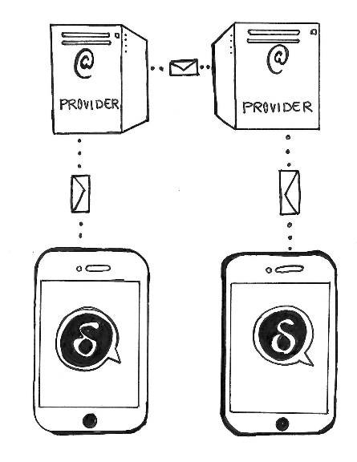

<!-- GENERATED FILE -- DO NOT EDIT -->

# Perguntas frequentes

- [Geral](#general)
- [Grupos](#groups)
- [Criptografia](#encryption)
- [Multicliente](#multiclient)
- [Diversos](#miscellaneous)

# Geral {#general}

## O que é o Delta Chat? 

O Delta Chat é um novo aplicativo de conversas que usa e-mails para transmitir
as mensagens. Se você receber uma mensagem pode respondê-la pelo seu
e-mail. **Não é obrigatório fazer uma nova conta, ir a um site ou mesmo
instalar o Delta Chat.**

## Como encontro pessoas para conversar? 

Com o Delta Chat, você pode escrever para qualquer e-mail - mesmo
que o destinatário não use o Delta Chat. Esta é uma das maiores
diferenças de outros aplicativos do tipo: Não é preciso que
o destinatário tenha o mesmo aplicativo que você.

## Quais são as vantagens do Delta Chat comparado a outros aplicativos do tipo?

- _Independente_ de empresas e serviços. _Você_ é dono de seus dados.
- Seus dados não ficam gravados num servidor central; assim, diferentemente de outros apps, o Delta Chat protege até seus metadados (quem escreveu para quem?)
- Você não compartilha seus contatos com ninguém.
- _Rápido_ por usar Push-IMAP
- _Maior base de usuários_ - destinatários que _não_ usem o Delta Chat podem ser contatados
- _Compatível_ - com e-mails comuns
- Interface _elegante_ e _simples_
- Sistema _distribuído_ 
- _Sem Spam_ - somente usuários conhecidos aparecem na lista
- _Confiável_ - seguro para uso profissional
- _Fidedigno_ - pode ser usado até para mensagens comerciais
- Totalmente de _código livre_ e _padronizado_ 

## Quais mensagens aparecem no Delta Chat?

O Delta Chat automaticamente exibe ...

- Mensagens de contatos da sua **agenda de endereços**
- Mensagens de contatos **que você contatou**
- **Respostas** a mensagens enviadas por você

Outras mensagens não aparecem automaticamente. Você poderá as ver no menu principal em **Requisições de contato** e, se desejar, comece a conversar.

## E o Spam?

- Mensagens da caixa de spam são ignoradas e os respectivos endereços são ignorados.
- Como as mensagens de completos desconhecidos não são exibidas automaticamente, normalmente, **não há spam**.
- No entanto, se realmente necessário, você pode **bloquear** qualquer contato.

## O Delta Chat exibe imagens, vídeos e aceita outros anexos?

- Sim. Além de texto puro, todos os anexos de e-mail são exibidos como mensagens separadas. Mensagens enviadas aceitam anexos também.

## O Delta Chat lê e-mails em HTML?

- Sim. Se a mensagem não estiver em texto puro, o HTML será convertido em texto puro. Mensagens sempre são enviadas em texto puro.

# Grupos {#groups}

## Como criar um grupo?

- Selecione **Novo grupo** do "menu sanduíche" no canto esquerdo superior da lista de conversas.
- Na tela seguinte, selecione os **membros do grupo** e toque na caixa de seleção no canto direito superior. Após, escolha um **nome para o grupo**.
- Tão logo você enviar a **primeira mensagem**, todos os membros serão informados sobre o novo grupo e poderão entrar em contato pelo grupo (enquanto a primeira mensagem não for encaminhada o grupo não será conhecido pelos demais membros).

## Como adicionar participantes ao grupo?

- Todos os membros do grupo têm os **mesmos poderes**. Assim, todos podem deletar e/ou incluir novos membros ao grupo.
- Para adicionar ou deletar membros, clique no nome do grupo no chat.

## O que significa 'grupo verificado'?

- "Grupo verificado" é uma funcionalidade experimental (Janeiro de 2019). 
  Utilizando-se de verificação participante por participante por código QR cria-se um
  grupo verificado.  Assim, reforça-se que a criptografia ponta a ponta está segura contra ataques 
  do provedor ou da rede.  Porém, alguns testes e relatórios sugerem que mudanças no UX 
  e na implementação são necessárias. Discussões recentes podem ser vistas aqui: 
  https://countermitm.readthedocs.io/en/latest/new.html

## Eu saí do grupo por acidente.

- Já que você não faz mais parte do grupo, você não pode se incluir nele de novo.
  No entanto, sem problema, peça para que alguém do grupo lhe inclua de novo.

## Não quero mais receber mensagens do grupo.

- Ou apague-se da lista de membros, ou delete o chat. Você poderá entrar 
  no grupo em outra ocasião de novo, pedindo para que alguém do grupo o readicione.

- Alternativamente, você pode "silenciar notificações" de um grupo - desta forma você receberá 
  todas as mensagens, poderá escrever no grupo, mas não será notificado de novas mensagens.

# Criptografia {#encryption}

## O Delta Chat tem criptografia ponta a ponta?

- Sim. O DeltaChat implementa o padrão Autocrypt Nível 1 de modo 
  que faz criptografia ponta a ponta com aplicativos compatíveis. 

## O que eu preciso fazer para ativar a criptografia ponta a ponta?

- Nada.

- O Delta Chat (e outros programas compatíveis com a tecnologia [Autocrypt](https://autocrypt.org) )
  compartilham, na primeira mensagem, as chaves necessárias para ativar a criptografia ponta a ponta.          Depois todas as mensagens posteriores são criptografadas ponta a ponta automaticamente. 
Se um dos participantes da conversa não estiver usando um programa que comporte criptografia, a
criptografia fica suspensa até ser reativada novamente, quando possível.

- Se você quiser _desativar_ a criptografia ponta a ponta, faça-o no menu 
"Configurações / Configurações avançadas".

## Se a criptografia ponta a ponta não estiver ativa a conexão estará completamente descriptografada?

- Não. A criptografia padrão de _tráfego_ será utilizada.

## Como posso me certificar de que a criptografia ponta a ponta está ativada?

- Se um **cadeadozinho** for exibido ao lado da mensagem, significa que ela está criptografada ponta a ponta _e_ foi enviada por um dado usuário _bem como_ sua resposta também será criptografada ponta a ponta.

- Se **não tiver um cadeadozinho**, a mensagem será, de regra, transportada sem criptografia, p. ex., devido ela ter sido desabilitada ou um dos usuários estiver usando um aplicativo incompatível com criptografia.

## Como posso verificar se o remetente é ele mesmo?

O perfil de usuário exibe algumas informações adicionais:

- É possível tocar em "Código QR de convite" e, depois, em "Escanear código QR"
nos dispositivos Android. Se ambos os dispositivos estiverem conectados
eles irão estabelecer uma nova conversa (se ainda não existente)
e, também, serão verificada as chaves.

- Nas mensagens criptografadas ponta a ponta o Delta Chat exibe duas digitais. Se elas conferirem com as do destinatário, a conexão está segura.

- No caso de criptografia de transporte, a respectiva informação é simplesmente exibida no aplicativo.

## Quais padrões são utilizados para a criptografia ponta a ponta?

- OpenPGP. A troca de chaves é feita via [Autocrypt](https://autocrypt.org).

## Posso reutilizar uma chave privada que já possuo?

- Sim. A melhor maneira é enviar uma mensagem de configuração do Autocrypt de um para outro cliente de e-mail. Procure pelo sth. com o nome **Inicializar configuração de transferência do Autocrypt** nas configurações do outro cliente e siga as respectivas intruções.

- Alternativamente, você pode importar a chave manualmente em "Configurações avançadas / Gerir chaves privadas". Atenção: Certifique-se de que a chave não esteja protegida por senha ou a remova anteriormente.

Se você não tiver uma chave ou nem mesmo sabe do que isso se trata - não se preocupe: o Delta Chat fará tudo automaticamente para você.

# Multicliente {#multiclient}

## Posso usar o Delta Chat em vários dispositivos ao mesmo tempo?

Se você quiser usar a **mesma conta** em diferentes dispositivos (compatíveis
com Autocrypt), você terá que fazer com que todos eles usem a mesma chave de criptografia:

- No primeiro dispositivo, escolha "Configurações avançadas / Enviar mensagem 
  de configuração Autocrypt" e vá clicando até que apareça o "número de segurança".

- No outro dispositivo, espere aparecer a "mensagem de configuração Autocrypt"
  e toque nela, ao que surgirá uma solicitação de inserir o "número de segurança".

- agora seus dispositivos estão sincronizados e todos podem enviar
  mensagens criptografadas ponta a ponta.

# Diversos {#miscellaneous}

## O Delta Chat funciona com o _meu_ provedor de e-mail?

- Muito provavelmente sim :)  
  Porém, alguns provedores precisam de configurações especiais; alguns usuários fizeram uma compilação no fórum em [Provider Overview](https://support.delta.chat/t/provider-overview/)

## Quero saber mais detalhes técnicos. Você pode me contar mais?

- Leia a página (em inglês) [Standards used in Delta Chat]().
