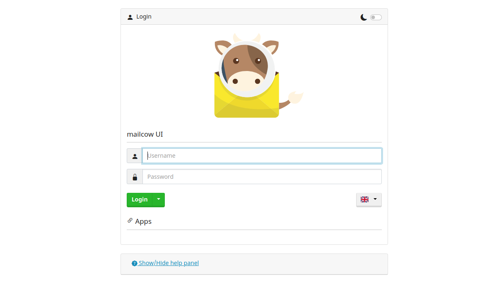
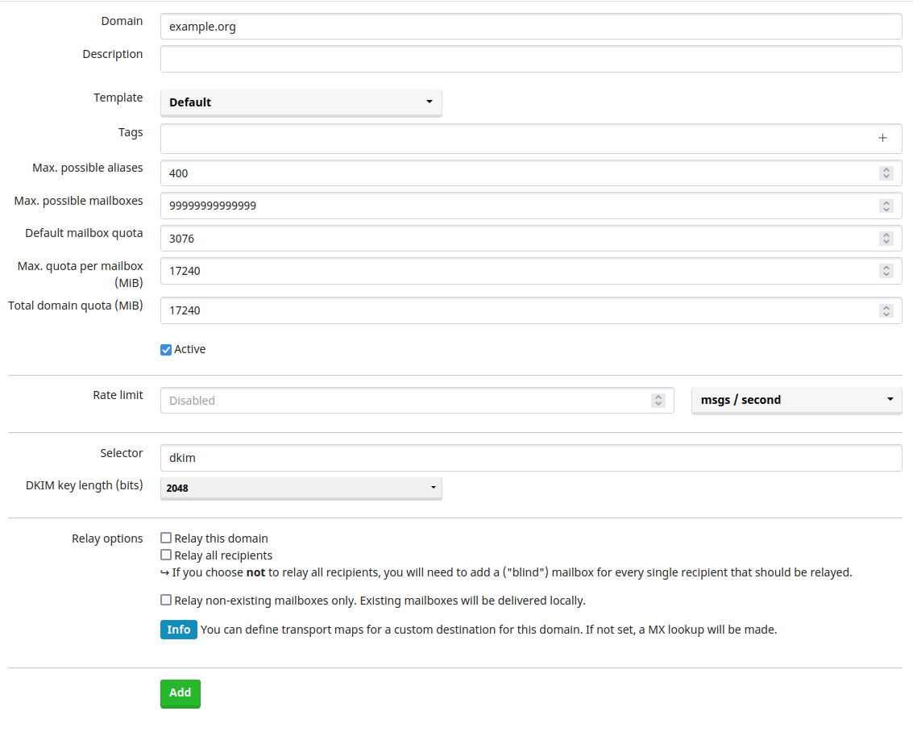
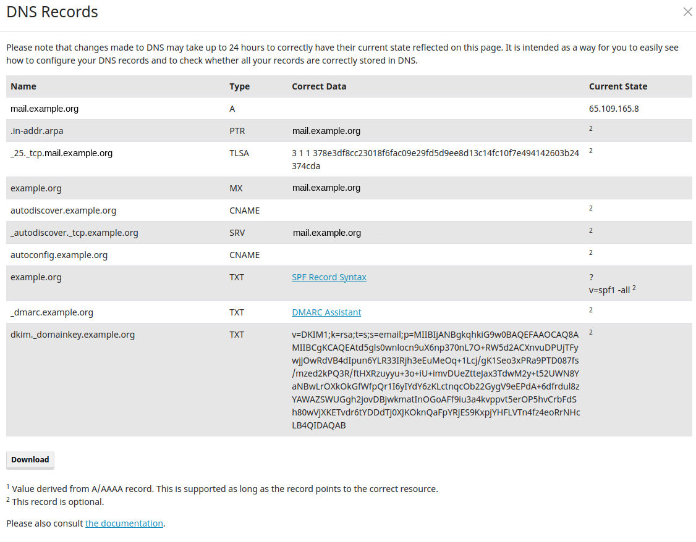

# Как настроить сервер электронной почты для Delta Chat

> **Обновление:** Информация устарела - мы больше не рекомендуем серверы mailcow,
> вместо них рекомендуем [Chatmail Relays](2023-12-13-chatmail) для общения в Delta Chat.
> Подробнее о настройке читайте [на GitHub](https://github.com/chatmail/relay)!

Delta Chat — это мессенджер, работающий по электронной почте. Это означает, что мы можем использовать любой
сервер электронной почты для создания аккаунтов Delta Chat. Одним из простых в настройке и управлении
почтовых серверов, который работает с Delta Chat "из коробки", является
[Mailcow](https://mailcow.email).

Вы можете запустить его вместе с [mailadm](https://mailadm.readthedocs.io), который
предлагает вашим пользователям простой способ создать учетную запись электронной почты и сразу же войти в систему
с Delta Chat. Это также описано в этом руководстве.

Что вам нужно:

- базовые знания командной строки
- доменное имя, и доступ к настройкам DNS 
- SSH доступ к серверу linux
  - с публичным IP,
  - минимум 10 Гб дискового пространства,
  - и минимум 2 Гб ОЗУ

## Установка Docker

Прежде чем приступить, необходимо установить [docker и
docker-compose](https://docs.mailcow.email/getstarted/install/#docker-and-docker-compose-installation).

### Если доступ к docker.com заблокирован:

В зависимости от страны, в которой находится ваш сервер, доступ к docker.com может быть заблокирован. Вы
также можете получить docker & docker-compose из других источников, которые могут быть доступны:

- Официальный репозиторий apt Ubuntu обычно содержит устаревшую версию docker,
  что не самый лучший вариант.
- [snap](https://docs.docker.com/engine/install/ubuntu/) еще один способ
  установки docker, но для docker-compose вариант snap не работает. Обратите
  внимание, что если вы устанавливаете docker через snap, он запускается не в systemd, а в snap.
- Вы можете попробовать загрузить двоичный файл docker-compose. [из GitHub](https://github.com/docker/compose/releases/download/v2.12.0/docker-compose-linux-x86_64)
  и скопировать его в [правильное место](https://docs.docker.com/compose/install/linux/#install-the-plugin-manually)
- И, наконец, вы можете попытаться получить доступ к серверу за пределами вашей страны, создав HTTPS-прокси и использовать его для установки docker и docker-compose. Это сложно, но может сработать. Вы можете [связаться с нами](mailto:mailadm@testrun.org) если
  возникнут проблемы.

## Создание записей DNS

Если у вас ещё нет домена, вы можете использовать такой ​​сервис как
[njal.la](https://njal.la) для покупки .net или .org домена за 15€ в год. Вы можете
оплачивать через PayPal, Bitcoin или Monero.

Давайте предположим:
- вы купили домен example.org. На данный момент вы хотите только почтовый сервер, но вы
  подумываете о размещении веб-сайта по адресу https://example.org позже.
- ваш сервер имеет IPv4-адрес: 24.48.100.24 - вы можете определить его с помощью
  команды `ip a` и найти номер, похожий на этот (который не начинается
  с 127 или 172).
- ваш сервер имеет IPv6-адрес: 7fe5:2f4:1ba:2381::3 (вы можете найти его в `ip
  a`, на 2 строки ниже IPv4-адреса. Пропустите `/64` в конце. Не используйте
  адрес, начинающийся с fe80, он не учитывается).

Теперь вы можете настроить параметры домена example.org следующим образом:

| Type  | Name                      | Data                                                 | TTL  | Priority |
|-------|---------------------------|------------------------------------------------------|------|----------|
| A     | mail.example.org          | 24.48.100.24                                         | 5min |          |
| AAAA  | mail.example.org          | 7fe5:2f4:1ba:2381::3                                 | 5min |          |
| MX    | @                         | mail.example.org                                     | 5min |    10    |
| CNAME | autoconfig.example.org    | mail.example.org                                     | 5min |          |
| CNAME | autodiscover.example.org  | mail.example.org                                     | 5min |          |
| CNAME | mailadm.example.org       | mail.example.org                                     | 5min |          |
| TXT   | @                         | "v=spf1 mx -all"                                     | 5min |          |
| TXT   | \_dmarc.example.org       | v=DMARC1;p=quarantine;rua=mailto:mailadm@example.org | 5min |          |

Вы можете установить ключ DKIM после настройки mailcow,
в System>Configuration>Options>ARC/DKIM keys.

Вы можете установить более 5 минут, но если вы заметите, что что-то не так,
короткий промежуток времени поможет исправить неправильную запись.

## Настройка Mailcow

### Настройка параметров Mailcow

Сначала клонируйте репозиторий git mailcow - если ваш сервер не имеет доступа к
github.com, вы можете выполнить этот шаг где-то еще и использовать `scp` для копирования
его на ваш сервер.

```
sudo apt install -y git
git clone https://github.com/mailcow/mailcow-dockerized
cd mailcow-dockerized
```

Теперь вы должны запустить `./generate_config.sh` , чтобы сгенерировать файл mailcow.conf.
Если ваш сервер не имеет доступа к github.com, вам сначала нужно удалить любые команды
git из скрипта. Введите такие параметры:

```
Mail server hostname (FQDN) - this is not your mail domain, but your mail servers hostname: mail.example.org
Timezone [Europe/Berlin]: UTC
Which branch of mailcow do you want to use?


Available Branches:
- master branch (stable updates) | default, recommended [1]
- nightly branch (unstable updates, testing) | not-production ready [2]
Choose the Branch with it´s number [1/2] 1
```

В mailcow.conf необходимо указать следующие переменные:

```
ADDITIONAL_SAN=mailadm.example.org
SKIP_CLAMD=y
SKIP_SOLR=y
SKIP_SOGO=y
```

Последние 3 параметра удаляют службы, которые не нужны для минимальной установки.

После этого нам нужно выполнить команду `echo '#' > data/conf/dovecot/global_sieve_before`.

### Mailadm NGINX конфиг

`mailadm.example.org/new_email` должен быть доступен для работы HTTP-запросов.
Итак, нам нужно создать два файла для перенаправления Mailcows Nginx.
Сначала мы делаем `echo 'mailadm.example.org' > data/conf/nginx/server_name.active`
а затем мы создаем файл `data/conf/nginx/site.mailadm.custom`
затем добавим в него следующий блок:

```
  location /new_email {
    proxy_pass http://24.48.100.24:3691/;
  }
```

Обязательно замените этот пример IP-адреса, на IP-адрес вашего сервера.

Все запросы будут перенаправлены на `mailadm.example.org/new_email` в контейнер
mailadm позже.

### Загрузка контейнеров mailcow

Запустите `sudo docker compose pull` для загрузки контейнеров mailcow. Если у вас нет доступа к docker.com на этом шаге, вы можете [использовать HTTP
-прокси](https://elegantinfrastructure.com/docker/ultimate-guide-to-docker-http-proxy-configuration/).

### Запуск Mailcow

Теперь запустите mailcow с помощью команды `sudo docker compose up -d`.

### Отключение IPv6 для mailcow

Если у вашего сервера нет адреса IPv6, вам следует [отключить
IPv6](https://docs.mailcow.email/post_installation/firststeps-disable_ipv6/).

### Добавление домена в Mailcow

Теперь вы можете войти в веб-интерфейс mailcow по адресу https://mail.example.org.
Имя пользователя по умолчанию `admin` и пароль `moohoo`. Вы должны изменить
этот пароль на более безопасный.



Затем добавьте домен в веб-интерфейсе в разделе "E-Mail > Configuration > Domains".
Например, это может быть:

- domain: example.org
- max. mailboxes: 999999
- default mailbox quota: 3076 (не имеет значения, mailadm это переопределит)
- max. mailbox quota: 17240 (примерно на немного меньше, чем ваше свободное место на диске)
- domain quota: 17240 (примерно на немного меньше, чем ваше свободное место на диске)



После этого вы можете перейти в раздел "E-Mail > Configuration > Mailboxes" и создать первый аккаунт.
Вы можете протестировать его с помощью Delta Chat прямо сейчас.

#### Рекомендуется: Добавить дополнительные записи DNS

В разделе "E-Mail > Configuration > Domains", справа от вашего домена, вы можете увидеть синюю кнопку "DNS". Она предоставляет дополнительные рекомендации по записям DNS, которые могут помочь, если у вас возникнут проблемы с доставкой электронной почты на другие серверы.



## Установка mailadm

Теперь мы можем настроить mailadm — с помощью этого инструмента можно генерировать QR-коды, которые
люди могут сканировать из Delta Chat, чтобы создать аккаунт электронной почты на вашем сервере. Это
вероятно, самый простой способ для пользователей начать использовать Delta Chat.

### Загрузка mailadm

Вы можете использовать эти команды для загрузки mailadm:

```
cd ~
git clone https://github.com/deltachat/mailadm
cd mailadm
mkdir docker-data
```

### Компиляция mailadm

Теперь вы можете создать контейнер Docker для mailadm с помощью
`sudo docker build . -t mailadm-mailcow`.

#### Если доступ к docker.com или pypi.org заблокирован

Если ваш сервер не может подключиться к docker.com, dl-cdn.alpinelinux.org или pypi.org. Вы можете собрать контейнер Docker на другой машине и скопировать его на VPS:

```
sudo docker build . -t mailadm-mailcow
sudo docker save -o mailadm-image.tar mailadm-mailcow
scp mailadm-image.tar example.org:
ssh example.org
sudo docker load --import mailadm-image.tar
```

###  Получение токена API из веб-интерфейса

Перейдите на https://mail.example.org/admin снова для получения mailcow API
ключа.

Вам необходимо активировать API (обязательно используйте "Read-Write Access API" а не "Read-Only Access API"!) и введите в интерфейс br-mailcow вашего сервера в разделе "Allow API access from these IPs/CIDR network notations". Узнать IP-адрес можно с помощью `ip a show br-mailcow`.

Установите флажок "Активировать API" и нажмите "Сохранить изменения", а затем скопируйте
ключ API.

### Настройка mailadm

Затем в каталоге mailadm, создайте файл `.env` и сконфигурируйте mailadm следующим
образом:

```
MAIL_DOMAIN=example.org
WEB_ENDPOINT=https://mailadm.example.org/new_email
MAILCOW_ENDPOINT=https://mail.example.org/api/v1/
MAILCOW_TOKEN=238473-081241-7A78B1-B7098C-E798BA
```

В `MAILCOW_TOKEN`, введите ключ API, который вы получили из веб-интерфейса mailcow.

Если вы не уверены, как выбрать значения в .env, посмотрите
[документацию](https://mailadm.readthedocs.io/en/latest/#configuration-details) mailadm.

### Добавьте алиас mailadm

Теперь, чтобы упростить запуск команд mailadm, добавьте этот алиас:

```
alias mailadm="$PWD/scripts/mailadm.sh"
echo "alias mailadm=$PWD/scripts/mailadm.sh" >> ~/.bashrc
```

### Запуск mailadm

Затем вы можете инициализировать базу данных и настроить бота mailadm, который будет использоваться для получения команд и поддерживать запросы от ваших пользователей:

```
mailadm init
mailadm setup-bot
```

Затем вам будет предложено отсканировать QR-код, чтобы присоединиться к группе Администраторов, подтвержденной группе Delta Chat. Любой участник группы может отправлять команды mailadm через Delta Chat. Вы можете отправить “/help” в группу, чтобы узнать, как ее использовать.

Теперь, когда все настроено, мы можем запустить контейнер mailadm окончательно:

```
sudo docker run -d -p 3691:3691 --mount type=bind,source=$PWD/docker-data,target=/mailadm/docker-data --name mailadm mailadm-mailcow gunicorn -b :3691 -w 1 mailadm.app:app
```

Это запустит контейнер Docker `mailadm`. Вы можете перезапустить его с помощью `sudo docker
restart mailadm`, если потребуется.

#### Первые шаги с mailadm

Вот и все! Теперь вы можете приступить к созданию токенов и пользователей с помощью mailadm.
Лучшая документация для [первых шагов](https://mailadm.readthedocs.io/en/latest/#first-steps) - также
содержит подсказки по устранению неполадок при настройке, если что-то не работает.

## Рекомендуется: Отключить POP3

Delta Chat использует только SMTP и IMAP,
так что если все ваши пользователи используют Delta Chat,
вы можете отключить POP3.

Для этого добавьте следующее, в файл `mailcow.conf`:

```
POP_PORT=127.0.0.1:110
POPS_PORT=127.0.0.1:995
```

Затем примените изменения с помощью команды `sudo docker compose up -d`.

## Рекомендуется: Перенаправить весь HTTP-трафик на HTTPS

По умолчанию,
сервер nginx также отвечает в незашифрованном виде
на port 80.
Это может быть плохо,
поскольку некоторые пользователи могут вводить пароли
через не зашифрованное соединение.

Чтобы этого не произошло,
создайте новый файл `data/conf/nginx/redirect.conf`
и добавьте следующую конфигурацию сервера в файл:

```
server {
  root /web;
  listen 80 default_server;
  listen [::]:80 default_server;
  include /etc/nginx/conf.d/server_name.active;
  if ( $request_uri ~* "%0A|%0D" ) { return 403; }
  location ^~ /.well-known/acme-challenge/ {
    allow all;
    default_type "text/plain";
  }
  location / {
    return 301 https://$host$uri$is_args$args;
  }
}
```

Затем примените изменения с помощью команды `sudo docker compose restart nginx-mailcow`.

## Рекомендуется: Нет журналов, нет хозяев

Mailcow записывает IP-адреса ваших пользователей в целях отладки,
поэтому если вы не хотите хранить эту критическую информацию на вашем сервере, вы можете
отключить журналирование. Обратите внимание, что это значительно усложняет отладку проблем.
Только вы можете решить, нужно ли это в вашей среде.

Mailcow хранит некоторые журналы в Redis, чтобы вы могли показать их в веб-интерфейсе, если вы добавите `command: '--save ""'` в контейнер redis-server в
docker-compose.yml, он будет хранить их только в ОЗУ, которая, будем надеяться, не будет сохранена
потенциальным злоумышленником.

Чтобы направить фактические файлы журналов в `/dev/null`, также известном как Nirvana, вы можете:

Добавьте следующие строки в каждый контейнер в 
`mailcow-dockerized/docker-compose.yml`:

```
      logging:
        driver: "syslog"
        options:
          syslog-address: "udp://127.0.0.1:514"
          syslog-facility: "local3"
```

Теперь вы можете настроить rsyslog, чтобы он слушал на этом порту входящие журналы. Разкомментируйте
следующие строки в файле `/etc/rsyslog.conf`:

```
module(load="imudp")
input(type="imudp" port="514")
```

И добавьте это в `/etc/rsyslog.d/`, чтобы отправить все это в Нирвану:

```
local3.*        /dev/null
& stop
```

Наконец, перезапустите rsyslog с помощью команды `sudo service rsyslog restart` и mailcow с помощью команды
`sudo docker compose up -d`.

Рассмотрите возможность просмотра [документации по ведению журнала Mailcow](https://docs.mailcow.email/post_installation/firststeps-logging/#log-rotation)
для альтернативных вариантов этой конфигурации.

## Рекомендуется: Добавьте записи обратного DNS у вашего провайдера

Вы также можете создать обратные DNS-записи
для IPv4 и IPv6-адресов вашего сервера,
содержащие ваш домен.
Обратные записи DNS улучшают доставляемость;
они помогают другим почтовым серверам
отличать почту ваших пользователей от спама.

Настройка записей rDNS должна быть возможна
в веб-интерфейсе вашего хостинг-провайдера.
Вы можете прочитать об этом больше
[в этой статье](https://docs.hetzner.com/dns-console/dns/general/reverse-dns/).

