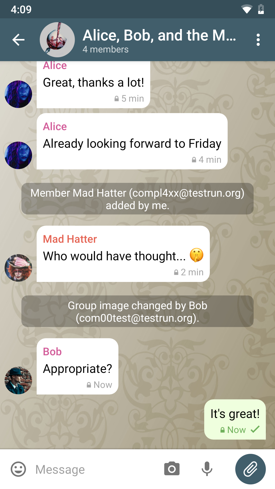

# Chatujte cez e-mail a vr치콘te sa s nami do bud칰cnosti! 

**Delta Chat je ako Telegram alebo Whatsapp, ale bez sledovania alebo centr치lneho ovl치dania.**
Delta Chat nepotrebuje va코e telef칩nne 캜칤slo. Pozrite si na코e [vyhl치senie o ochrane osobn칳ch 칰dajov](gdpr).

**Delta Chat nem치 svoje vlastn칠 servery**, ale pou쮂셨a najrozsiahlej코ie a najrozmanitej코ie otvoren칠 spr치vy
syst칠m v칪bec: existuj칰ca sie콘 e-mailov칳ch serverov.

** Chatujte s k칳mko쭀ek, ak pozn치te ich e-mailov칰 adresu, nie je potrebn칠, aby si nain코talovali DeltaChat!**
V코etko, 캜o potrebujete, je 코tandardn칳 e-mailov칳 칰캜et. 

Pozrite si [pr칤behy a hlasy pou쮂셨ate쬺v](user-voices) 游닊

# Sn칤mky obrazovky Android, Desktop a iOS

Skontrolujte [get.delta.chat](https://get.delta.chat) a [najnov코ie blogov칠 pr칤spevky](blog)
pre inform치cie o aktu치lnych vydaniach a udalostiach.

Delta Chat je [Open Source](https://en.wikipedia.org/wiki/Open-source_software)
a [Softv칠r zdarma](https://en.wikipedia.org/wiki/Free_software). M칪쬰코 pou쬴콘,
vidie콘, meni콘 a zdie쬬콘 to pod쬬 v칪le s ka쬯칳m.
