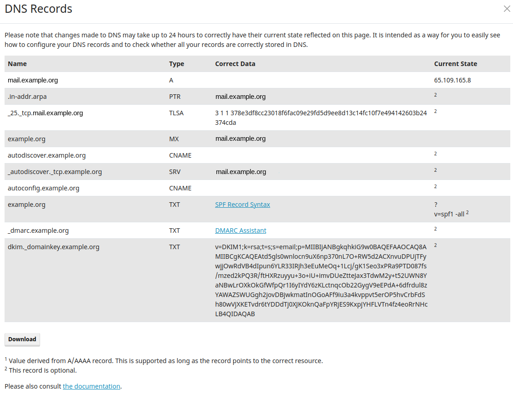

# How to Setup a Mail Server for Delta Chat

> **Update:** This is outdated - we now recommend
> [Chatmail Relays](2023-12-13-chatmail) over mailcow servers for chatting with Delta Chat,
> for faster delivery, reliable push notifications, and enforced message encryption.
> Read more [on GitHub](https://github.com/chatmail/relay) about how to set it up!
> mailcow is mostly an option
> if you want to communicate with classic mail users who can't use encryption.

Delta Chat is a chat messenger which runs on e-mail. This means we can use any
e-mail server to run Delta Chat accounts. One e-mail server which is easy to
setup and manage, and works with Delta Chat out of the box, is
[Mailcow](https://mailcow.email).

You can run it together with [mailadm](https://mailadm.readthedocs.io), which
offers your users an easy way to create an e-mail account and directly login
with Delta Chat. It is also included in this guide.

What you need:

- basic command line knowledge
- a domain name, and access to its DNS settings
- SSH access to a linux server
  - with a public IP,
  - minimum 10 GB disk space,
  - and minimum 2 GB RAM

## Installing Docker

As a prerequisite you need to install [docker and
docker-compose](https://docs.mailcow.email/getstarted/install/#docker-and-docker-compose-installation).

### If docker.com is Blocked:

Depending on the country where your server is in, docker.com may be blocked. You
can also get docker & docker-compose from other sources, which may work:

- Ubuntu's official apt repository usually has an outdated docker version; that
  is not the best idea.
- [snap](https://docs.docker.com/engine/install/ubuntu/) is another way to
  install docker, but for docker-compose the snap variant doesn't work. Note
  that if you install docker via snap, it doesn't run in systemd, but in snap.
- You can try to download the docker-compose binary [from GitHub](https://github.com/docker/compose/releases/download/v2.12.0/docker-compose-linux-x86_64)
  and copy it to [the right location](https://docs.docker.com/compose/install/linux/#install-the-plugin-manually)
- And finally you can try to get access to a server outside your country,
  create a HTTPS proxy, and use that to install docker and docker-compose. It's
  tricky, but might work. You can [contact us](mailto:mailadm@testrun.org) if
  you run into problems.

## Create DNS Entries

If you don't have a domain yet, you can use a service like
[njal.la](https://njal.la) to buy a .net or .org domain for 15€ a year. You can
pay with PayPal, Bitcoin, or Monero.

Let's assume:
- you bought example.org. For now you only want a mail server, but you think
  about hosting a website at https://example.org later.
- your server has the IPv4 address 24.48.100.24 - you can find out with the
  command `ip a` and look for a similar-looking number (which doesn't start
  with 127 or 172).
- your server has the IPv6 address 7fe5:2f4:1ba:2381::3 (you can find it in `ip
  a`, 2 lines below the IPv4 address. Ignore the `/64` at the end. Don't use
  the one starting with `fe80`, it doesn't count).

Now you could configure the domain settings for example.org like this:

| Type  | Name                      | Data                                                 | TTL  | Priority |
|-------|---------------------------|------------------------------------------------------|------|----------|
| A     | mail.example.org          | 24.48.100.24                                         | 5min |          |
| AAAA  | mail.example.org          | 7fe5:2f4:1ba:2381::3                                 | 5min |          |
| MX    | @                         | mail.example.org                                     | 5min |    10    |
| CNAME | autoconfig.example.org    | mail.example.org                                     | 5min |          |
| CNAME | autodiscover.example.org  | mail.example.org                                     | 5min |          |
| CNAME | mailadm.example.org       | mail.example.org                                     | 5min |          |
| TXT   | @                         | "v=spf1 mx -all"                                     | 5min |          |
| TXT   | \_dmarc.example.org       | v=DMARC1;p=quarantine;rua=mailto:mailadm@example.org | 5min |          |

You can setup the DKIM key after setting up mailcow,
in System>Configuration>Options>ARC/DKIM keys.

You can do more than 5 minutes, but in case you notice something is wrong a
short time helps with fixing the wrong entry.

## Setup Mailcow

### Set Mailcow Options

First clone the mailcow git repository - if your server doesn't have access to
github.com, you can do this step somewhere else and use `scp` to copy it to
your server.

```
sudo apt install -y git
git clone https://github.com/mailcow/mailcow-dockerized
cd mailcow-dockerized
```

Now you should run `./generate_config.sh` to generate the mailcow.conf file.
If your server doesn't have access to github.com, you first need to remove any
git command from the script. Enter the options like this:

```
Mail server hostname (FQDN) - this is not your mail domain, but your mail servers hostname: mail.example.org
Timezone [Europe/Berlin]: UTC
Which branch of mailcow do you want to use?


Available Branches:
- master branch (stable updates) | default, recommended [1]
- nightly branch (unstable updates, testing) | not-production ready [2]
Choose the Branch with it´s number [1/2] 1
```

You should specify the following variables in mailcow.conf:

```
ADDITIONAL_SAN=mailadm.example.org
SKIP_CLAMD=y
SKIP_SOLR=y
SKIP_SOGO=y
```

The last 3 options remove services which are not needed for a minimal setup.

After that we need to run `echo '#' > data/conf/dovecot/global_sieve_before`.

### Mailadm NGINX config

`mailadm.example.org/new_email` needs to be reachable for HTTP requests to work.
So we need to create two files for Mailcows Nginx redirection.
First we do `echo 'mailadm.example.org' > data/conf/nginx/server_name.active`
and then we create the file `data/conf/nginx/site.mailadm.custom`
and add the following block to it:

```
  location /new_email {
    proxy_pass http://24.48.100.24:3691/;
  }
```

Make sure to replace this example IP address with your server's IP address.

This will forward all requests to `mailadm.example.org/new_email` to the mailadm
container later.

### Download mailcow containers

Now run `sudo docker compose pull` to download the mailcow containers. If you don't
have access to docker.com at this step, you can [use an HTTP
proxy](https://elegantinfrastructure.com/docker/ultimate-guide-to-docker-http-proxy-configuration/).

### Start Mailcow

Now start mailcow with `sudo docker compose up -d`.

### Disabling IPv6 for mailcow

If your server doesn't have an IPv6 address, you should [disable
IPv6](https://docs.mailcow.email/post_installation/firststeps-disable_ipv6/).

### Adding Domain in Mailcow

Now you can login to the mailcow web interface at https://mail.example.org. The
default username is `admin` and the password is `moohoo`. You should change
this password to something more secure.


Next, add a domain in the web interface under "E-Mail > Configuration > Domains".
Somethings like this makes sense:

- domain: example.org
- max. mailboxes: 999999
- default mailbox quota: 3076 (it doesn't matter, mailadm will override this)
- max. mailbox quota: 17240 (basically a bit less than your free disk space)
- domain quota: 17240 (basically a bit less than your free disk space)


After this, you can go to "E-Mail > Configuration > Mailboxes" and create a first account.
You can try it out with Delta Chat now.

#### Recommended: Add Additional DNS Entries

In "E-Mail > Configuration > Domains", on the right next to your domain, you can see a blue
"DNS" button. It provides further recommendations for DNS entries which might
help if you have problems getting your e-mails delivered to other servers.



## Setting up mailadm

Now we can set up mailadm - with this tool you can generate QR codes, which
people can scan from Delta Chat to create an e-mail account on your server. It
is probably the easiest way for users to get started with Delta Chat.

### Downloading mailadm

You can use these commands to download mailadm:

```
cd ~
git clone https://github.com/deltachat/mailadm
cd mailadm
mkdir docker-data
```

### Building mailadm

Now you can build the mailadm docker container with
`sudo docker build . -t mailadm-mailcow`.

#### If docker.com or pypi.org is Blocked

If your server can't reach docker.com, dl-cdn.alpinelinux.org, or pypi.org,
this will fail. But you can build the docker container on a different machine
and copy it to the VPS:

```
sudo docker build . -t mailadm-mailcow
sudo docker save -o mailadm-image.tar mailadm-mailcow
scp mailadm-image.tar example.org:
ssh example.org
sudo docker load --import mailadm-image.tar
```

### Getting an API token from the web interface

Now you can go to https://mail.example.org/admin again, to get a mailcow API
key.

You have to activate the API (Make sure to use the "Read-Write Access API" and
not the "Read-Only Access API"!) and enter your server's br-mailcow interface
IP address under "Allow API access from these IPs/CIDR network notations". You
can find out the IP address with `ip a show br-mailcow`.

Check the checkbox "Activate API and then click on "Save Changes" and copy the
API key.

### Configuring mailadm

Then, in the mailadm directory, create a `.env` file and configure mailadm like
this:

```
MAIL_DOMAIN=example.org
WEB_ENDPOINT=https://mailadm.example.org/new_email
MAILCOW_ENDPOINT=https://mail.example.org/api/v1/
MAILCOW_TOKEN=238473-081241-7A78B1-B7098C-E798BA
```

At `MAILCOW_TOKEN`, enter the API key which you just got from the mailcow web
interface.

If you are unsure how to choose the values in .env, take a look at the
[documentation](https://mailadm.readthedocs.io/en/latest/#configuration-details)
of mailadm.

### Add mailadm alias

Now to make it easier to run mailadm commands, add this alias:

```
alias mailadm="$PWD/scripts/mailadm.sh"
echo "alias mailadm=$PWD/scripts/mailadm.sh" >> ~/.bashrc
```

### Start mailadm

Then you can initialize the database and setup the bot mailadm will use to
receive commands and support requests from your users:

```
mailadm init
mailadm setup-bot
```

Then you are asked to scan a QR code to join the Admin Group, a verified Delta
Chat group. Anyone in the group can issue commands to mailadm via Delta Chat.
You can send “/help” to the group to learn how to use it.

Now, as everything is configured, we can start the mailadm container for good:

```
sudo docker run -d -p 3691:3691 --mount type=bind,source=$PWD/docker-data,target=/mailadm/docker-data --name mailadm mailadm-mailcow gunicorn -b :3691 -w 1 mailadm.app:app
```

This starts a `mailadm` docker container. You can restart it with `sudo docker
restart mailadm`, should you ever want to.

#### First steps with mailadm

That's it! You can now get started with creating tokens and users with mailadm.
Best look at the documentation for the [first
steps](https://mailadm.readthedocs.io/en/latest/#first-steps) - it also
contains hints for troubleshooting the setup if something doesn't work.

## Recommended: Disable POP3

Delta Chat uses only SMTP and IMAP,
so if all of your users use Delta Chat,
you can disable POP3.

To do this, add the following to `mailcow.conf`:

```
POP_PORT=127.0.0.1:110
POPS_PORT=127.0.0.1:995
```

Then apply the changes with `sudo docker compose up -d`.

## Recommended: Redirect all HTTP traffic to HTTPS

By default,
the nginx server also responds unencrypted
on port 80.
This can be bad,
as some users might enter passwords
over this unencrypted connection.

To prevent this,
create a new file `data/conf/nginx/redirect.conf`
and add the following server config to the file:

```
server {
  root /web;
  listen 80 default_server;
  listen [::]:80 default_server;
  include /etc/nginx/conf.d/server_name.active;
  if ( $request_uri ~* "%0A|%0D" ) { return 403; }
  location ^~ /.well-known/acme-challenge/ {
    allow all;
    default_type "text/plain";
  }
  location / {
    return 301 https://$host$uri$is_args$args;
  }
}
```

Then apply the changes with `sudo docker compose restart nginx-mailcow`.

## Recommended: No Logs, No Masters

Mailcow logs the IP addresses of your users for debugging purposes, so if you
don't want to keep this critical information on your server, you might want to
disable logging. Note that this makes debugging of issues considerably harder.
Nobody but you can guess whether this is necessary in your environment.

Mailcow keeps some logs in redis, so you can show it in the web interface - but
if you add `command: '--save ""'` to the redis-server container in
docker-compose.yml, it keeps them only in the RAM, which is hopefully not saved
by a potential attacker.

To point the actual log files in `/dev/null`, aka Nirvana, you can:

Add the following lines to each container in
`mailcow-dockerized/docker-compose.yml`:

```
      logging:
        driver: "syslog"
        options:
          syslog-address: "udp://127.0.0.1:514"
          syslog-facility: "local3"
```

Now you can configure rsyslog to listen on that port for log input. Uncomment
the following lines in `/etc/rsyslog.conf`:

```
module(load="imudp")
input(type="imudp" port="514")
```

And put this in `/etc/rsyslog.d/` to redirect all of that to nirvana:

```
local3.*        /dev/null
& stop
```

Finally, restart rsyslog with `sudo service rsyslog restart` and mailcow with
`sudo docker compose up -d`.

Consider looking at the [Mailcow logging
documentation](https://docs.mailcow.email/post_installation/firststeps-logging/#log-rotation)
for alternatives to this configuration.

## Recommended: Add Reverse DNS Entries at Your Provider

You might also create reverse DNS entries
for the IPv4 and IPv6 addresses of your server,
containing your domain.
Reverse DNS entries improve deliverability;
it helps other mail server
distinguish your user's mails from spam.

Setting rDNS entries should be possible
in the hosting provider web interface.
You can read more about it
[in this article](https://docs.hetzner.com/dns-console/dns/general/reverse-dns/).

