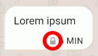

## Delta Chat nedir?

Delta Chat is a reliable, decentralized and secure messaging app, 
available for mobile and desktop platforms.

Delta Chat feels like Whatsapp or Telegram but you can also use and regard it as an e-mail app. 
You can signup anonymously to a variety of [interoperable chatmail servers](https://delta.chat/chatmail)
which are minimal e-mail servers optimized for fast and secure operations. 
Or you may use classic e-mail servers and an existing e-mail account
in which case Delta Chat acts as an e-mail app. 

### Sohbet edecek kişileri nasıl bulabilirim?

To securely setup contact with others [scan an invite QR code 
or share an invite link](#howtoe2ee). 
This is required when using a (default) chatmail-based chat profile 
because chatmail servers reject un-encrypted outgoing messages.

If you create a chat profile with a classic e-mail address 
you may manually create a contact if you know their e-mail address
and then write a message to them 
even if the recipient is not using Delta Chat.

### Delta Chat'in diğer mesajlaşma programlarına kıyasla avantajları nelerdir?

- Anonymous chat profiles with fast, secure and interoperable [chatmail servers](https://delta.chat/chatmail)
  which offer instant Push Notifications for iOS and Android devices. 

- Pervasive [multi-profile](#multiple-accounts) and multi-device support on all platforms. 

- Interactive [web apps in chats](https://webxdc.org/apps) for gaming and collaboration

- [Audited end-to-end encryption](#security-audits) 
  safe against network and server attacks. 

- Free and Open Source software, both app and server side. 
  Built on [E-mail and Web Internet Standards](https://github.com/deltachat/deltachat-core-rust/blob/master/standards.md), 
  [to avoid "yet another standard syndrome (xkcd 927)"](https://xkcd.com/927/) 

### What if I expect a message from someone I didn't write to in the past?

- If a message comes from an unknown contact, it appears as a **request**. You
  need to accept the request before you can reply.
- You can also "delete" it if you don't want to chat with them for now. This
  does *not* delete the message on the server, only on your device. So you can
  still deal with the message in a different mail app.
- If you delete a request, future messages from that contact will still appear
  as message request, so you can change your mind. If you really don't want to
  receive messages from this person, consider *blocking* them.

### Delta Chat resimleri, videoları ve diğer ekleri destekler mi?

- Evet. Düz metnin yanında, tüm e-posta ekleri ayrı mesajlar olarak görüntülenir. Giden iletiler gerektiğinde ekleri otomatik olarak alır.

- For performance, images are optimized and sent at a smaller size by default, but you can send it as a "file" to preserve the original.

### What are profiles? How can I switch between them? {#multiple-accounts}

A profile is **a name, a picture** and some additional information for encrypting messages.
A profile lives on your device(s) only
and uses a chatmail or a classic e-mail server to transport messages.

On first installation of Delta Chat a first profile is created.

Later, you can tap your profile image in the upper left corner to **Add Profiles**
or to **Switch Profiles**.

You may want to use separate profiles for political, family or work related activities,
or e. g. for a dedicated "spam-profile" with which you register at websites and platforms
that tend to cause unsolicited messages ("spam") sooner or later.

You may also wish to learn [how to use the same profile on multiple devices](#multiclient).

### Profil resmimi kimler görüyor?

- Ayarlarınıza bir profil resmi ekleyebilirsiniz. Kişilerinize yazarsanız veya
QR kodu ile eklerseniz, bunu otomatik olarak profil resminiz olarak görürler.

 - Delta Chat kullanmayan kişiler profil resmini göremez 
(ancak elbette Delta Chat'i yükleyebilirler :)

- Gizlilik nedeniyle, siz onlara bir mesaj yazana kadar hiç kimse profil resminizi görmez.

- Your profile picture isn't sent with every message, but regularly enough that
  your contacts will re-receive your profile picture, even if they add a new
  device.

### Can I set a Bio/Signature/Status/Motto with Delta Chat? {#signature}

Yes,
you can do so under **Settings → Profile → Bio**.
Your contacts who use Delta Chat will see it
when they view your contact details.
Moreover, it will appear as a classic e-mail signature.

### What do Pinning, Muting and Archiving mean?

Use these tools to organize your chats and keep everything in its place:

- **Pinned chats** always stay atop of the chat list. You can use them to access your most loved chats quickly or temporarily to not forget about things.

- **Mute chats** if you do not want to get notifications for them. Muted chats stay in place and you can also pin a muted chat.

- **Archive chats** if you do not want to see them in your chat list any longer.
  Archived chats remain accessible above the chat list or via search. 

- When an archived chat gets a new message, unless muted, it will **pop out of the archive** and back into your chat list.
  **Muted chats stay archived** until you unarchive them manually.

To archive or pin a chat, long tap (Android), use the chat's menu (Android/Desktop) or swipe to the left (iOS);
to mute a chat, use the chat's menu (Android/Desktop) or the chat's profile (iOS).

### What does the green dot mean?

- Since Delta Chat 1.34 you can sometimes see a "green dot" next to the avatar
  of a contact. It means they were "recently seen".
- In detail: it means, that in the last 10 minutes, Delta Chat has seen them:
  - either because they messaged you directly,
  - because they wrote something to a group you are both a member of,
  - because they sent you a read receipt for a message you wrote,
  - or because they sent data to your Delta Chat app by using a
    [webxdc app](#webxdc).
- So this is not a real time online status - and if someone doesn't answer
  right away even though they seem to be online, don't worry and give them some
  space ;-)
- On the other hand, others will not always "see that you are online". If you
  have turned off read receipts, they will not see the green dot until you
  message them or write to a group they're in as well.

### How do disappearing messages work? {#ephemeralmsgs}

You can turn on "disappearing messages"
in the settings of a chat,
at the top right of the chat window,
by selecting a time span
between 1 minute and 5 weeks.

Until the setting is turned off again,
each chat member's Delta Chat app takes care
of deleting the messages
after the selected time span.
The time span begins
when the receiver first sees the message in Delta Chat.
The messages are deleted
both in each email account on the server,
and in the app itself.

Note that you can rely on disappearing messages
only as long as you trust your chat partners;
malicious chat partners can take photos,
or otherwise save, copy or forward messages before deletion.

Apart from that,
if one chat partner uninstalls Delta Chat,
the messages will not get deleted from their email account.
They will most likely also not be decryptable anymore
(as long as they were encrypted in the first place).

## Gruplar

### Grup oluşturma

- Select **New chat** and then **New group** from the menu in the upper right corner or hit the corresponding button on Android/iOS.
- On the following screen, select the **group members** and define a **group name**. You can also select a **group avatar**.
- As soon as you write the **first message** in the group, all members are informed about the new group and can answer in the group (as long as you do not write a message in the group the group is invisible to the members).

### Bir gruba üye ekleme

- Every group member has the **same rights** as any other. For this reason every one can delete every member or add new ones.
- To add or delete members, click on the group name in the chat.

### Yanlışlıkla kendimi sildim.

- As you're no longer a group member, you cannot add yourself again. 
  However, no problem, just ask any other group member in a normal chat to re-add you.

### Artık bir grubun mesajlarını almak istemiyorum.

- Either delete yourself from the member list or delete the whole chat. 
  If you want to join the group again later on, ask another group member to add you again.

- As an alternative, you can also "Mute" a group - doing so means you get all messages and 
  can still write, but are no longer notified of any new messages.

### What do the ticks shown beside outgoing messages mean?

- **One tick** means that the message was sent successfully to your provider.
- **Two ticks** mean that at least one recipient's device
  reported back to having received the message.
- Recipients may have disabled read-receipts,
  so even if you see only one tick, the message may have been read.
- The other way round, two ticks do not automatically mean
  that a human has read or understood the message ;)

### What happens if I turn on "Delete old messages from server"?

- By default, Delta Chat stores all messages locally on your device.
  If you  e.g. want to save storage space at your mail provider,
  you can configure  Delta Chat
  to delete old already-received messages on the server automatically.
  They still remain on your device until you delete them there, too.

- To turn it on, go to **Delete Old Messages → Delete Messages from Server**
  in the "Chats and Media" settings.
  You can set a timeframe between "At once" and "After 1 year".
  All e-mails received by Delta Chat will be deleted from the server after this timeframe.

- Note that if you use Delta Chat on more than one device,
  you need to leave the message on the server with a sufficient timeframe
  so that the other device(s) can download them, too.

### What happens if I turn on "Delete old messages from device"? {#delold}

- If you want to save storage on your device, you can choose to delete old
  messages automatically. 
- To turn it on, go to "delete old messages from device" in the "Chats & Media"
  settings. You can set a timeframe between "after an hour" and "after a year";
  this way, *all* messages will be deleted from your device as soon as they are
  older than that.

## Instant message delivery and Push Notifications {#instant-delivery}

### What are Push Notifications? How can I get instant message delivery?

Push Notifications are sent by Apple and Google "Push services" to a user's device
so that an inactive Delta Chat app can fetch messages in the background
and show notifications on a user's phone if needed.

Push Notifications work with all [chatmail](https://delta.chat/chatmail) servers on

- iOS devices, by integrating with Apple Push services.

- Android devices, by integrating with the Google FCM Push service,
  including on devices that use [microG](https://microg.org)
  instead of proprietary Google code on the phone.

As of May 2024, classic e-mail servers do not support Push Notifications
for Delta Chat users.

### Are Push Notifications enabled on iOS devices? Is there an alternative?

Yes, Delta Chat automatically uses Push Notifications for [chatmail](https://delta.chat/chatmail) profiles.
And no, there is no alternative on Apple's phones to achieve instant message delivery
because Apple devices do not allow Delta Chat to fetch data in the background.
Push notifications are automatically activated for iOS users because
[Delta Chat's privacy-preserving Push Notification system](#privacy-notifications)
does not expose data to Apple that it doesn't already have.

### Are Push notifications enabled / needed on Android devices? {#android-push}

If a "Push Service" is available, Delta Chat enables Push Notifications
to achieve instant message delivery for all chatmail users.
If you are using a classic e-mail provider instead of [chatmail](https://delta.chat/chatmail) servers,
Push Notifications are not available.

In the Delta Chat "Notifications" settings for "Instant delivery"
you can change the following settings effecting all chat profiles:

- Use Background Connection: If you are not using a Push service,
  you may disable "battery optimizations" for Delta Chat,
  allowing it to fetch messages in the background.
  However, there could be delays from minutes to hours.
  Some Android vendors even restrict apps completely
  (see [dontkillmyapp.com](https://dontkillmyapp.com))
  and Delta Chat might not show  incoming messages
  until you manually open the app again.
  
- Force Background Connection: This is the fallback option
  if the previous options are not available or do not achieve "instant delivery".
  Enabling it causes a permanent notification on your phone
  which may sometimes be "minified" with recent Android phones.

Both "Background Connection" options are energy-efficient and
safe to try if you experience messages arrive only with long delays.

### How private are Delta Chat Push Notifications? {#privacy-notifications}

Delta Chat Push Notification support avoids leakage of private information.
It does not leak e-mail, IP address or message content (not even encrypted)
to any system involved in the delivery of Push Notifications.

Here is how Delta Chat apps perform Push Notification delivery:

- A Delta Chat app obtains a "device token" locally and stores it
  on the [chatmail](https://delta.chat/chatmail) server.

- When a [chatmail](https://delta.chat/chatmail) server receives an e-mail for a Delta Chat user
  it forwards the "device token" to the central Delta Chat notification proxy.

- The central Delta Chat notification proxy forwards
  the "device token" to the respective Push service (Apple, Google, etc.),
  without ever knowing the IP or e-mail address of Delta Chat users.

- The central Push Service (Apple, Google, etc.)
  wakes up the Delta Chat app on your device
  to check for new messages in the background.
  It does not know about the chatmail or e-mail address of the device it wakes up.
  The central Apple/Google Push services never see an e-mail address (sender or receiver)
  and also never see any message content (also not in encrypted forms).

As of May 2024, chatmail servers know about "device tokens"
but we plan to encrypt this information to the notification proxy
such that the chatmail server never learns the device token.

The central Delta Chat notification proxy [is small and fully implemented in Rust](https://github.com/deltachat/notifiers)
and forgets about device-tokens as soon as Apple/Google/etc processed them,
usually in a matter of milliseconds.

Resulting from this overall privacy design, even the seizure of a chatmail server,
or the full seizure of the central Delta Chat notification proxy
would not reveal private information that Push services do not already have.

### Why does Delta Chat integrate with centralized proprietary Apple/Google push services?

Delta Chat is a free and open source decentralized messenger with free server choice,
but we want users to reliably experience "instant delivery" of messages,
like they experience from Whatsapp, Signal or Telegram apps,
without asking questions up-front that are more suited to expert users or developers.

Note that Delta Chat has a [small and privacy-preserving Push Notification system](#privacy-notifications)
that achieves "instant delivery" of messages for all chatmail servers
including a potential one [you might setup yourself without our permission](https://delta.chat/chatmail#selfhosted).
Welcome to the power of the interoperable and massive chatmail and e-mail system :)

## Encryption and Security 

### Which standards are used for end-to-end encryption? 

[Autocrypt](https://autocrypt.org) is used for automatically
establishing end-to-end encryption with contacts and group chats.
Autocrypt uses a limited and [secure subset of the OpenPGP standard](#openpgp-secure).
End-to-End encrypted messages are marked with a padlock 
.

[Secure-Join protocols](https://securejoin.delta.chat/en/latest/new.html)
are used for establishing chats with guaranteed end-to-end encryption 
which protects against network attacks and compromised servers.
Chats marked with a green checkmark 

guarantee end-to-end encrypted messages. 

### How can i know if messages are end-to-end encrypted? {#whene2e}

All end-to-end encrypted messages carry a padlock:

End-to-end encryption is guaranteed if there is a green checkmark next to the chat title:

### How can I get guaranteed end-to-end encryption and green checkmarks? {#howtoe2ee}

If you have a second communication channel with your chat partner,
like a video chat or a different messenger,
you can generate an invite link.

If you are together in person,
you can show a QR code to your chat partner.

- For **Group invitations**,
  tap the chat group title to see its member list,
  and select "QR Invite code".

- For **direct 1:1 chat invitations**,
  tap the QR Code icon 
  on the Delta Chat app main screen.

Let your chat partner scan the QR image
with their Delta Chat app,
or click "Copy" or "Share" to create an invite link
and share it with your chat partner.

Now wait while [Secure-Join network messages are exchanged](https://securejoin.delta.chat/en/latest/new.html#setup-contact-protocol) between both devices.

- If both devices are online,
  both sides will eventually see a (group or direct) chat with a green checkmark
  
  next to the title.

- If one of the devices is offline, the green checkmarks will only
  appear later when the device is internet-connected again
  and the Secure-Join network protocol completed. 

Congratulations! 
You now will automatically use guaranteed end-to-end encryption
with this contact and both of you can add each other to green-checkmarked groups
,
thereby automatically spreading guaranteed end-to-end encryption among its members. 

### What does the green checkmark and "guaranteed end-to-end encryption" mean? {#e2eeguarantee}

Chat titles with green checkmarks

mean that all messages in the chat will be end-to-end encrypted
and can not be read or altered by compromised e-mail servers or Internet providers. 
Joining green-checkmarked group chats
safely spreads everybody's encryption information (and green checkmarks)
in a manner that guarantees end-to-end encryption in the group and among members. 

Contact profiles with green checkmarks 

mean that messaging a contact is currently guaranteed to be end-to-end encrypted.
Every green-checkmarked contact either did a direct [QR-scan](#howtoe2ee) with you
or was introduced by a another green-checkmarked contact.
Introductions happen automatically when adding members to groups. 
Whoever adds a contact to a green-checkmarked group becomes an introducer 
to those members who didn't yet know about the added contact.
In a contact profile you can tap on the "Introduced by ..." text repeatedly
until you get to the one with whom you directly did a [QR-scan](#howtoe2ee).

Note that in a contact profile you may see and tap introducers 
but there is no green checkmark in the profile title. 
This usually means that the contact ["sent a message from another device"](#nocryptanymore). 

For more in-depth discussion of "guaranteed end-to-end encryption"
please see [Secure-Join protocols](https://securejoin.delta.chat/en/latest/new.html)
and specifically read about "Verified Groups", the technical term
of what is called here "green-checkmarked" or "guaranteed end-to-end encrypted" chats.

### A contact "sent a message from another device", what can i do? {#nocryptanymore}

Your chat with a contact lost guaranteed end-to-end encryption. 
The green checkmark was removed for this chat and contact when you see this warning. 
**If you find the sudden drop of guaranteed end-to-end encryption 
surprising for this contact then don't accept the warning!**
Instead check with your contact through a second channel 
like a video call, other messenger or a phone call,
to find out what happened. 

If your contact actually caused the drop of guaranteed end-to-end encryption
please see the next paragraphs for common reasons and their mitigations. 
Regardless, all other green-checkmarked chats remain guaranteed end-to-end encrypted
even if the contact is a member there. 

**Your contact is using Delta Chat on a second device (phone or laptop)**

If they have another device with a Delta Chat app running,
they should remove the profile from the new device
and add it [as a second device as described here](#multiclient).
As soon as they message you afterwards, the warning will be gone
and guaranteed encryption is established with both devices of your contact. 

**Your contact reinstalled Delta Chat using their old account login**
 
If they have [a backup file](#backup), 
they should remove the profile from the new device
and rather import the backup file to re-create their profile.
As soon as they message you afterwards, the warning will be gone
and guaranteed encryption is re-established for this contact.

If they don't have a backup file, it's best to perform a [QR scan](#howtoe2ee) 
with your chat partner to re-establish guaranteed end-to-end encryption.

**Your contact sent a mail through a webmail interface or another e-mail app
and will get back to using Delta Chat soon again.**

If you are sure that the contact sometimes uses webmail,
or another mail app lacking end-to-end encryption,
then you may accept the warning.
As soon as your contact uses Delta Chat again, 
guaranteed end-to-end encryption will be automatically re-established. 

**Your contact stopped using Delta Chat entirely**

Sometimes remaining in contact is more important than end-to-end encryption.
["Transport Layer Encryption" (TLS)](#tls) may still meaningfully protect
the confidentiality of your messages between your device and the e-mail server. 
But without end-to-end encryption you and your contact are trusting your e-mail server
to not read or manipulate your messages, and to not hand them to third parties. 

In any case, you can not do much else than accept the warning.
Please also remove the contact from any active green-checkmarked group 
which you can find in "Shared chats" in the Contact profile. 
This spares your contact from getting "unreadable" messages. 

If the contact removed Delta Chat because of buggy or undesirable behaviour, 
please consider posting to our [support forum](https://support.delta.chat) 
to help us identify and address common problems. Thanks!

### Are attachments (pictures, files, audio etc.) end-to-end encrypted?

Yes.

When we talk about an "end-to-end encrypted message"
we always mean a whole message is encrypted,
including all the attachments
and attachment metadata such as filenames.

### Is OpenPGP secure? {#openpgp-secure}

Yes, Delta Chat uses a secure subset of OpenPGP
and only displays a padlock security indicator on a message
if the whole message is properly encrypted and signed.
For example, "Detached signatures" are not treated as secure.

OpenPGP is not insecure by itself.
Most publically discussed OpenPGP security problems
actually stem from bad usability or bad implementations of tools or apps (or both).
It is particularly important to distinguish between OpenPGP, the IETF encryption standard, 
and GnuPG (GPG), a command line tool implementing OpenPGP. 
Many public critiques of OpenPGP actually discuss GnuPG which Delta Chat has never used. 
Delta Chat rather uses the OpenPGP Rust implementation [rPGP](https://github.com/rpgp/rpgp),
available as [an independent "pgp" package](https://crates.io/crates/pgp),
and [security-audited in 2019](https://delta.chat/assets/blog/2019-first-security-review.pdf). 

We aim, along with other OpenPGP implementors, 
to further improve security characteristics by implementing the
[new IETF OpenPGP Crypto-Refresh](https://datatracker.ietf.org/doc/draft-ietf-openpgp-crypto-refresh/) 
which was thankfully adopted in summer 2023. 

### Did you consider using alternatives to OpenPGP for end-to-end -encryption? {#openpgp-alternatives}

Yes, we are following efforts like [MLS](https://en.wikipedia.org/wiki/Messaging_Layer_Security)
or [Saltpack](https://saltpack.org/) 
but adopting them would mean breaking end-to-end encryption interoperability 
with all other e-mail apps that typically support OpenPGP encryption. 
So it would not be a light decision to take 
and there must be tangible improvements for users. 

Delta Chat takes a holistic "usable security" approach 
and works with a wide range of activist groupings as well as 
renowned researchers such as [TeamUSEC](https://teamusec.de) 
to improve actual user outcomes against security threats. 
The wire protocol and standard for establishing end-to-end encryption is
only one part of "user outcomes",
see also our answers to [device-seizure](#device-seizure)
and [message-metadata](#message-metadata) questions. 

### Is Delta Chat vulnerable to EFAIL?

No, [Delta Chat never was vulnerable to EFAIL](https://delta.chat/en/2018-05-15-delta-chat-not-vulnerable-to-efail)
because its OpenPGP implementation [rPGP](https://github.com/rpgp/rpgp) 
uses Modification Detection Code when encrypting messages
and returns [an error](https://docs.rs/pgp/latest/pgp/errors/enum.Error.html#variant.MdcError)
if the Modification Detection Code is incorrect.

Delta Chat also never was vulnerable to the "Direct Exfiltration" EFAIL attack
because it only decrypts `multipart/encrypted` messages
which contain exactly one encrypted and signed part,
as defined by the Autocrypt Level 1 specification. 

### Is a message exposed in cleartext if end-to-end encryption is not available? {#tls}

Even if your messages are not guaranteed to be end-to-end encrypted, 
they are still protected from Internet providers like cell or cable companies. 
However, your and your recipient's e-mail providers 
may read, analyze or even modify your messages, 
including any attachments,
if they are not end-to-end encrypted. 

Delta Chat by default uses strict 
[TLS encryption](https://en.wikipedia.org/wiki/Transport_Layer_Security) 
which secures connections between your device and your e-mail provider. 
All of Delta Chat's TLS-handling has been independently [security audited](#security-audits).
Moreover, the connection between your and the recipient's e-mail provider
will typically be transport-encrypted as well.
If the involved e-mail servers support [MTA-STS](https://datatracker.ietf.org/doc/html/rfc8461)
then transport encryption will be enforced between e-mail providers 
in which case Delta Chat communications will never be exposed in cleartext to the Internet
even if the message was not end-to-end encrypted.

Note that [maintaining guaranteed end-to-end encryption](#howtoe2ee) on top of TLS encryption 
provides pervasive safety between your and the recipient's devices.
Not even your e-mail or Internet provider will be able to read or modify your messages. 

### How does Delta Chat protect metadata in messages? {#message-metadata}

Delta Chat protects most message metadata by putting the following information
into the end-to-end encrypted part of messages:

- Subject line 
- Group avatar and name 
- MDN (read receipt) requests (`Chat-Disposition-Notification-To`)
- Disappearing message timer (`Ephemeral-Timer`) 
- `Chat-Group-Member-Removed`, `Chat-Group-Member-Added` 
- `Secure-Join` header containing secure join commands
- Notification about enabling location streaming
- WebRTC room URL

E-Mail servers do not get access to this protected metadata 
but they do see the message date as well as the message size,
and, more importantly, the sender and receiver addresses. 
E-mail servers need receiver addresses to route and 
deliver messages to recipient's devices. 

### How to protect metadata and contacts when a device is seized? {#device-seizure}

Both for protecting against metadata-collecting e-mail servers 
as well as against the threat of device seizure
we recommend to use a [chatmail server](https://delta.chat/chatmail)
to create pseudonymous temporary profiles through QR-code scans.
Note that Delta Chat apps on all platforms support multiple profiles
so you can easily use situation-specific profiles next to your "main" profile
with the knowledge that all their data, along with all metadata, will be deleted.
Moreover, if a device is seized then contacts using temporary profiles
can not be identified easily, as compared to messengers which reveal
phone numbers in chat groups which in turn are often associated with legal identities.

### How can i check encryption information?

You may check the end-to-end encryption status manually in the "Encryption" dialog
(user profile on Android/iOS or right-click a user's chat-list item on desktop).
Delta Chat shows two fingerprints there.
If the same fingerprints appear on your own and your contact's device,
the connection is safe.

### How can I check the encryption status of messages?

A little **padlock** in a message bubble denotes
that the message was properly end-to-end encrypted from the given sender.
If there is **no padlock**, the message was not properly end-to-end encrypted
most likely because the sender uses an app or webmail interface
without support for end-to-end--encryption.

### Why do I see unencrypted messages? 

If a contact uses a non-Autocrypt e-mail app,
all messages involving this contact (in a group or 1:1 chat)
will not be end-to-end encrypted, and thus not show a "padlock" with messages.
Note that even if your contacts use Delta Chat on their account,
they might also use a non-Autocrypt e-mail app on that account
which then may cause intermittently unencrypted messages.
Replying unencrypted to unencrypted messages is mandated by Autocrypt
to prevent unreadable messages on the side of your contacts
and their non-Autocrypt e-mail app.

### How can i get an end-to-end encrypted chat with a Delta Chat contact who sometimes uses webmail or another non-Autocrypt e-mail app? 

If you need a safely end-to-end encrypted chat with a contact 
who is using their e-mail account both with Delta Chat and non-Autocrypt apps (e.g. webmail),
it's best to setup [guaranteed end-to-end encryption with them](#howtoe2ee)
and then create a guaranteed end-to-end encrypted group chat with you two as members. 
In this group chat all messages will be end-to-end encrypted 
even if the direct chat between you two has a
["… sent a message from another device"](#nocryptanymore) warning. 

### How can I ensure message end-to-end encryption and deletion?

The best way to ensure every message is end-to-end encrypted,
and metadata deleted as quickly as possible
is [using chats with guaranteed end-to-end encryption](#howtoe2ee)
and turning on [disappearing messages](#ephemeralmsgs).

Guaranteed end-to-end encrypted chats protect against [MITM attacks](https://en.wikipedia.org/wiki/Man-in-the-middle_attack)
and turning on disappearing messages deletes the messages
on the server after a user-configured time.

If you don't need a longer-lived copy of your messages on the server, 
you can also turn on ["delete messages from server automatically"](#delold).

### Does Delta Chat support Perfect Forward Secrecy? {#pfs}

No, Delta Chat doesn't support Perfect Forward Secrecy (PFS).
This means that if your Delta Chat private decryption key is leaked,
and someone has collected your prior in-transit messages,
they will be able to decrypt and read them using the leaked decryption key.

Note, however, that if anyone obtains to your decryption keys, 
they will typically also be able to obtain your messages, 
irrespective if Perfect Forward Secrecy is in place or not. 
The typical real-world situation for leaked decryption keys is device seizure
which we discuss in our answer [on metadata and device seizure](#device-seizure). 

It is possible that Delta Chat evolves to support Perfect Forward Secrecy,
because OpenPGP is just a container for encrypted messages 
but encryption key management (and thus key rotation or key "ratcheting") 
could be organized in flexible ways. 
See [Seqouia's PFS prototype](https://gitlab.com/sequoia-pgp/openpgp-dr)
for existing experiments in the OpenPGP implementor community.

### Is end-to-end encryption of Delta Chat as safe as Signal? 

It depends on what is important to you. 
Delta Chat [does not support PFS](#pfs) like Signal does
but it provides [guaranteed end-to-end encrypted chats](#e2eeguarantee)
that are safe against compromised servers or corrupted networks. 
Signal and most other PFS-supporting messengers do not provide 
a practical scheme for protecting chat groups from network attacks
which are arguably more worrysome 
than a potential attacker who seizes your phone and private encryption setup
but somehow not your messages, yet has a full record of all 
past encrypted messages. 

In any case, Delta Chat's end-to-end encryption uses a [secure subset of OpenPGP](#openpgp-secure)
which has been [independently security-audited](../assets/blog/2019-first-security-review.pdf).

### Can I reuse my existing private key? {#importkey}

Yes.
The best way is to send an Autocrypt Setup Message from the other e-mail client.
Look for something like **Start Autocrypt Setup Transfer** in the settings of the other client and follow the instructions shown there.

Alternatively, you can import the key manually in "Settings -> Advanced settings -> Import secret keys".
Caution: Make sure the key is not protected by a password, or remove the password beforehand.

If you don't have a key or don't even know you would need one - don't worry: Delta Chat generates keys as needed, you don't have to hit a button for it.

### I can't import my existing PGP key into Delta Chat.

The most likely cause is that your key is encrypted and/or uses a password.
Such keys are not supported by Delta Chat.
You could remove the passphrase encryption and the password and try the import again.

Another common error is having the wrong file ending.
Use the ASCII armored format and an `.asc` file ending.

Delta Chat supports common OpenPGP private key formats, however, it
is unlikely that private keys from all sources will be fully supported. This
is not the main goal of Delta Chat. In fact, the majority of new users 
will not have any key prior to using Delta Chat.
We do, however, try to support private keys from as many sources as possible. 

Removing the password from the private key will depend on the
software you use to manage your PGP keys. With Enigmail, you can set your
password to an empty value in the Key Management window. With GnuPG you can set
it [via the command
line](https://github.com/deltachat/deltachat-android/issues/98#issuecomment-378383429).
For other programs, you should be able to find a solution online.

### Was Delta Chat independently audited for security vulnerabilities? {#security-audits}

The Delta Chat project underwent four independent security audits and one
independent security analysis, from most recent to older: 

- 2024 March, we received a deep security analysis from the Applied Cryptography
  research group at ETH Zuerich and addressed all raised issues. 
  See our blog post about [Hardening Guaranteed End-to-End encryption](https://delta.chat/en/2024-03-25-crypto-analysis-securejoin) for more detailed information and the
  [Cryptographic Analysis of Delta Chat](https://eprint.iacr.org/2024/918.pdf) 
  research paper published afterwards. 

- 2023 April, we fixed security and privacy issues with the "web
  apps shared in a chat" feature, related to failures of sandboxing
  especially with Chromium. We subsequently got an independent security
  audit from Cure53 and all issues found were fixed in the 1.36 app series released in April 2023.
  See [here for the full background story on end-to-end security in the web](https://delta.chat/en/2023-05-22-webxdc-security).

- 2023 March, [Cure53](https://cure53.de) analyzed both the transport encryption of
  Delta Chat's network connections and a reproducible mail server setup as
  [recommended on this site](serverguide).
  You can read more about the audit [on our blog](https://delta.chat/en/2023-03-27-third-independent-security-audit)
  or read the [full report here](../assets/blog/MER-01-report.pdf).

- 2020, [Include Security](https://includesecurity.com) analyzed Delta
  Chat's Rust [core](https://github.com/deltachat/deltachat-core-rust/),
  [IMAP](https://github.com/async-email/async-imap),
  [SMTP](https://github.com/async-email/async-smtp), and
  [TLS](https://github.com/async-email/async-native-tls) libraries.
  It did not find any critical or high-severity issues.
  The report raised a few medium-severity weaknesses -
  they are no threat to Delta Chat users on their own
  because they depend on the environment in which Delta Chat is used.
  For usability and compatibility reasons,
  we can not mitigate all of them
  and decided to provide security recommendations to threatened users.
  You can read the [full report here](../assets/blog/2020-second-security-review.pdf).

- 2019, [Include Security](https://includesecurity.com) analyzed Delta
  Chat's [PGP](https://github.com/rpgp/rpgp) and
  [RSA](https://github.com/RustCrypto/RSA) libraries.
  It found no critical issues,
  but two high-severity issues that we subsequently fixed.
  It also revealed one medium-severity and some less severe issues,
  but there was no way to exploit these vulnerabilities in the Delta Chat implementation.
  Some of them we nevertheless fixed since the audit was concluded.
  You can read the [full report here](../assets/blog/2019-first-security-review.pdf).

## Multi-client {#multiclient}

### Can I use Delta Chat on multiple devices at the same time?

Yes. Delta Chat 1.36 comes with a new, experimental function for using the same profile on different devices:

- Make sure both devices are on the same Wi-Fi or network

- On the first device, go to **Settings → Add Second Device**, unlock the screen if needed
  and wait a moment until a QR code is shown

- On the second device, [install Delta Chat](https://get.delta.chat)

- On the second device, start Delta Chat, select **Add as Second Device**, and scan the QR code from the old device

- Transfer should start after a few seconds and during transfer both devices will show the **progress**.
  Wait until it is finished on both devices.

In contrast to many other messengers, after successful transfer,
both **devices are completely independent.**
One device is not needed for the other to work.

### Troubleshooting

- Double-check both devices are in the **same Wi-Fi or network**

- On **Windows**, go to **Control Panel / Network and Internet**
  and make sure, **Private Network** is selected as "Network profile type"
  (after transfer, you can change back to the original value)

- Your system might have a "personal firewall",
  which is known to cause problems (especially on Windows).
  **Disable the personal firewall** for Delta Chat on both ends and try again

- **Guest Networks** may not allow devices to communicate with each other.
  If possible, use a non-guest network.

- Ensure there is **enough storage** on the destination device

- If transfer started, make sure, the devices **stay active** and do not fall asleep.
  Do not exit Delta Chat.
  (we try hard to make the app work in background, but [systems tend to kill apps](https://dontkillmyapp.com), unfortunately)

- Delta Chat is **already logged in** on the destination device?
  You can use multiple profiles per device, just [add another profile](#multiple-accounts)

- If you still have problems or if you **cannot scan a QR code**
  try the **manual transfer** described below

### Manual Transfer {#backup}

This method is only recommended if "Add Second Device" as described above does not work.

- On the old device, go to "Settings -> Chats and media -> Export Backup". Enter your
  screen unlock PIN, pattern, or password. Then you can click on "Start
  Backup". This saves the backup file to your device. Now you have to transfer
  it to the other device somehow.
- On the new device, in the "I already have a profile" menu,
  choose "restore from backup". After import, your conversations, encryption
  keys, and media should be copied to the new device.
  - **If you use iOS:** and you encounter difficulties, maybe
    [this guide](https://support.delta.chat/t/import-backup-to-ios/1628) will
    help you.
- You are now synchronized, and can use both devices for sending and receiving
  end-to-end encrypted messages with your communication partners.

### Are there any plans for introducing a Delta Chat Web Client?

- There are no immediate plans but some preliminary thoughts.
- There are 2-3 avenues for introducing a Delta Chat Web Client, but all are
  significant work. For now, we focus on getting stable releases into all
  app stores (Google Play/iOS/Windows/macOS/Linux repositories) as native apps.
- If you need a Web Client, because you are not allowed to install software on
  the computer you work with, you can use the portable Windows Desktop Client,
  or the AppImage for Linux. You can find them on
  [get.delta.chat](https://get.delta.chat).

## webxdc apps {#webxdc}

In Delta Chat, you can share [webxdc apps](https://webxdc.org), attachments with an `.xdc` file
extension. They can do very different things, and make Delta Chat a truly
extendable messenger.

### How private are webxdc apps?

- webxdc apps can not send data to the Internet, or download anything.
- A webxdc app can only exchange data within a Delta Chat chat, with its
  copies on the devices of your chat partners. Other than that, it's completely
  isolated from the Internet.
- The privacy a webxdc app offers is the privacy of your chat - as long as you
  trust the people you chat with, you can trust the webxdc app as well.
- This also means: it can be a privacy risk to open webxdc apps in chats where
  you don't trust the members - as you know it from e-mail attachments, where 
  you only open attachments from senders you trust, and not from spammers.

### Where can I get webxdc apps?

- In general, anyone can share webxdc apps with each
  other without restrictions.
- You can [send 'hi' to xstore@testrun.org](https://delta.chat/en/2023-08-11-xstore)
  to see an experimental webxdc appstore.
  All of the apps are open source and for free.
- Many people write their own webxdc apps and post them to [the Delta Chat
  forum](https://support.delta.chat/c/webxdc/20).

### How can I create my own webxdc apps?

- webxdc apps are just zip files containing html, css, and javascript code.
- You can extend the [Hello World example app](https://github.com/webxdc/hello)
  to get started.
- All else you need to know is written in the
  [documentation](https://docs.webxdc.org/).
- If you have question, you can ask others with experience in the [Delta Chat
  Forum](https://support.delta.chat/c/webxdc/20).

## Experimental Features

We are very grateful for feedback on these features - do you want to share
your ideas? Join the [Forum](https://support.delta.chat) to contribute. 
You may conveniently login via Delta Chat and a QR code scan,
another rather stable experiment we run on the side (sic!).

### How can I use audio/video calls with Delta Chat?

- To turn on audio/video calls, go to the "experimental features" section in
  the advanced settings and choose a "Video Chat Instance". 
- When you invite others to a video chat, it is opened in your browser/app at
  once. The others receive an e-mail with a link to the video chat. 
  This way, it is also compatible if your chat partners don't use Delta Chat.
- Note that there is no ring tone on the other side, and your chat partners
  will not get interrupted by a video chat invite.
- You can use any video chat service which allows joining by link. Just add the
  link in the settings.
- For example, to use the flagship Jitsi Meet instance, you could enter
  `https://meet.jit.si/$ROOM`. The `$ROOM` variable will be a random value;
  this way, you will have a new random jitsi room every time you call someone.

### What are Broadcast Lists and how can I use them?

- With a Broadcast List you can send a message to many recipents at once; when
  they reply to you, you get the reply in your direct 1:1 chat with them. The
recipients can't see each other.
- Technically, it is an E-Mail with many recipients in BCC.
- You can turn on the feature in the "experimental features" section in the
  advanced settings. Then you can create a Broadcast List from the "New Chat"
dialog.
- In case you are using more than one device, Broadcast Lists are currently not
  synced between them.
- Messages sent to broadcast lists are not encrypted. Encryption would break
  anonymity, because then all recipients would know who else received it
  (Sending individual mails to everyone would be worse for rate limit and network
  consumption reason).

### How can I share my location with my chat partners?

- You can turn on location streaming in the "experimental features" section of
  the advanced settings.
- Now, if you want to share your location in a chat, go to "attach" and select
  "location". You can now set a time frame in which your location will be
  streamed to your chat partners, between 5 minutes and 6 hours.
- When your location changes, the others in the chat can view it on a map in
  the chat.
- To see the map and view locations of others, you need to turn on the feature
  in the advanced settings.
- This feature will not share your location with anyone except your chat partners.
  Map tiles are downloaded from [OpenStreetMap](https://openstreetmap.org).
- On desktop, the OS typically can't determine your location. Instead you can
  right click on the map and describe a location, which is sent to the chat as
  a message, but also appears on the map.

### Why can I choose to only watch the DeltaChat folder?

This is an experimental setting for some people who are experimenting with
server-side rules. Not all providers support this, but with some you can move
all mails with a "Chat-Version" header to the DeltaChat folder. Normally, this
would be done by the Delta Chat app.

Enabling "Only Fetch from DeltaChat folder" makes sense if you have **both**:

- enabled a server-side rule to move all messages with Chat-Version header to the DeltaChat folder, and
- have set the "Show classic emails" setting to "no, chats only".

In this case, Delta Chat doesn't need to watch the Inbox, and it's enough to only watch the DeltaChat folder.

### How can I use a different e-mail address with my profile?

1. Change your address in “Settings → Advanced → Password and Account” and
   enter the password of your new e-mail account (and if necessary, server settings).
   You will get an information notice about the fact that you are moving to a new address. 
   An additional notice will also show up in your "Device messages" chat. 

2. If possible, let your old e-mail provider forward all messages to your new address.

3. Tell your contacts that you changed your address. 
   Writing to guaranteed end-to-end encrypted chats and groups,
   will make them notice your move automatically 
   and they will continue chatting with you using your new address. 

Note that Delta Chat will not retrieve messages anymore from your old e-mail provider.
If you didn't configure your e-mail provider to forward messages (step 2.) 
only those contacts to whom you sent a message in a guaranteed end-to-end encrypted chat
will send messages to your new address. 

To learn more about this the details behind this, [read our blogpost on
it](https://delta.chat/en/2022-09-14-aeap).

## Çeşitli

### Delta Chat hangi izinlere ihtiyaç duyar?

Kullanılan işletim sistemine bağlı olarak,
uygulamaya izin vermeniz istenebilir.
Delta Chat'in bu izinlerle şununları yapar:

- Camera *(can be disallowed)*
  - take pictures and videos: for sending Photos
- Contacts *(can be disallowed)*
  - read your contacts: to discover contacts to chat with
- Location *(can be disallowed)*
  - access approximate location (network location sources): for the location streaming feature
  - access precise location (GPS and network location sources): for the location streaming feature
- Microphone *(can be disallowed)*
  - record audio: for audio messages
- Storage *(can be disallowed)*
  - modify or delete the contents of your SD card: to download message attachments
  - read the contents of your SD card: to share files with your contacts
- Other app capabilities
  - change your audio settings: so you can choose ring tones and volume for notifications and audio messages
  - run at startup: so you don't have to start Delta Chat manually
  - control vibration: for notifications
  - view network connections: to connect to your E-Mail provider
  - prevent phone from sleeping: so you can easier copy the security code during the Autocrypt Setup Message
  - have full network access: to connect to your E-Mail provider
  - view Wi-Fi connections: to connect to your E-Mail provider
  - ask to ignore battery optimisations: for achieving "instant message delivery"

### Delta Chat _my_ e-posta sağlayıcımla çalışır mı?

- With a rather good chance: Yes :)  
  However, some providers need special options to work properly,
  see [Provider Overview](https://providers.delta.chat)

### I want to manage my own e-mail server for Delta Chat. What do you recommend?

- Most mail servers will work well. But what we personally recommend is a
  combination of mailcow and mailadm, as described [in this
  blogpost](https://delta.chat/en/2023-01-27-upcoming-mail-server-workshops).
- You can find an [installation guide on our website](serverguide).

### E-posta parolamı neden Delta Chat'e girmem gerekiyor? Bu güvenli mi?

As with other E-Mail programs like Thunderbird, K9-Mail, or Outlook, the
program needs the password so you can use it to send and receive mails. Of course, the
password is stored only on your device. The password is only transmitted to
your E-Mail provider (when you login), which has access to your mails anyway.

As Delta Chat is Open Source, you can check the [Source
Code](https://github.com/deltachat/deltachat-core-rust/blob/master/src/login_param.rs)
if you want to verify that your credentials are handled securely. We are happy
about feedback which makes the app more secure for all of our users.

### Delta Chat'te hangi mesajlar görünür?

By default, Delta Chat shows all e-mails.

At "Settings → Advanced → Show Classic E-Mails",
you can change this. You have these options:

- "No, chats only": Only messages sent by other Delta Chat users and replies to
  your Delta Chat messages are shown. This makes most sense if you use the same
  e-mail account for normal e-mails as well.
- "All": Delta Chat shows all e-mails that are sent to your email address. This
  makes sense if you want to use Delta Chat for all your e-mails, so no message
  gets lost. This is the default setting.
- "For accepted contacts": Delta Chat shows all e-mails from contacts with whom
  you already have a chat, but new chats only pop up for Delta Chat messages.
  This helps to decide on a case-by-case basis whether you want to have a
  conversation in Delta Chat or in a "normal" e-mail app.

### Delta Chat, HTML e-postaları destekler mi?

Yes, incoming HTML messages come with a "Show full message" button.
Outgoing messages always use plain text.

### Can I set the E-Mail Subject with Delta Chat?

Delta Chat sets (and [encrypts](#message-metadata)!) the classic e-mail subject
automatically to  the group name or to the sender name.

So if you want to set the subject yourself,
for example for a formal e-mail to a business contact,
you can create a group
with only yourself and the recipient(s).
Set the Chat Title to the Subject you want,
and then send your e-mail as the first message.
If the recipients don't use Delta Chat,
it will look like a normal,
formal e-mail to them.
You will get bonus professionalism points
if you set a [signature text](#signature).

### What is the "Send Copy to Self" setting good for?

Sending a copy of your messages to yourself ensures that you receive your own
messages on all devices. If you have multiple devices and don't turn it on, you
see only the messages from other people, and the messages you send from the
current device.

The copy is sent to the Inbox, and then moved to the DeltaChat folder; it's not
put into the "Sent" folder. Delta Chat *never* uploads anything to the Sent
folder because this would mean uploading a message twice (once through SMTP,
and once through IMAP to Sent folder).

The default setting for "Send Copy to Self" is "on".

### Why can I choose to watch the "Sent" folder?

The only reason one wants to watch the Sent folder is if you are using another
mail program (like Thunderbird) next to your Delta Chat app, and want your MUA
to participate in chat conversations.

However, we recommend using the Delta Chat Desktop Client; you can download it
on [get.delta.chat](https://get.delta.chat). The option to watch the "Sent"
folder might go away in the future. It was introduced at a time where there was
no Delta Chat Desktop client available on all platforms.

### Why can I choose not to watch the DeltaChat folder?

Some people use Delta Chat as a regular email client, and want to use the Inbox
folder for their mail, instead of the DeltaChat folder. If you disable "Watch
DeltaChat folder", you should also disable "move chat messages to DeltaChat".
Otherwise, deleting messages or multi-device setups might not work properly.

### Delta Chat, Protonmail / Tutanota / Criptext ile uyumlu mu?

- Yes and No.
- No, you can not use your Protonmail, Tutanota, or Criptext account with Delta
  Chat; they do not offer receiving mails via IMAP.
- In any case you can use Delta Chat to send Messages to people who use
  Protonmail, Tutanota, or Criptext. Those messages will not be end-to-end
  encrypted, though. The end-to-end encryption those providers offer is not
  compatible with [Autocrypt](https://autocrypt.org/), the standard Delta Chat
  uses.
- Delta Chat can end-to-end-encrypt through any e-mail provider with any
  [Autocrypt-enabled e-mail app](https://autocrypt.org/dev-status.html).

### How can I delete my account? {#remove-account}

If you use a default chat profile
you can simply uninstall the app.
This will automatically trigger deletion of all associated account data on the chatmail server.
For more info, please refer to [nine.testrun.org account-deletion](https://nine.testrun.org/info.html#account-deletion) for the default onboarding server,
or the respective page from your chosen [3rd party chatmail server](chatmail).

If you have set up your chat profile on multiple devices
you need to remove it from all devices.

If you are using more than one account,
but don't want to get rid of all of them,
you can remove it in the account switcher menu (on android and iOS),
or in the sidebar with a right click (in the desktop client).

Accounts on [classic e-mail providers](https://providers.delta.chat)
will not be deleted automatically;
how you can delete your account depends on your e-mail provider.
We don't have any control over e-mail accounts at those providers,
so unfortunately we can't help you with that.

If you want to continue using a classic e-mail account with other apps,
but uninstall Delta Chat,
it is recommended to leave any group chat before uninstalling Delta Chat.
Otherwise you might receive undecryptable messages from those group chats.

### Teknik ayrıntılarla ilgileniyorum. Bana daha fazlasını söyleyebilir misin?

- Bkz. [Delta Chat'te kullanılan standartlar]().

### Delta Chat geliştirmeleri nasıl finanse ediliyor?

Delta Chat does not receive any Venture Capital and
is not indebted, and under no pressure to produce huge profits, or to 
sell users and their friends and family to advertisers (or worse). 
We rather use public funding sources, so far from EU and US origins, to help
our efforts in instigating a decentralized and diverse chat messaging eco-system
based on Free and Open-Source community developments.

Concretely, Delta Chat developments have so far been funded from these sources,
ordered chronologically: 

- The [NEXTLEAP](https://nextleap.eu) EU project funded the research
  and implementation of verified groups and setup contact protocols
  in 2017 and 2018 and also helped to integrate end-to-end Encryption
  through [Autocrypt](https://autocrypt.org).

- The [Open Technology Fund](https://opentechfund.org) gave us a 
  first 2018/2019 grant (~$200K) during which we majorly improved the Android app 
  and released a first Desktop app beta version, and which moreover 
  moored our feature developments in UX research in human rights contexts, 
  see our concluding [Needfinding and UX report](https://delta.chat/en/2019-07-19-uxreport).
  The second 2019/2020 grant (~$300K) helped us to 
  release Delta/iOS versions, to convert our core library to Rust, and
  to provide new features for all platforms.  

- The [NLnet foundation](https://nlnet.nl/) granted in 2019/2020 EUR 46K for
  completing Rust/Python bindings and instigating a Chat-bot eco-system. 

- In 2021 we received further EU funding for two Next-Generation-Internet
  proposals, namely for [EPPD - e-mail provider portability directory](https://dapsi.ngi.eu/hall-of-fame/eppd/) (~97K EUR) and [AEAP - email address porting](https://nlnet.nl/project/EmailPorting/) (~90K EUR) which resulted in better multi-profile support, improved QR-code contact and group setups and many networking improvements on all platforms.

- From End 2021 till March 2023 we received *Internet Freedom* funding (500K USD) from the
  U.S. Bureau of Democracy, Human Rights and Labor (DRL). 
  This funding supported our long-running goals to make Delta Chat more usable 
  and compatible with a wide range of e-mail servers world-wide, and more resilient and secure
  in places often affected by internet censorship and shutdowns.

- 2023-2024 we successfully completed the OTF-funded 
  [Secure Chatmail project](https://www.opentech.fund/projects-we-support/supported-projects/secure-chat-mail-with-delta-chat/), 
  allowing us to introduce guaranteed encryption, 
  creating a [chatmail server network](https://deltachat/chatmail) 
  and providing "instant onboarding" in all apps released from April 2024 on. 

- In 2023 and 2024 we got accepted in the Next Generation Internet (NGI)
  program for our work in [webxdc PUSH](https://nlnet.nl/project/WebXDC-Push/),
  along with collaboration partners working on 
  [webxdc evolve](https://nlnet.nl/project/Webxdc-Evolve/), 
  [webxdc XMPP](https://nlnet.nl/project/WebXDC-XMPP/), 
  [DeltaTouch](https://nlnet.nl/project/DeltaTouch/) and 
  [DeltaTauri](https://nlnet.nl/project/DeltaTauri/). 
  All of these projects are partially completed or to be completed in early 2025. 

- Sometimes we receive one-time donations from private individuals. 
  For example, in 2021 a generous individual bank-wired us 4K EUR 
  with the subject "keep up the good developments!". 💜 
  We use such money to fund development gatherings or to care for ad-hoc expenses 
  that can not easily be predicted for, or reimbursed from, public funding grants. 
  Receiving more donations also helps us to become more independent and long-term viable
  as a contributor community. 

  [Donate Money](donate){: .cta-button}

- Last but by far not least, several pro-bono experts and enthusiasts contributed 
  and contribute to Delta Chat developments without receiving money, or only 
  small amounts. Without them, Delta Chat would not be where it is today, not
  even close. 

Yukarıda bahsedilen maddi finansman çoğunlukla merlinux GmbH tarafından organize edilmektedir.
Freiburg (Almanya) ve dünya çapında bir düzineden fazla katılımcıya dağıtılmaktadır.

Please see [Delta Chat Contribution channels](contribute)
for both monetary and and other contribution possibilities.  
