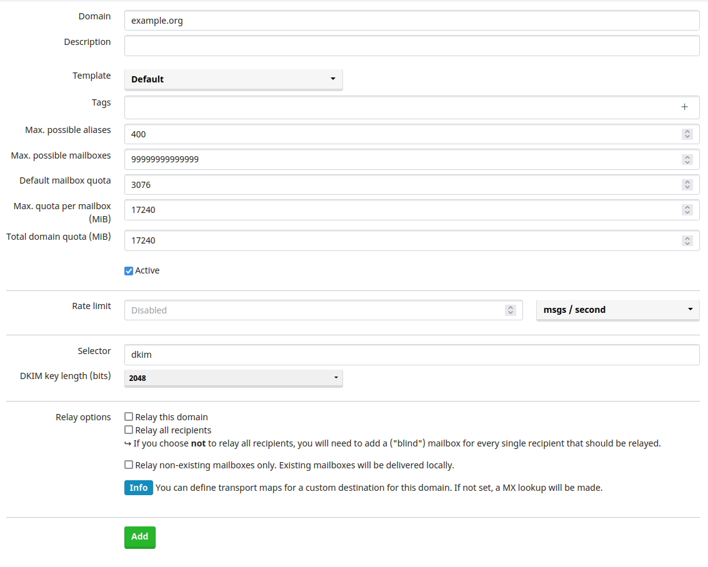

# Як налаштувати поштовий сервер для Delta Chat

> **Оновлення:** Це застаріло - тепер ми рекомендуємо
> [Chatmail Relays](2023-12-13-chatmail) через сервери mailcow для спілкування у Delta Chat,
> для швидшої доставки, надійних push-сповіщень та примусового шифрування повідомлень.
> Дізнайтеся більше [на GitHub](https://github.com/chatmail/relay) про те, як його налаштувати!
> mailcow - це здебільшого варіант
> якщо ви хочете спілкуватися з класичною поштою користувачі, яка не може використовувати шифрування.

Delta Chat — це чат-месенджер, який працює на базі електронної пошти. Це означає, що ми можемо використовувати будь-який сервер електронної пошти для запуску облікових записів Delta Chat. Один сервер електронної пошти, який легко використовувати і налаштовувати, а також працює з Delta Chat із коробки це [Mailcow](https://mailcow.email).

Ви можете запустити його разом із [mailadm](https://mailadm.readthedocs.io), який пропонує вашим користувачам простий спосіб створити обліковий запис електронної пошти та безпосередньо ввійти в обліковий запис із Delta Chat. Це також включено в цей посібник.

Що вам буде потрібно:

- базові знання командного рядка 
- доменне ім'я та доступ до його налаштувань DNS 
- SSH доступ до сервера Linux 
 - з публічним IP, 
 - мінімум 10 ГБ дискового простору, 
 - і мінімум 2 ГБ оперативної пам'яті

## Встановлення Docker

Заздалегідь необхідно встановити [docker і docker-compose](https://docs.mailcow.email/getstarted/install/#docker-and-docker-compose-installation).

### Якщо docker.com заблоковано:

В залежності від країни, в якій розташований ваш сервер, docker.com може бути заблоковано. Ви також можете отримати docker і docker-compose з інших джерел, які можуть спрацювати:

- Офіційне apt-сховище Ubuntu зазвичай має застарілу версію docker; це не найкраща ідея. 
- [snap](https://docs.docker.com/engine/install/ubuntu/) – ще один спосіб встановити докер, але для docker-compose варіант із snap не працює. Примітка: якщо ви встановлюєте докер через snap, він запускається не в systemd, а в snap. 
- Ви можете спробувати завантажити двійковий файл docker-compose [з GitHub](https://github.com/docker/compose/releases/download/v2.12.0/docker-compose-linux-x86_64) і скопіювати його в [правильне розташування](https://docs.docker.com/compose/install/linux/#install-the-plugin-manually) 
- І, нарешті, ви можете спробувати отримати доступ до сервера за межами вашої країни, створіть проксі-сервер HTTPS і використовуйте його для встановлення docker і docker-compose. Це складно, але може спрацювати. Ви можете [зв’язатися з нами](mailto:mailadm@testrun.org), якщо ви зіткнетеся з проблемами.

## Створення записів DNS

Якщо у вас ще немає домену, ви можете скористатися такою послугою, як [njal.la](https://njal.la), щоб придбати домен .net або .org за 15 євро на рік. Оплата можлива за допомогою PayPal, Bitcoin або Monero.

Припустимо:
- ви купили example.org. Наразі вам потрібен лише поштовий сервер, але ви думаєте про те, аби згодом розмістити на https://example.org веб-сайт.
- Ваш сервер має IPv4-адресу 24.48.100.24 - це можна дізнатися за допомогою команди `ip a` і пошукайте схожий номер (який не починається
  з 127 або 172).
- ваш сервер має IPv6-адресу 7fe5:2f4:1ba:2381::3 (її можна знайти в `ip a`, на 2 рядки нижче IPv4-адреси. Ігноруйте `/64` в кінці. Не використовуйте те що починається з `fe80`, він не враховується).

Тепер ви можете налаштувати параметри домену example.org таким чином:

| Тип  | Ім'я                      | Дані                                         | TTL  | Пріоритет|
|-------|---------------------------|------------------------------------------------------|------|----------|
| A     | mail.example.org          | 24.48.100.24                                         | 5min |          |
| AAAA  | mail.example.org          | 7fe5:2f4:1ba:2381::3                                 | 5min |          |
| MX    | @                         | mail.example.org                                     | 5min |    10    |
| CNAME | autoconfig.example.org    | mail.example.org                                     | 5min |          |
| CNAME | autodiscover.example.org  | mail.example.org                                     | 5min |          |
| CNAME | mailadm.example.org       | mail.example.org                                     | 5min |          |
| TXT   | @                         | "v=spf1 mx -all"                                     | 5min |          |
| TXT   | \_dmarc.example.org       | v=DMARC1;p=quarantine;rua=mailto:mailadm@example.org | 5min |          |

Ви можете налаштувати ключ DKIM після налаштування mailcow, у розділі Система>Конфігурація>Налаштування>Ключі ARC/DKIM.

Ви можете робити більше, ніж 5 хвилин, але у разі, якщо ви помічаєте, що щось не так, короткий час допомагає виправити неправильний запис.

## Налаштування Mailcow

### Налаштування параметрів Mailcow

Спочатку клонуйте репозиторій mailcow git - якщо ваш сервер не має доступу до github.com, ви можете виконати цей крок десь інде і використовувати `scp`, щоб скопіювати його на ваш сервер.

```
sudo apt install -y git
git clone https://github.com/mailcow/mailcow-dockerized
cd mailcow-dockerized
```

Тепер вам потрібно запустити `./generate_config.sh`, щоб створити файл mailcow.conf. Якщо ваш сервер не має доступу до github.com, спочатку вам потрібно видалити будь-яку команду git зі скрипту. Введіть параметри таким чином:

```
Mail server hostname (FQDN) - this is not your mail domain, but your mail servers hostname: mail.example.org
Timezone [Europe/Berlin]: UTC
Which branch of mailcow do you want to use?


Available Branches:
- master branch (stable updates) | default, recommended [1]
- nightly branch (unstable updates, testing) | not-production ready [2]
Choose the Branch with it´s number [1/2] 1
```

У файлі mailcow.conf потрібно вказати наступні змінні:

```
ADDITIONAL_SAN=mailadm.example.org
SKIP_CLAMD=y
SKIP_SOLR=y
SKIP_SOGO=y
```

Останні 3 варіанти видаляють сервіси, які не потрібні для мінімальної настройки.

Після цього нам потрібно виконати `echo '#' > data/conf/dovecot/global_sieve_before`.

### Конфігурація NGINX Mailadm

`mailadm.example.org/new_email` потрібно зробити доступним для HTTP-запитів, щоб вони працювали. Тому нам потрібно створити два файли для перенаправлення Nginx Mailcows. Спочатку ми робимо `echo 'mailadm.example.org' > data/conf/nginx/server_name.active`, а потім ми створюємо файл `data/conf/nginx/site.mailadm.custom` і додаємо до нього наступний блок:

```
  location /new_email {
    proxy_pass http://24.48.100.24:3691/;
  }
```

Переконайтеся, що ви замінили цю IP-адресу на IP-адресу вашого сервера.

Це перенаправить всі запити на `mailadm.example.org/new_email` до контейнера mailadm пізніше.

### Завантаження контейнерів mailcow

Тепер виконайте `sudo docker compose pull`, щоб завантажити контейнери mailcow. Якщо у вас немає доступу до docker.com на цьому кроці, ви можете [використовувати HTTP-проксі](https://elegantinfrastructure.com/docker/ultimate-guide-to-docker-http-proxy-configuration/).

### Запуск Mailcow

Тепер запустіть mailcow за допомогою `sudo docker compose up -d`.

### Вимкнення IPv6 для mailcow

Якщо ваш сервер не має IPv6-адреси, ви повинні [вимкнути IPv6](https://docs.mailcow.email/post_installation/firststeps-disable_ipv6/).

### Додавання домену в Mailcow

Тепер ви можете увійти до веб-інтерфейсу mailcow за адресою https://mail.example.org. Ім'я користувача за замовчуванням -- `admin`, а пароль -- `moohoo`. Ви повинні змінити цей пароль на щось більш безпечне.


Далі, додайте домен у веб-інтерфейсі в розділі "E-Mail > Configuration > Domains". Щось на зразок цього має сенс:

- домен: example.org
- макс. поштові скриньки: 999999
- квота за замовчуванням для скриньки: 3076 (це не має значення, mailadm перезапише це)
- макс. квота для скриньки: 17240 (практично трохи менше, ніж ваш вільний диск)
- квота домену: 17240 (практично трохи менше, ніж ваш вільний диск)



Після цього ви можете перейти до "E-Mail > Configuration > Mailboxes" та створити перший обліковий запис. Ви можете спробувати це зараз з Delta Chat.

#### Рекомендовано: Додати додаткові DNS-записи

У "E-Mail > Configuration > Domains", справа поруч з вашим доменом, ви можете побачити синю кнопку "DNS". Вона надає додаткові рекомендації для DNS-записів, які можуть допомогти, якщо у вас виникають проблеми з доставкою електронних листів на інші сервери.


## Налаштування mailadm

Тепер ми можемо налаштувати mailadm - за допомогою цього інструменту ви можете генерувати QR-коди, які люди можуть сканувати з Delta Chat, щоб створити обліковий запис електронної пошти на вашому сервері. Це, ймовірно, найпростіший спосіб для користувачів почати використовувати Delta Chat.

### Завантаження mailadm

Ви можете використовувати ці команди для завантаження mailadm:

```
cd ~
git clone https://github.com/deltachat/mailadm
cd mailadm
mkdir docker-data
```

### Збірка mailadm

Тепер ви можете побудувати контейнер mailadm docker за допомогою `sudo docker build . -t mailadm-mailcow`.

### Якщо docker.com або pypi.org заблоковано

Якщо ваш сервер не може отримати доступ до docker.com, dl-cdn.alpinelinux.org або pypi.org, це не вдасться. Але ви можете збудувати контейнер Docker на іншій машині і скопіювати його на VPS:

```
sudo docker build . -t mailadm-mailcow
sudo docker save -o mailadm-image.tar mailadm-mailcow
scp mailadm-image.tar example.org:
ssh example.org
sudo docker load --import mailadm-image.tar
```

### Отримання токена API з веб-інтерфейсу

Тепер ви можете перейти за адресою https://mail.example.org/admin, щоб отримати ключ API mailcow.

Вам потрібно активувати API (Переконайтеся, що використовуєте "API з читанням та записом", а не "API з тільки читанням"!) та ввести IP-адресу інтерфейсу br-mailcow вашого сервера під "Дозволити доступ до API з цих IP-адрес/мереж у форматі CIDR". Ви можете дізнатися IP-адресу за допомогою команди `ip a show br-mailcow`.

Перевірте прапорець "Активувати API", а потім натисніть "Зберегти зміни" і скопіюйте ключ API.

### Налаштування mailadm

Тоді, в каталозі mailadm, створіть файл `.env` і налаштуйте mailadm таким чином:

```
MAIL_DOMAIN=example.org
WEB_ENDPOINT=https://mailadm.example.org/new_email
MAILCOW_ENDPOINT=https://mail.example.org/api/v1/
MAILCOW_TOKEN=238473-081241-7A78B1-B7098C-E798BA
```

На `MAILCOW_TOKEN` введіть ключ API, який ви щойно отримали з веб-інтерфейсу mailcow.

Якщо ви не впевнені, як вибрати значення в .env, подивіться на [документацію](https://mailadm.readthedocs.io/en/latest/#configuration-details) mailadm.

### Додати псевдонім mailadm

Тепер, щоб полегшити виконання команд mailadm, додайте цей псевдонім:

```
alias mailadm="$PWD/scripts/mailadm.sh"
echo "alias mailadm=$PWD/scripts/mailadm.sh" >> ~/.bashrc
```

### Запуск mailadm

Тепер ви можете ініціалізувати базу даних і налаштувати поштового бота, який mailadm буде використовувати для отримання команд та запитів на підтримку від ваших користувачів.

```
mailadm init
mailadm setup-bot
```

Потім вас просять просканувати QR-код, щоб приєднатися до групи Admin, перевіреної групи Delta Chat. Будь-хто в групі може давати команди mailadm через Delta Chat. Ви можете надіслати "/help" в групу, щоб дізнатися, як це використовувати.

Тепер, коли все налаштовано, ми можемо запустити контейнер mailadm назавжди:

```
sudo docker run -d -p 3691:3691 --mount type=bind,source=$PWD/docker-data,target=/mailadm/docker-data --name mailadm mailadm-mailcow gunicorn -b :3691 -w 1 mailadm.app:app
```

Це призведе до запуску контейнера докера `mailadm`. Ви можете перезапустити його за допомогою команди `sudo docker restart mailadm`, якщо вам це потрібно.

#### Перші кроки з mailadm

Ось і все! Тепер ви можете почати створювати токени та користувачів за допомогою mailadm. Найкраще перегляньте документацію для [перших кроків](https://mailadm.readthedocs.io/en/latest/#first-steps) - вона також містить підказки для усунення проблем з налаштуванням, якщо щось не працює.

## Рекомендовано: Вимкніть POP3

Delta Chat використовує лише SMTP та IMAP, тому якщо всі ваші користувачі використовують Delta Chat, ви можете вимкнути POP3.

Для цього додайте наступне до `mailcow.conf`:

```
POP_PORT=127.0.0.1:110
POPS_PORT=127.0.0.1:995
```

Тепер застосуйте зміни за допомогою `sudo docker compose up -d`.

## Рекомендовано: перенаправити весь HTTP-трафік на HTTPS

За замовчуванням, сервер nginx також відповідає незашифровано на порту 80. Це може бути погано, оскільки деякі користувачі можуть вводити паролі через це незашифроване з'єднання.

Щоб запобігти цьому, створіть новий файл `data/conf/nginx/redirect.conf` і додайте наступну конфігурацію сервера до файлу:

```
server {
  root /web;
  listen 80 default_server;
  listen [::]:80 default_server;
  include /etc/nginx/conf.d/server_name.active;
  if ( $request_uri ~* "%0A|%0D" ) { return 403; }
  location ^~ /.well-known/acme-challenge/ {
    allow all;
    default_type "text/plain";
  }
  location / {
    return 301 https://$host$uri$is_args$args;
  }
}
```

Тепер застосуйте зміни за допомогою `sudo docker compose restart nginx-mailcow`.

## Рекомендовано: Немає журналів, немає хазяїв

Mailcow реєструє IP-адреси ваших користувачів для налагоджувальних цілей, тому якщо ви не хочете зберігати цю критичну інформацію на своєму сервері, ви можете вимкнути реєстрацію. Зверніть увагу, що це значно ускладнює виявлення проблем. Ніхто, крім вас, не може вгадати, чи є це необхідним у вашому середовищі.

Mailcow зберігає деякі журнали в Redis, щоб ви могли побачити їх у веб-інтерфейсі - але якщо ви додаєте `command: '--save ""'` до контейнера redis-server у файлі docker-compose.yml, вони зберігаються тільки в оперативній пам'яті, що, сподіваємось, не зберігається потенційним зловмисником.

Щоб спрямувати фактичні журнали у `/dev/null`, так званий Нірвана, ви можете:

Додайте наступні рядки до кожного контейнера в `mailcow-dockerized/docker-compose.yml`:

```
      logging:
        driver: "syslog"
        options:
          syslog-address: "udp://127.0.0.1:514"
          syslog-facility: "local3"
```

Тепер ви можете налаштувати rsyslog для прослуховування цього порту для введення журналу. Розкоментуйте наступні рядки в `/etc/rsyslog.conf`.

```
module(load="imudp")
input(type="imudp" port="514")
```

І додайте це до `/etc/rsyslog.d/`, щоб перенаправити все це у нірвану:

```
local3.*        /dev/null
& stop
```

Нарешті, перезапустіть rsyslog за допомогою `sudo service rsyslog restart` і mailcow за допомогою `sudo docker compose up -d`.

Розгляньте [документацію з логування Mailcow](https://docs.mailcow.email/post_installation/firststeps-logging/#log-rotation) для альтернатив до цієї конфігурації.

## Рекомендовано: Додайте зворотні DNS-записи у вашому провайдері

Ви також можете створити зворотні DNS-записи для IPv4 та IPv6-адрес вашого сервера, що містять ваш домен. Зворотні DNS-записи покращують доставку; це допомагає іншим поштовим серверам відрізняти листи вашого користувача від спаму.

Встановлення записів rDNS повинно бути можливим у веб-інтерфейсі постачальника хостингу. Ви можете дізнатися більше про це [у цій статті](https://docs.hetzner.com/dns-console/dns/general/reverse-dns/).

