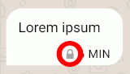

## 什么是 Delta Chat？

Delta Chat 是一款可靠、去中心化且安全的即时通讯应用，
适用于移动和桌面平台。

Delta Chat 用起来感觉像 Whatsapp 或 Telegram，但你也可以将其视为电子邮件应用。
你可以匿名注册各种[可互操作的 Chatmail 服务器](https://delta.chat/chatmail)，
这些服务器是为快速和安全操作优化的最小化电子邮件服务器。
或者你可以使用传统的电子邮件服务器和现有的电子邮件帐户，
在这种情况下，Delta Chat 充当电子邮件应用。

### 如何找到聊天对象？

要安全地与他人建立联系，请[扫描邀请二维码或分享邀请链接](#howtoe2ee)。
当使用基于 (默认) Chatmail 的聊天配置文件时，这是必需的，
因为 Chatmail 服务器会拒绝未加密的传出消息。

如果你使用传统的电子邮件地址创建聊天配置文件，
如果你知道对方的电子邮件地址，你可以手动创建联系人，
然后给他们写消息，即使接收者没有使用 Delta Chat。

### 与其他即时通讯应用相比，Delta Chat 有哪些优势？

- 匿名聊天配置文件，配备快速、安全且可互操作的 [Chatmail 服务器](https://delta.chat/chatmail)，
  为 iOS 和 Android 设备提供即时推送通知。

- 在所有平台上普遍支持[多配置文件](#multiple-accounts)和多设备。

- 用于游戏和协作的聊天室内交互式 [Web 应用](https://webxdc.org/apps)

- [经过审计的端到端加密](#security-audits)，
  可抵御网络和服务器攻击。

- 免费和开源软件，包括应用和服务器端。
  基于 [电子邮件和 Web 互联网标准](https://github.com/deltachat/deltachat-core-rust/blob/master/standards.md) 构建，
  [以避免“又一个标准综合征 (xkcd 927)”](https://xkcd.com/927/)

### 如果我期望收到来自我过去没有写过信的人的消息怎么办？

- 如果消息来自未知联系人，它将显示为**请求**。你需要
  接受请求才能回复。
- 如果你现在不想与他们聊天，也可以“删除”它。这
  *不会*删除服务器上的消息，仅删除你设备上的消息。 因此你仍然可以
  在其他邮件应用中处理该消息。
- 如果你删除请求，来自该联系人的未来消息仍将显示为
  消息请求，因此你可以改变主意。 如果你真的不想
  接收来自此人的消息，请考虑*阻止*他们。

### Delta Chat 是否支持图片、视频和其他附件？

- 是的。 除了纯文本外，所有电子邮件附件都将显示为单独的消息。 传出消息会自动添加所需的附件。

- 为了提高性能，图片默认会进行优化并以较小的尺寸发送，但你可以将其作为“文件”发送以保留原始尺寸。

### 什么是配置文件？ 如何在它们之间切换？ {#multiple-accounts}

配置文件是**一个名称、一张图片**以及一些用于加密消息的附加信息。
配置文件仅存在于你的设备上
并使用 Chatmail 或传统的电子邮件服务器来传输消息。

首次安装 Delta Chat 时，会创建一个初始配置文件。

之后，你可以点击左上角的个人资料图片以**添加配置文件**
或**切换配置文件**。

你可能希望为政治、家庭或工作相关活动使用单独的配置文件，
或者例如，创建一个专门的“垃圾邮件配置文件”，用于在网站和平台上注册，
这些网站和平台迟早会引起不请自来的消息（“垃圾邮件”）。

你可能还希望了解[如何在多台设备上使用同一配置文件](#multiclient)。

### 谁能看到我的个人资料图片？

- 你可以在设置中添加个人资料图片。 如果你给你的联系人写信
  或通过二维码添加他们，他们会自动看到它作为你的个人资料图片。

- 不使用 Delta Chat 的联系人看不到个人资料图片
  （当然，他们可以安装 Delta Chat :)

- 出于隐私原因，在你给他们写消息之前，没有人会看到你的个人资料图片。

- 你的个人资料图片不会随每条消息一起发送，但会定期发送，
  即使你的联系人添加了新设备，他们也会重新收到你的个人资料图片。

### 我可以在 Delta Chat 中设置个人简介/签名/状态/座右铭吗？ {#signature}

是的，
你可以在**设置 → 个人资料 → 个人简介**下进行设置。
使用 Delta Chat 的联系人将在查看你的联系方式时看到它。
此外，它将作为经典的电子邮件签名出现。

### 置顶、静音和存档是什么意思？

使用这些工具来组织你的聊天并使一切井井有条：

- **置顶聊天**始终位于聊天列表的顶部。 你可以使用它们快速访问你最喜欢的聊天，或临时使用以记住某些事情。

- **静音聊天**如果你不想收到它们的通知。 静音聊天保持原位，你也可以置顶静音聊天。

- **存档聊天**如果你不想再在聊天列表中看到它们。
  存档聊天仍然可以通过聊天列表上方或搜索访问。

- 当存档聊天收到新消息时，除非静音，否则它将**从存档中弹出**并返回到你的聊天列表中。
  **静音聊天将保持存档状态**，直到你手动取消存档。

要使用这些功能，请长按或右键单击聊天列表中的聊天。

### 绿点是什么意思？

- 自 Delta Chat 1.34 起，你有时会在联系人头像旁边看到一个“绿点”。 这意味着他们“最近可见”。
- 详细来说：这意味着在过去 10 分钟内，Delta Chat 已经看到他们：
  - 要么是因为他们直接给你发消息，
  - 要么是因为他们在你都是成员的群组中写了东西，
  - 要么是因为他们给你发送了你写的消息的已读回执，
  - 要么是因为他们通过使用 [WebXDC 应用](#webxdc) 向你的 Delta Chat 应用发送了数据。
- 因此，这不是一个真正的实时在线状态 - 即使有人看起来在线，但没有立即回复，也不要担心，给他们一些
  空间 ;-)
- 另一方面，其他人不会总是“看到你在线”。 如果你
  关闭了已读回执，他们将不会看到绿点，直到你给他们发消息或在你也在其中的群组中写消息为止。

### 阅后即焚消息是如何工作的？ {#ephemeralmsgs}

你可以在聊天设置中开启“阅后即焚消息”，
在聊天窗口的右上角，
通过选择 1 分钟到 5 周之间的时间跨度。

在再次关闭该设置之前，
每个聊天成员的 Delta Chat 应用都会负责
在选定的时间跨度后删除消息。
时间跨度从
接收者首次在 Delta Chat 中看到消息时开始。
消息将在
服务器上的每个电子邮件帐户中以及应用本身中删除。

请注意，你只能在你信任你的聊天伙伴的情况下
依赖阅后即焚消息；
恶意聊天伙伴可能会拍照，
或以其他方式保存、复制或转发消息，然后在删除之前进行操作。

除此之外，
如果一个聊天伙伴卸载了 Delta Chat，
消息将不会从他们的电子邮件帐户中删除。
它们很可能也无法再解密
（只要它们首先是加密的）。

## 群组

### 创建群组

- 从右上角的菜单中选择**新聊天**，然后选择**新建群组**，或点击 Android/iOS 上的相应按钮。
- 在接下来的屏幕上，选择**群组成员**并定义**群组名称**。 你也可以选择**群组头像**。
- 一旦你在群组中写下**第一条消息**，所有成员都会收到有关新群组的通知，并且可以在群组中回复（只要你不在群组中写消息，该群组对成员是不可见的）。

### 向群组添加成员

- 每个群组成员都拥有与任何其他成员**相同的权利**。 因此，每个人都可以删除每个成员或添加新成员。
- 要添加或删除成员，请点击聊天中的群组名称。

### 我不小心删除了自己。

- 由于你不再是群组成员，因此你无法再次添加自己。
  但是，没问题，只需在普通聊天中要求任何其他群组成员重新添加你即可。

### 我不想再接收群组的消息了。

- 要么从成员列表中删除自己，要么删除整个聊天。
  如果你想稍后再次加入群组，请要求另一个群组成员再次添加你。

- 作为替代方案，你也可以“静音”群组 - 这样做意味着你将收到所有消息并且
  仍然可以写消息，但不再收到任何新消息的通知。

### 外发消息旁边的勾号是什么意思？

- **一个勾号**表示消息已成功发送到你的提供商。
- **两个勾号**表示至少一个接收者的设备
  已报告收到消息。
- 接收者可能已禁用已读回执，
  因此即使你只看到一个勾号，消息也可能已被阅读。
- 反过来说，两个勾号并不自动意味着
  有人已经阅读或理解了消息 ;)

### 如果我开启“删除服务器上的旧消息”会发生什么？

- 默认情况下，Delta Chat 会将所有消息本地存储在你的设备上。
  如果你例如想要节省邮件提供商的存储空间，
  你可以配置 Delta Chat
  以自动删除服务器上已接收的旧消息。
  它们仍然保留在你的设备上，直到你也将其删除为止。

- 要开启它，请转到“删除旧消息 → 从服务器删除消息”
  在“聊天和媒体”设置中。
  你可以设置“立即”和“1 年后”之间的时间范围。
  在此时间范围之后，Delta Chat 收到的所有电子邮件都将从服务器中删除。

- 请注意，如果你在多台设备上使用 Delta Chat，
  你需要将消息保留在服务器上足够长的时间
  ，以便其他设备也可以下载它们。

### 如果我开启“删除设备上的旧消息”会发生什么？ {#delold}

- 如果你想节省设备上的存储空间，你可以选择自动删除旧消息。
- 要开启它，请转到“聊天和媒体”设置中的“删除设备上的旧消息”。 你可以设置“一小时后”和“一年后”之间的时间范围；
  这样，*所有*消息将在它们超过该时间后立即从你的设备中删除。

## 即时消息传递和推送通知 {#instant-delivery}

### 什么是推送通知？ 如何获得即时消息传递？

推送通知由 Apple 和 Google “推送服务”发送到用户的设备，
以便不活跃的 Delta Chat 应用可以在后台获取消息，
并在需要时在用户的手机上显示通知。

推送通知适用于所有 [Chatmail](https://delta.chat/chatmail) 服务器，

- iOS 设备，通过与 Apple 推送服务集成。

- Android 设备，通过与 Google FCM 推送服务集成，
  包括在 [microG](https://microg.org) 设备上
  而不是手机上的专有 Google 代码。

截至 2024 年 5 月，传统的电子邮件服务器不支持
Delta Chat 用户的推送通知。

### iOS 设备上是否启用了推送通知？ 有替代方案吗？

是的，Delta Chat 会自动为 [Chatmail](https://delta.chat/chatmail) 配置文件使用推送通知。
不，Apple 手机上没有替代方案来实现即时消息传递，
因为 Apple 设备不允许 Delta Chat 在后台获取数据。
推送通知会自动为 iOS 用户激活，因为
[Delta Chat 的隐私保护推送通知系统](#privacy-notifications)
不会将 Apple 已经拥有的数据泄露给 Apple。

### Android 设备上是否启用/需要推送通知？ {#android-push}

如果“推送服务”可用，Delta Chat 将启用推送通知
，以便为所有 Chatmail 用户实现即时消息传递。
如果你使用的是传统的电子邮件提供商而不是 [Chatmail](https://delta.chat/chatmail) 服务器，
则推送通知不可用。

在 Delta Chat “通知”设置中的“即时传递”下，
你可以更改以下影响所有聊天配置文件的设置：

- 使用后台连接：如果你没有使用推送服务，
  你可以禁用 Delta Chat 的“电池优化”，
  允许它在后台获取消息。
  但是，可能会有几分钟到几小时的延迟。
  一些 Android 供应商甚至完全限制应用
  （请参阅 [dontkillmyapp.com](https://dontkillmyapp.com)），
  并且 Delta Chat 可能不会显示传入的消息，
  直到你手动再次打开应用为止。

- 强制后台连接：如果之前的选项不可用或无法实现“即时传递”，
  这是后备选项。
  启用它会在你的手机上导致永久通知，
  这有时可能会被最新的 Android 手机“最小化”。

如果消息到达时间延迟较长，
则“后台连接”选项都节能且安全，可以尝试。

### Delta Chat 推送通知的隐私性如何？ {#privacy-notifications}

Delta Chat 推送通知支持避免了私人信息的泄露。
它不会将电子邮件、IP 地址或消息内容（甚至加密后的内容）
泄露给参与推送通知传递的任何系统。

以下是 Delta Chat 应用如何执行推送通知传递：

- Delta Chat 应用在本地获取“设备令牌”，对其进行加密并将其存储在
  [Chatmail](https://delta.chat/chatmail) 服务器上。

- 当 [Chatmail](https://delta.chat/chatmail) 服务器收到 Delta Chat 用户的电子邮件时，
  它会将加密的设备令牌转发到中央 Delta Chat 通知代理。

- 中央 Delta Chat 通知代理解密设备令牌
  并将其转发到相应的推送服务（Apple、Google 等），
  而永远不知道 Delta Chat 用户的 IP 或电子邮件地址。

- 中央推送服务（Apple、Google 等）
  唤醒你设备上的 Delta Chat 应用
  ，以便在后台检查新消息。
  它不知道它唤醒的设备的 Chatmail 或电子邮件地址。
  中央 Apple/Google 推送服务永远不会看到电子邮件地址（发件人或收件人），
  也永远不会看到任何消息内容（也包括未加密的形式）。

中央 Delta Chat 通知代理[体积小，完全用 Rust 实现](https://github.com/deltachat/notifiers)
，并在 Apple/Google 等处理设备令牌后立即忘记它们，
通常在几毫秒内。

请注意，设备令牌在应用和通知代理之间加密，
但未签名。
因此，通知代理永远不会看到与用户设备（令牌）关联的电子邮件地址、IP 地址或
任何加密身份信息。

由此产生的整体隐私设计，即使查封 Chatmail 服务器，
或完全查封中央 Delta Chat 通知代理
也不会泄露推送服务尚未拥有的私人信息。

### 为什么 Delta Chat 与集中式专有的 Apple/Google 推送服务集成？

Delta Chat 是一款免费且开源的去中心化即时通讯应用，用户可以自由选择服务器，
但我们希望用户可靠地体验到“即时消息传递”，
就像他们从 Whatsapp、Signal 或 Telegram 应用体验到的那样，
而无需预先提出更适合专家用户或开发人员的问题。

请注意，Delta Chat 具有[小型且隐私保护的推送通知系统](#privacy-notifications)，
可为所有 Chatmail 服务器实现“即时消息传递”，
包括[你可能在未经我们许可的情况下自行设置的服务器](https://delta.chat/chatmail#selfhosted)。
欢迎来到可互操作且庞大的 Chatmail 和电子邮件系统的力量 :)

## 加密和安全

### 端到端加密使用哪些标准？

[Autocrypt](https://autocrypt.org) 用于自动
与联系人和群组聊天建立端到端加密。
Autocrypt 使用 OpenPGP 标准的有限且[安全子集](#openpgp-secure)。
端到端加密消息标有挂锁
。

[安全加入协议](https://securejoin.delta.chat/en/latest/new.html)
用于建立具有保证的端到端加密的聊天，
从而防止网络攻击和受损服务器。
标有绿色复选标记的聊天

保证端到端加密消息。

### 我如何知道消息是否已端到端加密？ {#whene2e}

所有端到端加密的消息都带有挂锁：

如果聊天标题旁边有绿色复选标记，则保证端到端加密：

### 如何获得保证的端到端加密和绿色复选标记？ {#howtoe2ee}

如果你与你的聊天伙伴有第二个通信渠道，
例如视频聊天或不同的即时通讯应用，
你可以生成邀请链接。

如果你们面对面在一起，
你可以向你的聊天伙伴展示二维码。

- 对于**群组邀请**，
  点击聊天群组标题以查看其成员列表，
  然后选择“QR 邀请码”。

- 对于**直接 1:1 聊天邀请**，
  点击 Delta Chat 应用主屏幕上的二维码图标 。

让你的聊天伙伴用他们的 Delta Chat 应用扫描二维码图像，
或点击“复制”或“分享”以创建邀请链接
并与你的聊天伙伴分享。

现在等待 [安全加入网络消息在两个设备之间交换](https://securejoin.delta.chat/en/latest/new.html#setup-contact-protocol)。

- 如果两个设备都处于在线状态，
  双方最终都会看到一个（群组或直接）聊天，标题旁边带有绿色复选标记
  。

- 如果其中一个设备处于离线状态，则绿色复选标记只会
  在稍后设备再次连接到互联网
  且安全加入网络协议完成时才会出现。

恭喜！
你现在将自动使用保证的端到端加密
与此联系人，并且你们都可以将彼此添加到带有绿色复选标记的群组
，
从而自动在其成员之间传播保证的端到端加密。

### 绿色复选标记和“保证的端到端加密”是什么意思？ {#e2eeguarantee}

带有绿色复选标记的聊天标题

表示聊天中的所有消息都将进行端到端加密，
并且不会被受损的电子邮件服务器或互联网提供商读取或更改。
加入带有绿色复选标记的群组聊天
可以安全地传播每个人的加密信息（和绿色复选标记），
从而保证群组和成员之间的端到端加密。

带有绿色复选标记的联系人配置文件

表示当前保证与联系人的消息传递是端到端加密的。
每个带有绿色复选标记的联系人要么直接与你进行了 [二维码扫描](#howtoe2ee)，
要么由另一个带有绿色复选标记的联系人介绍。
当向群组添加成员时，介绍会自动发生。
任何将联系人添加到带有绿色复选标记的群组的人都成为
那些还不认识添加的联系人的成员的介绍人。
在联系人配置文件中，你可以反复点击“由...介绍”文本
，直到你到达直接与你进行 [二维码扫描](#howtoe2ee) 的那个人。

请注意，在联系人配置文件中，你可能会看到并点击介绍人，
但在配置文件标题中没有绿色复选标记。
这通常意味着联系人“[从另一台设备发送了消息](#nocryptanymore)”。

有关“保证的端到端加密”的更深入讨论，
请参阅 [安全加入协议](https://securejoin.delta.chat/en/latest/new.html)，
并专门阅读有关“已验证群组”的内容，这是
此处所谓的“带有绿色复选标记”或“保证的端到端加密”聊天的技术术语。

### 联系人“从另一台设备发送了消息”，我该怎么办？ {#nocryptanymore}

你与联系人的聊天失去了保证的端到端加密。
当你看到此警告时，此聊天的绿色复选标记和联系人已被删除。
**如果你发现保证的端到端加密突然下降
对于此联系人来说很意外，请不要接受警告！**
相反，请通过第二个渠道（
如视频通话、其他即时通讯应用或电话）与你的联系人核实
，以找出发生了什么。

如果你的联系人实际上导致了保证的端到端加密下降，
请参阅以下段落，了解常见原因及其缓解措施。
无论如何，所有其他带有绿色复选标记的聊天都保持保证的端到端加密，
即使该联系人是那里的成员。

**你的联系人在第二台设备（手机或笔记本电脑）上使用 Delta Chat**

如果他们有另一台运行 Delta Chat 应用的设备，
他们应该从新设备中删除配置文件，
并[按照此处所述将其添加为第二台设备](#multiclient)。
在他们之后给你发消息后，警告将消失，
并且保证的加密将在你的联系人的两台设备之间建立。

**你的联系人使用他们的旧帐户登录名重新安装了 Delta Chat**

如果他们有[备份文件](#backup)，
他们应该从新设备中删除配置文件，
而是导入备份文件以重新创建他们的配置文件。
在他们之后给你发消息后，警告将消失，
并且保证的加密将为此联系人重新建立。

如果他们没有备份文件，最好与你的聊天伙伴执行 [二维码扫描](#howtoe2ee)，
以重新建立保证的端到端加密。

**你的联系人通过 Webmail 界面或其他电子邮件应用发送了邮件，
并且将很快恢复使用 Delta Chat。**

如果你确定联系人有时使用 Webmail，
或其他缺少端到端加密的邮件应用，
那么你可以接受警告。
一旦你的联系人再次使用 Delta Chat，
保证的端到端加密将自动重新建立。

**你的联系人完全停止使用 Delta Chat**

有时保持联系比端到端加密更重要。
["传输层加密" (TLS)](#tls) 可能仍然有意义地保护
你的设备和电子邮件服务器之间消息的机密性。
但是，如果没有端到端加密，你和你的联系人将信任你的电子邮件服务器
不会读取或操纵你的消息，也不会将其交给第三方。

在任何情况下，你都无法做太多其他事情，只能接受警告。
另请从任何活动的带有绿色复选标记的群组中删除该联系人，
你可以在联系人配置文件中的“共享聊天”中找到这些群组。
这可以避免你的联系人收到“无法读取”的消息。

如果联系人因为错误或不良行为而删除了 Delta Chat，
请考虑发布到我们的 [支持论坛](https://support.delta.chat)，
以帮助我们识别和解决常见问题。 谢谢！

### 附件（图片、文件、音频等）是否已端到端加密？

是的。

当我们谈论“端到端加密消息”时，
我们始终指的是整个消息都已加密，
包括所有附件和附件元数据，例如文件名。

### OpenPGP 安全吗？ {#openpgp-secure}

是的，Delta Chat 使用 OpenPGP 的安全子集，
并且仅在消息上显示挂锁安全指示器
，前提是整个消息都已正确加密和签名。
例如，“分离签名”不被视为安全。

OpenPGP 本身并不不安全。
大多数公开讨论的 OpenPGP 安全问题
实际上都源于工具或应用的糟糕可用性或糟糕实现（或两者兼而有之）。
区分 OpenPGP（IETF 加密标准）
和 GnuPG (GPG)（实现 OpenPGP 的命令行工具）尤为重要。
许多对 OpenPGP 的公开批评实际上是在讨论 GnuPG，而 Delta Chat 从未使用过 GnuPG。
Delta Chat 而是使用 OpenPGP Rust 实现 [rPGP](https://github.com/rpgp/rpgp)，
作为 [独立的“pgp”软件包](https://crates.io/crates/pgp) 提供，
并且 [在 2019 年进行了安全审计](https://delta.chat/assets/blog/2019-first-security-review.pdf)。

我们的目标是与其他 OpenPGP 实现者一起，
通过实施 [新的 IETF OpenPGP Crypto-Refresh](https://datatracker.ietf.org/doc/draft-ietf-openpgp-crypto-refresh/)
来进一步提高安全特性，该标准已于 2023 年夏季获得通过，令人欣慰。

### 你们是否考虑过使用 OpenPGP 的替代方案进行端到端加密？ {#openpgp-alternatives}

是的，我们正在关注 [MLS](https://en.wikipedia.org/wiki/Messaging_Layer_Security)
或 [Saltpack](https://saltpack.org/) 等工作，
但采用它们将意味着破坏与
通常支持 OpenPGP 加密的所有其他电子邮件应用的端到端加密互操作性。
因此，这不是一个可以轻易做出的决定，
并且必须为用户带来切实的改进。

Delta Chat 采用整体“可用安全性”方法，
并与广泛的活动家团体以及
[TeamUSEC](https://teamusec.de) 等知名研究人员合作
，以改进针对安全威胁的实际用户结果。
用于建立端到端加密的线路协议和标准
只是“用户结果”的一部分，
另请参阅我们对 [设备查封](#device-seizure)
和 [消息元数据](#message-metadata) 问题的回答。

### Delta Chat 是否容易受到 EFAIL 攻击？

不，[Delta Chat 从未容易受到 EFAIL 攻击](https://delta.chat/en/2018-05-15-delta-chat-not-vulnerable-to-efail)，
因为它的 OpenPGP 实现 [rPGP](https://github.com/rpgp/rpgp)
在加密消息时使用修改检测代码，
如果修改检测代码不正确，则返回 [错误](https://docs.rs/pgp/latest/pgp/errors/enum.Error.html#variant.MdcError)。

Delta Chat 也从未容易受到“直接泄露”EFAIL 攻击，
因为它只解密 `multipart/encrypted` 消息，
这些消息正好包含一个加密和签名的部分，
如 Autocrypt Level 1 规范所定义。

### 如果端到端加密不可用，消息是否会以明文形式暴露？ {#tls}

即使你的消息未保证端到端加密，
它们仍然受到互联网提供商（如手机或有线电视公司）的保护。
但是，你的和你的接收者的电子邮件提供商
可能会读取、分析甚至修改你的消息，
包括任何附件，
如果它们未进行端到端加密。

Delta Chat 默认使用严格的
[TLS 加密](https://en.wikipedia.org/wiki/Transport_Layer_Security)，
这可以保护你的设备和电子邮件提供商之间的连接安全。
Delta Chat 的所有 TLS 处理都经过了独立的 [安全审计](#security-audits)。
此外，你的和接收者的电子邮件提供商之间的连接
通常也会进行传输加密。
如果所涉及的电子邮件服务器支持 [MTA-STS](https://datatracker.ietf.org/doc/html/rfc8461)，
则将在电子邮件提供商之间强制执行传输加密，
在这种情况下，即使消息未进行端到端加密，Delta Chat 通信也永远不会以明文形式暴露给互联网。

请注意，[在 TLS 加密之上保持保证的端到端加密](#howtoe2ee)
可在你的和接收者的设备之间提供普遍的安全性。
即使你的电子邮件或互联网提供商也无法读取或修改你的消息。

### Delta Chat 如何保护消息中的元数据？ {#message-metadata}

Delta Chat 通过将以下信息放入消息的端到端加密部分来保护大多数消息元数据：

- 主题行
- 群组头像和名称
- MDN（已读回执）请求 (`Chat-Disposition-Notification-To`)
- 阅后即焚消息计时器 (`Ephemeral-Timer`)
- `Chat-Group-Member-Removed`, `Chat-Group-Member-Added`
- 包含安全加入命令的 `Secure-Join` 标头
- 关于启用位置流式传输的通知
- WebRTC 房间 URL

电子邮件服务器无法访问此受保护的元数据，
但它们可以看到消息日期以及消息大小，
更重要的是，可以看到发件人和收件人地址。
电子邮件服务器需要收件人地址来路由和
将消息传递到接收者的设备。

### 当设备被查封时，如何保护元数据和联系人？ {#device-seizure}

为了防止收集元数据的电子邮件服务器
以及设备查封的威胁，
我们建议使用 [Chatmail 服务器](https://delta.chat/chatmail)
通过二维码扫描创建匿名临时配置文件。
请注意，所有平台上的 Delta Chat 应用都支持多配置文件，
因此你可以轻松地在你“主要”配置文件旁边使用特定于情况的配置文件，
并且知道它们的所有数据以及所有元数据都将被删除。
此外，如果设备被查封，则与使用临时配置文件的联系人
相比，无法轻易识别，因为即时通讯应用会在聊天群组中显示
电话号码，而电话号码通常与合法身份相关联。

### 如何检查加密信息？

你可以在“加密”对话框中手动检查端到端加密状态
（Android/iOS 上的用户配置文件或桌面上的用户聊天列表项上右键单击）。
Delta Chat 在此处显示两个指纹。
如果相同的指纹出现在你自己的设备和你联系人的设备上，
则连接是安全的。

### 如何检查消息的加密状态？

消息气泡中的小**挂锁**表示
消息已从给定的发件人正确进行端到端加密。
如果**没有挂锁**，则消息未正确进行端到端加密，
最可能是因为发件人使用的应用或 Webmail 界面
不支持端到端加密。

### 为什么我会看到未加密的消息？

如果联系人使用非 Autocrypt 电子邮件应用，
则涉及此联系人（在群组或 1:1 聊天中）的所有消息
将不会进行端到端加密，因此消息中不会显示“挂锁”。
请注意，即使你的联系人在其帐户上使用 Delta Chat，
他们也可能在该帐户上使用非 Autocrypt 电子邮件应用，
这可能会导致间歇性未加密的消息。
回复未加密的消息是 Autocrypt 强制执行的
，以防止你的联系人及其非 Autocrypt 电子邮件应用端出现无法读取的消息。

### 如何与有时使用 Webmail 或其他非 Autocrypt 电子邮件应用的 Delta Chat 联系人获得端到端加密的聊天？

如果你需要与
同时使用 Delta Chat 和非 Autocrypt 应用（例如 Webmail）的电子邮件帐户的联系人进行安全端到端加密的聊天，
最好与他们设置 [保证的端到端加密](#howtoe2ee)，
然后创建一个由你二人作为成员的保证的端到端加密的群组聊天。
在此群组聊天中，所有消息都将进行端到端加密，
即使你二人之间的直接聊天有
[“...从另一台设备发送了消息”](#nocryptanymore) 警告。

### 如何确保消息端到端加密和删除？

确保每条消息都进行端到端加密，
并尽快删除元数据的最佳方法是
[使用具有保证的端到端加密的聊天](#howtoe2ee)
并开启 [阅后即焚消息](#ephemeralmsgs)。

保证的端到端加密聊天可防止 [MITM 攻击](https://en.wikipedia.org/wiki/Man-in-the-middle_attack)，
而开启阅后即焚消息会在用户配置的时间后删除服务器上的消息。

如果你不需要在服务器上保留消息的长期副本，
你还可以开启 [“自动从服务器删除消息”](#delold)。

### Delta Chat 是否支持完美前向保密？ {#pfs}

否，Delta Chat 不支持完美前向保密 (PFS)。
这意味着，如果你的 Delta Chat 私有解密密钥泄露，
并且有人收集了你以前的传输中消息，
他们将能够使用泄露的解密密钥解密和读取它们。

但是请注意，如果任何人获得了你的解密密钥，
他们通常也能够获得你的消息，
无论是否实施了完美前向保密。
泄露解密密钥的典型现实情况是设备查封，
我们在 [关于元数据和设备查封的回答](#device-seizure) 中对此进行了讨论。

Delta Chat 可能会发展为支持完美前向保密，
因为 OpenPGP 只是加密消息的容器，
但密钥管理（以及密钥轮换或密钥“棘轮”）
可以以灵活的方式组织。
请参阅 [Seqouia 的 PFS 原型](https://gitlab.com/sequoia-pgp/openpgp-dr)，
了解 OpenPGP 实现者社区中现有的实验。

### Delta Chat 的端到端加密是否与 Signal 一样安全？

这取决于对你而言重要的是什么。
Delta Chat [不支持像 Signal 那样的 PFS](#pfs)，
但它提供了 [保证的端到端加密聊天](#e2eeguarantee)，
可以安全地抵御受损的服务器或损坏的网络。
Signal 和大多数其他支持 PFS 的即时通讯应用
没有提供实用的方案来保护聊天群组免受网络攻击，
而网络攻击可以说比
潜在的攻击者查封你的手机和私有加密设置
但不知何故没有你的消息，却完整记录了所有
过去的加密消息更令人担忧。

在任何情况下，Delta Chat 的端到端加密都使用 [OpenPGP 的安全子集](#openpgp-secure)，
该子集已 [通过独立的安全审计](../assets/blog/2019-first-security-review.pdf)。

### 我可以重用我现有的私钥吗？ {#importkey}

是的。
最好的方法是从其他电子邮件客户端发送 Autocrypt 设置消息。
在其他客户端的设置中查找类似**开始 Autocrypt 设置传输**的内容，然后按照那里显示的说明进行操作。

或者，你可以在“设置 -> 高级设置 -> 导入私钥”中手动导入密钥。
注意：确保密钥未受密码保护，或事先删除密码。

如果你没有密钥，甚至不知道你需要密钥 - 不用担心：Delta Chat 会根据需要生成密钥，你无需点击按钮。

### 我无法将我现有的 PGP 密钥导入到 Delta Chat 中。

最可能的原因是你的密钥已加密和/或使用密码。
Delta Chat 不支持此类密钥。
你可以删除密码短语加密和密码，然后再次尝试导入。

另一个常见错误是文件扩展名错误。
使用 ASCII 编码格式和 `.asc` 文件扩展名。

Delta Chat 支持常见的 OpenPGP 私钥格式，但是，
不太可能完全支持来自所有来源的私钥。 这
不是 Delta Chat 的主要目标。 事实上，大多数新用户
在使用 Delta Chat 之前不会有任何密钥。
但是，我们确实尝试支持来自尽可能多来源的私钥。

删除私钥的密码将取决于你用于管理 PGP 密钥的
软件。 使用 Enigmail，你可以在“密钥管理”窗口中将密码设置为空值。 使用 GnuPG，你可以
[通过命令行设置密码](https://github.com/deltachat/deltachat-android/issues/98#issuecomment-378383429)。
对于其他程序，你应该能够在网上找到解决方案。

### Delta Chat 是否已进行独立的安全漏洞审计？ {#security-audits}

Delta Chat 项目经历了四次独立的安全性审计和一次
独立的安全性分析，从最近到最旧：

- 2024 年 3 月，我们收到了苏黎世联邦理工学院应用密码学
  研究小组的深入安全性分析，并解决了所有提出的问题。
  有关更多详细信息，请参阅我们关于 [加强保证的端到端加密](https://delta.chat/en/2024-03-25-crypto-analysis-securejoin) 的博客文章以及
  之后发表的 [Delta Chat 密码学分析](https://eprint.iacr.org/2024/918.pdf)
  研究论文。

- 2023 年 4 月，我们修复了“在聊天中共享的 Web 应用”的安全性
  和隐私问题，这些问题与沙箱故障有关，尤其是在 Chromium 中。 随后，我们获得了 Cure53 的独立安全
  审计，并且在 2023 年 4 月发布的 1.36 应用系列中修复了发现的所有问题。
  请参阅 [此处，了解有关 Web 中端到端安全性的完整背景故事](https://delta.chat/en/2023-05-22-webxdc-security)。

- 2023 年 3 月，[Cure53](https://cure53.de) 分析了 Delta
  Chat 网络连接的传输加密和一个可重现的邮件服务器设置，如
  [本网站](serverguide) 推荐的那样。
  你可以在 [我们的博客](https://delta.chat/en/2023-03-27-third-independent-security-audit) 上阅读有关审计的更多信息
  ，或在此处阅读 [完整报告](../assets/blog/MER-01-report.pdf)。

- 2020 年，[Include Security](https://includesecurity.com) 分析了 Delta
  Chat 的 Rust [核心](https://github.com/deltachat/deltachat-core-rust/)、
  [IMAP](https://github.com/async-email/async-imap)、
  [SMTP](https://github.com/async-email/async-smtp) 和
  [TLS](https://github.com/async-email/async-native-tls) 库。
  它没有发现任何严重或高严重性问题。
  该报告提出了一些中等严重性的弱点 -
  它们本身不会对 Delta Chat 用户构成威胁，
  因为它们取决于 Delta Chat 使用的环境。
  出于可用性和兼容性原因，
  我们无法减轻所有这些弱点，
  并决定向受威胁的用户提供安全建议。
  你可以在 [此处阅读完整报告](../assets/blog/2020-second-security-review.pdf)。

- 2019 年，[Include Security](https://includesecurity.com) 分析了 Delta
  Chat 的 [PGP](https://github.com/rpgp/rpgp) 和
  [RSA](https://github.com/RustCrypto/RSA) 库。
  它没有发现任何严重问题，
  但发现了两个高严重性问题，我们随后修复了这些问题。
  它还揭示了一个中等严重性和一些不太严重的问题，
  但在 Delta Chat 实现中无法利用这些漏洞。
  尽管如此，自审计结束以来，我们仍然修复了其中一些问题。
  你可以在 [此处阅读完整报告](../assets/blog/2019-first-security-review.pdf)。

## 多客户端 {#multiclient}

### 我可以同时在多台设备上使用 Delta Chat 吗？

是的。 Delta Chat 1.36 附带了一个新的实验性功能，用于在不同的设备上使用相同的配置文件：

- 确保两台设备都在同一个 Wi-Fi 或网络中

- 在第一台设备上，转到**设置 → 添加第二台设备**，如果需要，解锁屏幕
  并稍等片刻，直到显示二维码

- 在第二台设备上，[安装 Delta Chat](https://get.delta.chat)

- 在第二台设备上，启动 Delta Chat，选择**添加为第二台设备**，然后扫描旧设备上的二维码

- 传输应在几秒钟后开始，并且在传输过程中，两台设备都将显示**进度**。
  等待直到两台设备都完成。

与其他许多即时通讯应用不同，在成功传输后，
两台**设备完全独立。**
一台设备不是另一台设备工作的必要条件。

### 故障排除

- 仔细检查两台设备是否在**同一个 Wi-Fi 或网络中**

- 在 **Windows** 上，转到**控制面板 / 网络和 Internet**
  并确保**专用网络**被选为“网络配置文件类型”
  （传输后，你可以更改回原始值）

- 在 **iOS** 上，确保授予“系统设置 / 应用 / Delta Chat / **本地网络**”访问权限

- 在 **macOS** 上，启用“系统设置 / 隐私和安全 / **本地网络** / Delta Chat”

- 你的系统可能具有“个人防火墙”，
  已知这会引起问题（尤其是在 Windows 上）。
  在两端**禁用个人防火墙**以用于 Delta Chat，然后重试

- **访客网络**可能不允许设备相互通信。
  如果可能，请使用非访客网络。

- 确保目标设备上有**足够的存储空间**

- 如果传输已开始，请确保设备**保持活动状态**，并且不会进入睡眠状态。
  不要退出 Delta Chat。
  （我们努力使应用在后台工作，但不幸的是，[系统倾向于杀死应用](https://dontkillmyapp.com)）

- 目标设备上**已登录** Delta Chat？
  你可以在每台设备上使用多个配置文件，只需[添加另一个配置文件](#multiple-accounts)

- 如果你仍然遇到问题，或者**无法扫描二维码**
  ，请尝试下面描述的**手动传输**

### 手动传输 {#backup}

仅当上述“添加第二台设备”方法不起作用时，才建议使用此方法。

- 在旧设备上，转到“设置 -> 聊天和媒体 -> 导出备份”。 输入你的
  屏幕解锁 PIN 码、图案或密码。 然后你可以点击“开始
  备份”。 这会将备份文件保存到你的设备。 现在你必须
  以某种方式将其传输到另一台设备。
- 在新设备上，在“我已经有一个配置文件”菜单中，
  选择“从备份还原”。 导入后，你的对话、加密
  密钥和媒体应复制到新设备。
  - **如果你使用 iOS：** 并且你遇到困难，也许
    [本指南](https://support.delta.chat/t/import-backup-to-ios/1628) 将
    帮助你。
- 你现在已同步，并且可以使用两台设备与你的通信伙伴发送和接收
  端到端加密消息。

### 是否有引入 Delta Chat Web 客户端的计划？

- 目前没有立即的计划，但有一些初步的想法。
- 有 2-3 种引入 Delta Chat Web 客户端的途径，但所有这些都需要
  大量工作。 目前，我们专注于将稳定版本作为本机应用发布到所有
  应用商店（Google Play/iOS/Windows/macOS/Linux 存储库）中。
- 如果你需要 Web 客户端，因为你不允许在你工作的计算机上安装软件，
  则可以使用便携式 Windows 桌面客户端或 Linux 的 AppImage。 你可以在
  [get.delta.chat](https://get.delta.chat) 上找到它们。

## WebXDC 应用 {#webxdc}

在 Delta Chat 中，你可以共享 [WebXDC 应用](https://webxdc.org)，即带有 `.xdc` 文件扩展名的附件。
它们可以做非常不同的事情，并使 Delta Chat 成为真正的可扩展即时通讯应用。

### WebXDC 应用的隐私性如何？

- WebXDC 应用无法向互联网发送数据或下载任何内容。
- WebXDC 应用只能在 Delta Chat 聊天中与其聊天伙伴设备上的副本交换数据。 除此之外，它与互联网完全隔离。
- WebXDC 应用提供的隐私性就是你的聊天的隐私性 - 只要你
  信任与你聊天的人，你也可以信任 WebXDC 应用。
- 这也意味着：在你不信任成员的聊天中打开 WebXDC 应用可能存在隐私风险 - 正如你从电子邮件附件中了解到的那样，你
  只打开来自你信任的发件人的附件，而不是来自垃圾邮件发送者的附件。

### 我在哪里可以获得 WebXDC 应用？

- 总的来说，任何人都可以相互共享 WebXDC 应用，没有任何限制。
- 来自 [webxdc.org/apps](https://webxdc.org/apps/)。
- 你可以 [向 xstore@testrun.org 发送“hi”](https://delta.chat/en/2023-08-11-xstore)
  以查看实验性的 WebXDC 应用商店。
  所有应用都是开源且免费的。
- 许多人编写自己的 WebXDC 应用并将其发布到 [Delta Chat
  论坛](https://support.delta.chat/c/webxdc/20)。

### 如何创建自己的 WebXDC 应用？

- WebXDC 应用只是包含 html、css 和 javascript 代码的 zip 文件。
- 你可以扩展 [Hello World 示例应用](https://github.com/webxdc/hello)
  以开始入门。
- 你需要了解的所有其他内容都写在
  [文档](https://docs.webxdc.org/) 中。
- 如果你有疑问，可以在 [Delta Chat
  论坛](https://support.delta.chat/c/webxdc/20) 中向有经验的人提问。

## 实验性功能

我们非常感谢您对这些功能的反馈 - 您想分享您的想法吗？ 加入 [论坛](https://support.delta.chat) 以做出贡献。
你可以通过 Delta Chat 和二维码扫描方便地登录，
这是我们顺便运行的另一个相当稳定的实验（sic！）。

### 如何使用 Delta Chat 进行音频/视频通话？

- 要开启音频/视频通话，请转到高级设置中的“实验性功能”部分，
  然后选择“视频聊天实例”。
- 当你邀请其他人进行视频聊天时，它会立即在你的浏览器/应用中打开。
  其他人会收到一封包含视频聊天链接的电子邮件。
  这样，即使你的聊天伙伴不使用 Delta Chat，它也兼容。
- 请注意，另一端没有铃声，你的聊天伙伴
  不会被视频聊天邀请打断。
- 你可以使用任何允许通过链接加入的视频聊天服务。 只需在设置中添加
  链接即可。
- 例如，要使用旗舰 Jitsi Meet 实例，你可以输入
  `https://meet.jit.si/$ROOM`。 `$ROOM` 变量将是一个随机值；
  这样，每次你呼叫某人时，你都会有一个新的随机 Jitsi 房间。

### 什么是广播列表，我该如何使用它们？

- 使用广播列表，你可以一次向多个收件人发送消息； 当
  他们回复你时，你将在你与他们的直接 1:1 聊天中收到回复。
  收件人看不到彼此。
- 从技术上讲，它是一封在 BCC 中包含多个收件人的电子邮件。
- 你可以在高级设置中的“实验性功能”部分中开启该功能。 然后你可以从“新建聊天”
  对话框中创建广播列表。
- 如果你使用多台设备，则广播列表目前
  不会在它们之间同步。
- 发送到广播列表的消息未加密。 加密会破坏
  匿名性，因为那时所有收件人都将知道还有谁收到了它
  （出于速率限制和网络消耗原因，向每个人发送单独的邮件会更糟）。

### 如何与我的聊天伙伴分享我的位置？

- 你可以在高级设置的“实验性功能”部分中开启位置流式传输。
- 现在，如果你想在聊天中分享你的位置，请转到“附加”并选择
  “位置”。 你现在可以设置一个时间范围，在此期间你的位置将
  流式传输给你的聊天伙伴，时间范围在 5 分钟到 6 小时之间。
- 当你的位置发生变化时，聊天中的其他人可以在聊天中的地图上查看它。
- 要查看地图并查看其他人的位置，你需要开启高级设置中的功能。
- 此功能不会与除你的聊天伙伴之外的任何人分享你的位置。
  地图瓦片从 [OpenStreetMap](https://openstreetmap.org) 下载。
- 在桌面上，操作系统通常无法确定你的位置。 相反，你可以
  右键单击地图并描述一个位置，该位置将作为消息发送到聊天中，
  但也显示在地图上。

### 为什么我可以选择仅监视 DeltaChat 文件夹？

这对于一些正在试验
服务器端规则的人来说是一个实验性设置。 并非所有提供商都支持此设置，但对于某些提供商，你可以将所有带有“Chat-Version”标头的邮件移动到 DeltaChat 文件夹。 通常，
这将由 Delta Chat 应用完成。

如果你**同时**满足以下两个条件，则启用“仅从 DeltaChat 文件夹获取”才有意义：

- 启用了服务器端规则，将所有带有 Chat-Version 标头的消息移动到 DeltaChat 文件夹，并且
- 已将“显示经典电子邮件”设置设置为“否，仅聊天”。

在这种情况下，Delta Chat 不需要监视“收件箱”，仅监视 DeltaChat 文件夹就足够了。

### 如何使用配置文件的其他电子邮件地址？

1. 在“设置 → 高级 → 密码和帐户”中更改你的地址，
   然后输入你的新电子邮件帐户的密码（如有必要，还需输入服务器设置）。
   你将收到有关你正在迁移到新地址的信息通知。
   在你的“设备消息”聊天中也会显示一条附加通知。

2. 如果可能，让你的旧电子邮件提供商将所有消息转发到你的新地址。

3. 告诉你的联系人你已更改地址。
   向保证的端到端加密聊天和群组发送消息，
   将使他们自动注意到你的迁移，
   并且他们将继续使用你的新地址与你聊天。

请注意，Delta Chat 将不再从你的旧电子邮件提供商处检索消息。
如果你没有配置你的电子邮件提供商转发消息（步骤 2），
则只有你在保证的端到端加密聊天中向其发送消息的联系人
才会将消息发送到你的新地址。

要了解有关此操作背后细节的更多信息，请[阅读我们关于
它的博客文章](https://delta.chat/en/2022-09-14-aeap)。

## 其他

### Delta Chat 需要哪些权限？

根据所使用的操作系统，
可能会要求你授予应用权限。
以下是 Delta Chat 对这些权限的操作：

- 相机 *(可以拒绝)*
  - 拍照和录制视频：用于发送照片
- 联系人 *(可以拒绝)*
  - 读取你的联系人：发现要聊天的联系人
- 位置 *(可以拒绝)*
  - 访问大致位置（网络位置来源）：用于位置流式传输功能
  - 访问精确位置（GPS 和网络位置来源）：用于位置流式传输功能
- 麦克风 *(可以拒绝)*
  - 录制音频：用于音频消息
- 存储 *(可以拒绝)*
  - 修改或删除 SD 卡的内容：下载消息附件
  - 读取 SD 卡的内容：与你的联系人分享文件
- 其他应用功能
  - 更改你的音频设置：以便你可以为通知和音频消息选择铃声和音量
  - 在启动时运行：这样你就不必手动启动 Delta Chat
  - 控制振动：用于通知
  - 查看网络连接：连接到你的电子邮件提供商
  - 阻止手机休眠：以便你可以更轻松地在 Autocrypt 设置消息期间复制安全代码
  - 完全的网络访问权限：连接到你的电子邮件提供商
  - 查看 Wi-Fi 连接：连接到你的电子邮件提供商
  - 请求忽略电池优化：实现“即时消息传递”

### Delta Chat 是否适用于 _我的_ 电子邮件提供商？

- 很有可能：是的 :)
  但是，某些提供商需要特殊选项才能正常工作，
  请参阅 [提供商概述](https://providers.delta.chat)

### 我想管理自己的 Delta Chat 电子邮件服务器。 你有什么建议？

- 大多数邮件服务器都能很好地工作。 但我们个人推荐的是
  mailcow 和 mailadm 的组合，如 [本
  博客文章](https://delta.chat/en/2023-01-27-upcoming-mail-server-workshops) 中所述。
- 你可以在我们的 [网站上找到安装指南](serverguide)。

### 为什么我必须在 Delta Chat 中输入我的电子邮件密码？ 这安全吗？

与其他电子邮件程序（如 Thunderbird、K9-Mail 或 Outlook）一样，
该程序需要密码，以便你可以使用它来发送和接收邮件。 当然，
密码仅存储在你的设备上。 密码仅传输到
你的电子邮件提供商（当你登录时），无论如何，他们都可以访问你的邮件。

由于 Delta Chat 是开源的，因此你可以检查 [源代码](https://github.com/deltachat/deltachat-core-rust/blob/master/src/login_param.rs)
，如果你想验证你的凭据是否得到安全处理。 我们很高兴收到反馈，
这可以使应用对我们所有用户都更加安全。

### Delta Chat 中会显示哪些消息？

默认情况下，Delta Chat 会显示所有电子邮件。

在“设置 → 高级 → 显示经典电子邮件”中，
你可以更改此设置。 你有以下选项：

- “否，仅聊天”：仅显示其他 Delta Chat 用户发送的消息以及对
  你的 Delta Chat 消息的回复。 如果你也使用相同的电子邮件帐户
  来处理普通电子邮件，则此设置最有意义。
- “全部”：Delta Chat 显示发送到你的电子邮件地址的所有电子邮件。 如果你想将 Delta Chat 用于
  所有电子邮件，以便不会丢失任何消息，则此设置最有意义。 这是默认设置。
- “对于接受的联系人”：Delta Chat 显示来自你已经与之聊天的联系人的所有电子邮件，
  但只有 Delta Chat 消息才会弹出新聊天。 这有助于
  在个案基础上决定你是否想在 Delta Chat 或“普通”电子邮件应用中进行对话。

### Delta Chat 是否支持 HTML 电子邮件？

是的，传入的 HTML 消息带有一个“显示完整消息”按钮。
传出消息始终使用纯文本。

### 我可以在 Delta Chat 中设置电子邮件主题吗？

Delta Chat 会自动将经典电子邮件主题设置为群组名称或发件人姓名，
并对其进行[加密](#message-metadata)！

因此，如果你想自己设置主题，
例如， для正式给商业联系人发送电子邮件，
你可以创建一个只有你和收件人的群组。
将聊天标题设置为你想要的主题，
然后将你的电子邮件作为第一条消息发送。
如果收件人不使用 Delta Chat，
则对他们来说，它看起来就像一封普通的
正式电子邮件。
如果你设置了[签名文本](#signature)，你将获得额外的专业加分。

### “给自己发送副本”设置有什么用？

给自己发送消息副本可确保你在所有设备上收到自己的
消息。 如果你有多个设备并且未开启此设置，则你
只能看到来自其他人的消息以及你从当前设备发送的消息。

副本将发送到“收件箱”，然后移动到 DeltaChat 文件夹； 它不会
放入“已发送”文件夹中。 Delta Chat *从不*将任何内容上传到“已发送”
文件夹，因为这将意味着将消息上传两次（一次通过 SMTP，
一次通过 IMAP 上传到“已发送”文件夹）。

“给自己发送副本”的默认设置为“开启”。

### 为什么我可以选择监视“已发送”文件夹？

想要监视“已发送”文件夹的唯一原因是，如果你在 Delta Chat 应用旁边
使用另一个邮件程序（如 Thunderbird），并且希望你的 MUA 参与聊天对话。

但是，我们建议使用 Delta Chat 桌面客户端； 你可以在
[get.delta.chat](https://get.delta.chat) 上下载它。 监视“已发送”
文件夹的选项将来可能会消失。 它是在没有适用于所有平台的 Delta Chat 桌面客户端时引入的。

### 为什么我可以选择不监视 DeltaChat 文件夹？

有些人将 Delta Chat 用作常规电子邮件客户端，并且希望使用“收件箱”
文件夹来处理他们的邮件，而不是 DeltaChat 文件夹。 如果你禁用“监视
DeltaChat 文件夹”，你也应该禁用“将聊天消息移动到 DeltaChat”。
否则，删除消息或多设备设置可能无法正常工作。

### Delta Chat 是否与 Protonmail / Tutanota / Criptext 兼容？

- 是的，也不是。
- 否，你不能将你的 Protonmail、Tutanota 或 Criptext 帐户与 Delta
  Chat 一起使用； 它们不提供通过 IMAP 接收邮件的功能。
- 在任何情况下，你都可以使用 Delta Chat 向使用
  Protonmail、Tutanota 或 Criptext 的人发送消息。 但是，这些消息不会进行端到端
  加密。 这些提供商提供的端到端加密与
  Delta Chat 使用的 [Autocrypt](https://autocrypt.org/) 不兼容。
- Delta Chat 可以通过任何电子邮件提供商与任何
  [启用 Autocrypt 的电子邮件应用](https://autocrypt.org/dev-status.html) 进行端到端加密。

### 如何删除我的帐户？ {#remove-account}

如果你使用默认聊天配置文件，
则只需卸载该应用即可。
这将自动触发删除 Chatmail 服务器上的所有关联帐户数据。
有关更多信息，请参阅默认入职服务器的 [nine.testrun.org 帐户删除](https://nine.testrun.org/info.html#account-deletion)，
或你选择的 [第三方 Chatmail 服务器](https://delta.chat/chatmail) 的相应页面。

如果你已在多台设备上设置了聊天配置文件，
则需要从所有设备中删除它。

如果你使用多个帐户，
但不希望删除所有帐户，
则可以在帐户切换器菜单（在 Android 和 iOS 上）中删除它，
或者在侧边栏中右键单击（在桌面客户端中）。

[传统电子邮件提供商](https://providers.delta.chat) 上的帐户
不会自动删除；
如何删除你的帐户取决于你的电子邮件提供商。
我们无法控制这些提供商的电子邮件帐户，
因此很遗憾，我们无法在这方面为你提供帮助。

如果你想继续将传统电子邮件帐户与其他应用一起使用，
但卸载 Delta Chat，
建议在卸载 Delta Chat 之前退出任何群组聊天。
否则，你可能会收到来自这些群组聊天的无法解密的消息。

### 我对技术细节感兴趣。 你能告诉我更多吗？

- 请参阅 [Delta Chat 中使用的标准]()。

### 我的朋友在哪里可以找到 Delta Chat？

Delta Chat 适用于所有主要平台和一些次要平台：

- **官方网站**，<https://delta.chat/download> 详细显示所有选项

- 如果不可用，请使用 **镜像** <https://deltachat.github.io/deltachat-pages>

- 打开以下 **应用商店之一并搜索“Delta Chat”：**
  Google Play 商店、F-Droid、华为应用商店、亚马逊应用商店、iOS 和 macOS 应用商店、Microsoft Store

- 检查你的 Linux 发行版的 **软件包管理器**

- **Android APK** 也可在 <https://github.com/deltachat/deltachat-android/releases> 上获得

### Delta Chat 开发是如何获得资金的？

Delta Chat 未获得任何风险投资，
没有负债，也没有压力要产生巨额利润，或者要
将用户及其朋友和家人出售给广告商（或更糟）。
我们宁愿使用公共资金来源，到目前为止来自欧盟和美国的来源，以帮助
我们在建立一个基于免费和开源社区开发的去中心化和多样化的聊天消息生态系统方面做出努力。

具体而言，Delta Chat 的开发迄今为止已从以下来源获得资金，
按时间顺序排列：

- [NEXTLEAP](https://nextleap.eu) 欧盟项目资助了
  2017 年和 2018 年经验证的群组和设置联系人协议的研究
  和实施，并帮助通过 [Autocrypt](https://autocrypt.org) 集成了端到端加密。

- [开放技术基金](https://opentechfund.org) 在
  2018/2019 年给了我们第一笔拨款（约 20 万美元），在此期间，我们主要改进了 Android 应用
  并发布了第一个桌面应用 beta 版本，此外，
  我们的功能开发也锚定在人权背景下的 UX 研究中，
  请参阅我们的总结性 [需求发现和 UX 报告](https://delta.chat/en/2019-07-19-uxreport)。
  第二笔 2019/2020 年拨款（约 30 万美元）帮助我们
  发布了 Delta/iOS 版本，将我们的核心库转换为 Rust，并
  为所有平台提供了新功能。

- [NLnet 基金会](https://nlnet.nl/) 在 2019/2020 年拨款 4.6 万欧元用于
  完成 Rust/Python 绑定并启动聊天机器人生态系统。

- 2021 年，我们收到了进一步的欧盟资金，用于两个下一代互联网
  提案，即 [EPPD - 电子邮件提供商可移植性目录](https://dapsi.ngi.eu/hall-of-fame/eppd/)（约 9.7 万欧元）和 [AEAP - 电子邮件地址移植](https://nlnet.nl/project/EmailPorting/)（约 9 万欧元），
  这带来了更好的多配置文件支持、改进的二维码联系人和群组设置以及
  所有平台上的许多网络改进。

- 从 2021 年底到 2023 年 3 月，我们收到了美国国务院
  民主、人权和劳工事务局 (DRL) 的 *互联网自由* 资助（50 万美元）。
  这项资金支持了我们长期以来的目标，即让 Delta Chat 更加易用
  ，并与全球范围内的各种电子邮件服务器兼容，并在
  经常受互联网审查和关闭影响的地区更具弹性和安全性。

- 2023-2024 年，我们成功完成了 OTF 资助的
  [安全 Chatmail 项目](https://www.opentech.fund/projects-we-support/supported-projects/secure-chat-mail-with-delta-chat/)，
  使我们能够引入保证的加密，
  创建一个 [Chatmail 服务器网络](https://delta.chat/chatmail)，
  并在 2024 年 4 月起发布的所有应用中提供“即时入职”。

- 在 2023 年和 2024 年，我们的 [WebXDC PUSH](https://nlnet.nl/project/WebXDC-Push/) 工作已在下一代互联网 (NGI) 中获得认可，
  并与致力于
  [WebXDC evolve](https://nlnet.nl/project/Webxdc-Evolve/)、
  [WebXDC XMPP](https://nlnet.nl/project/WebXDC-XMPP/)、
  [DeltaTouch](https://nlnet.nl/project/DeltaTouch/) 和
  [DeltaTauri](https://nlnet.nl/project/DeltaTauri/) 的合作伙伴合作。
  所有这些项目都已部分完成或将在 2025 年初完成。

- 有时我们会收到来自私人的个人捐款。
  例如，在 2021 年，一位慷慨的个人通过银行汇款给我们 4000 欧元，
  主题为“继续保持良好的发展势头！”。💜
  我们使用这笔钱资助开发聚会或处理临时费用，
  这些费用无法轻松预测或从公共资金补助金中报销。
  收到更多捐款也有助于我们作为一个贡献者社区变得更加独立和长期可行。

  [捐款](donate){: .cta-button}

- 最后但绝非最不重要的是，一些无偿专家和爱好者
  贡献了并继续为 Delta Chat 的发展做出贡献，而没有收到报酬，或只收到
  少量报酬。 没有他们，Delta Chat 就不会有今天的成就，甚至
  相差甚远。

上述货币资金主要由德国弗莱堡的 merlinux GmbH 组织，
并分配给全球十多位贡献者。

请参阅 [Delta Chat 贡献渠道](contribute)，
了解货币和其他贡献的可能性。
