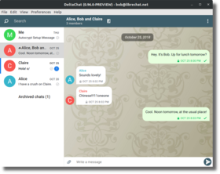

# Delta Chat 是基于电子邮件的聊天软件 

💬 向任意电子邮件地址发送消息，[即使他们不使用 Delta Chat](https://www.youtube-nocookie.com/embed/8LbrGXKZN70)。

🥳 通过 [webxdc 应用](https://webxdc.org)，享受互动聊天体验。

🔒 使用 [Autocrypt](https://autocrypt.org) 与 [SecureJoin](https://securejoin.delta.chat/en/latest/new.html) 协议进行端到端加密，经过[多次安全审计](https://delta.chat/en/2023-03-27-third-independent-security-audit)。

# 在移动端与桌面端均可使用

<a href="../assets/blog/screenshots/2019-12-17-delta-chat-google-play-release-chat-list-light.png">
<picture>
<source srcset="../assets/blog/screenshots/2019-12-17-delta-chat-google-play-release-chat-list-light-thumbnail.webp" type="image/webp" />
<source srcset="../assets/blog/screenshots/2019-12-17-delta-chat-google-play-release-chat-list-light-thumbnail.png" type="image/png" />

</picture>
</a>

<a href="../assets/blog/screenshots/2019-12-17-delta-chat-google-play-release-group-light.png">
<picture>
<source srcset="../assets/blog/screenshots/2019-12-17-delta-chat-google-play-release-group-light-thumbnail.webp" type="image/webp" />
<source srcset="../assets/blog/screenshots/2019-12-17-delta-chat-google-play-release-group-light-thumbnail.png" type="image/png" />

</picture>
</a>

<a href="../assets/blog/desktop-screenshot.png">
<picture>
<source srcset="../assets/blog/desktop-screenshot-thumbnail.webp" type="image/webp" />
<source srcset="../assets/blog/desktop-screenshot-thumbnail.png" type="image/png" />

</picture>
</a>

<a href="../assets/blog/screenshots/2020-01-09-delta-chat-iOS-weekend-group-chat.png">
<picture>
<source srcset="../assets/blog/screenshots/2020-01-09-delta-chat-iOS-weekend-group-chat-thumbnail.webp" type="image/webp" />
<source srcset="../assets/blog/screenshots/2020-01-09-delta-chat-iOS-weekend-group-chat-thumbnail.png" type="image/png" />

</picture>
</a>

[下载](https://get.delta.chat){: .cta-button}

Delta Chat 是[开源](https://en.wikipedia.org/wiki/Open-source_software)的[自由软件](https://en.wikipedia.org/wiki/Free_software)，构建于[互联网标准](https://github.com/deltachat/deltachat-core-rust/blob/master/standards.md)之上。 

点击查看[用户故事与发言](user-voices)。
